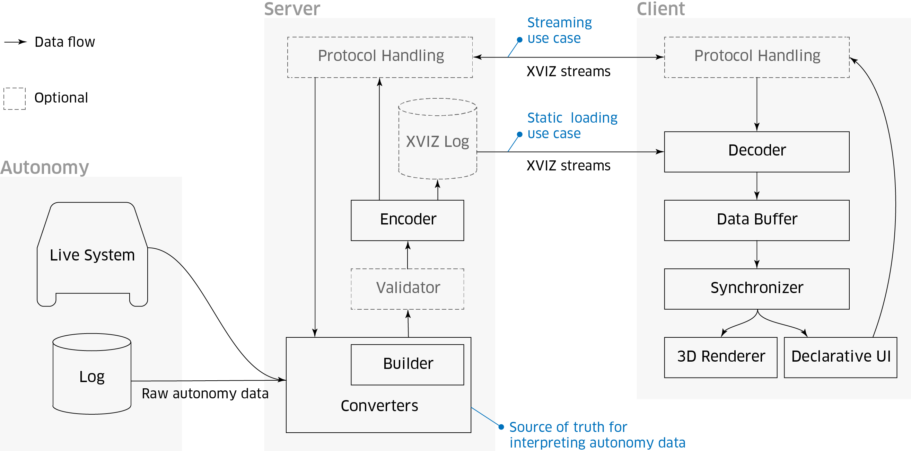

> 推荐阅读：
> [AVS Home](https://avs.auto/#/)
> [AVS: Autonomous Visualization System](https://avs.auto/#/about)
> [Introducing AVS, an Open Standard for Autonomous Vehicle Visualization from Uber](https://eng.uber.com/avs-autonomous-vehicle-visualization/)

# 1. AVS
自主可视化系统 (Autonomous Visualization System, AVS) 是一种快速、功能强大、基于 Web 的 3D 可视化工具包，用于从自主和机器人数据构建应用程序。

AVS 是专为开发者的应用程序和工作流程而设计的，用于描述和可视化自动车辆感知、运动和规划的新标准，它提供了一个功能强大的基于 Web 的工具包，用于构建应用程序，以对机器数据进行探索和交互，并做出关键开发决策。

作为独立的标准化可视化层，AVS 具有的抽象可视化能力，可以使开发人员不必为自动驾驶汽车构建重新构建可视化软件，从而专注于驱动系统的核心功能、远程协助、映射和模拟。

AVS 系统围绕两个关键部分构建：1. XVIZ（数据层，包括数据管理和规范）；2. StreetscapeGL（应用层，为 Web 应用程序提供支持的组件工具包）。

---
# 2. XVIZ
> [XVIZ - Documentation | AVS](https://avs.auto/#/xviz/overview/introduction)
> [XVIZ - Github | Uber](https://github.com/uber/xviz)

我们需要正式且灵活地规范自治系统生成的数据，以便数据格式可以与不断发展的基础架构相集成，同时兼容多个客户端，并且能够有效地进行管理。

XVIZ 提供了一个面向流的随时间变化的场景视图，和一个声明性的用户界面系统。像视频录制一样，可以随时查看并了解任何一个时间点的环境状况。XVIZ 通过自我检查的模式进行聚焦和结构化，同时也允许单独的数据流更新和绑定到单个对象中，以便更方便地分析数据。

XVIZ 流是在特定时间和特定基元下存储的数据序列。其中基元是能够描述诸如 LiDAR 点云、相机图像、对象边界、轨迹、车辆速度等，能够随时间变化并进行预测的对象。为了优化可视化效果，可以单独为这些对象（包括流）设置样式或分配样式类。

XVIZ 通过分层命名的方式来组织流，其中每条流的信息可以通过元数据进行设置。用户界面将对象的图形面板与数据捆绑在一起，通过 YAML 为用户提供控件，以配置显示布局和组件。

**目录**
1. [XVIZ - Overview](/2019/07/05/avs-xviz-0)
2. [XVIZ - Getting Started](/2019/07/05/avs-xviz-1)
3. [XVIZ - User Guide](/2019/07/05/avs-xviz-2)
4. [XVIZ - Tool](/2019/07/08/avs-xviz-3)
5. [XVIZ - Protocal](/2019/07/09/avs-xviz-4)
6. [XVIZ - API](/2019/07/10/avs-xviz-5)

---
# 3. StreetscapeGL
> [StreetscapeGL - Documentation | AVS](https://avs.auto/#/streetscape.gl/overview/introduction)
> [StreetscapeGL - Github | Uber](https://github.com/uber/streetscape.gl)

StreetscapeGL 是一个用于构建 XVIZ 协议数据的 Web 应用程序工具包，它提供的组件可以在 3D 视图、图表、表格、视频等中可视化 XVIZ 流。它解决了常见的可视化难点，例如跨流的时间同步、坐标系统、摄像机、动态样式以及与 3D 对象和交叉组件的交互，使开发者可以投入更多时间来构建自主车辆系统本身。

渲染性能是 StreetscapeGL 的首要目标，基于 React 和 Uber 成熟的 WebGL 驱动的可视化平台，StreetscapeGL 能够支持实时回放以及与数十万个几何场景的平滑交互。

模块化也是 StreetscapeGL 设计的重点，具有高度可定制性和可扩展性，为分类、标记、调试、远程协助和场景编辑等十几个不同的用例提供支持，因此任何团队都可以根据其独特的工作流程构建一个量身定制的可视化系统。

**目录**
1. [StreetscapeGL - Overview & Getting Started](/2019/07/08/avs-streetscape-0)
2. [StreetscapeGL - Advanced Topics]()
3. [StreetscapeGL - API]()
