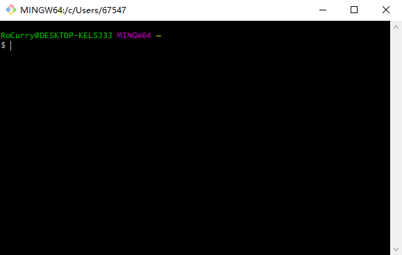
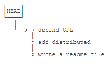
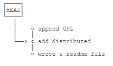

> 推荐阅读：
> [Git Official](https://git-scm.com/)
> [Git Cheat Sheet](https://gitee.com/liaoxuefeng/learn-java/raw/master/teach/git-cheatsheet.pdf)
> [Git教程 - 廖雪峰](https://www.liaoxuefeng.com/wiki/896043488029600)
> [Git教程 - 菜鸟教程](https://www.runoob.com/git/git-tutorial.html)


# 1. Git 简介
+ Git 是一个开源的分布式版本控制系统，用于敏捷高效地处理任何或小或大的项目。
+ Git 是 Linux 之父 Linus Torvalds 为了帮助管理 Linux 系统而开发的一个开放源码的版本控制软件。
+ Git 与常用的版本控制工具 CVS, Subversion(SVN) 等集中式的版本控制系统不同，它采用了分布式版本库的方式，不必服务器端软件支持。

**集中式vs分布式**
+ **集中式版本控制系统**版本库是集中存放在中央服务器的，所以工作的时候要先从中央服务器取得最新的版本，等工作完成再推送给中央服务器。
+ **分布式版本控制系统**没有“中央服务器”，每个人的电脑上都是一个完整的版本库，这样工作的时候就不需要联网了，因为版本库就在你自己的电脑上。


---
# 2. 安装配置
Git 目前支持 Linux/Unix、Windows、Mac和 Solaris 平台上运行，各平台安装包可以在 [官网](http://git-scm.com/downloads) 下载。

**Windows 平台上安装**
+ 下载安装包并按照默认选项安装即可。
+ 安装完成后，在开始菜单里找到“Git”->“Git Bash”，蹦出一个类似命令行窗口的东西，就说明Git安装成功！



**Linux 平台上安装**
+ 在 Linux 平台上安装 Git 比较简便，可以采用如下命令安装，安装后输入 `git --version` 命令，能正确输出 Git 版本信息，则说明安装成功。 
    ```
    $ sudo apt-get install git
    $ git --version
    ```
+ 若是 Linux 版本较老，该方法不能正确安装，也可以在官网下载源码包来安装。

**Git 配置**
安装 Git 后必须配置用户名和邮箱，Git 提供了一个叫做 `git config` 的工具，专门用来配置或读取相应的工作环境变量。
这些环境变量，决定了 Git 在各个环节的具体工作方式和行为。这些变量可以存放在以下三个不同的地方：
+ `/etc/gitconfig` 文件：系统中对所有用户都普遍适用的配置。若使用 `git config` 时用 `--system` 选项，读写的就是这个文件。
+ `~/.gitconfig` 文件：用户目录下的配置文件只适用于该用户。若使用 `git config `时用 `--global` 选项，读写的就是这个文件。
+ `.git/config` 文件：当前项目（也就是工作目录）的 Git 目录中的配置文件，这里的配置仅仅针对当前项目有效。每一个级别的配置都会覆盖上层的相同配置，所以 `.git/config` 里的配置会覆盖 `/etc/gitconfig` 中的同名变量。

在 Windows 系统上，Git 会找寻用户主目录下的 `.gitconfig `文件，即 `$HOME` 变量指定的目录，一般都是 `C:\user\$USER\.gitconfig`。


**用户信息**
配置用户的用户名和邮箱：
```
$ git config --global user.name "Your Name"
$ git config --global user.email "email@example.com"
```
如果用了 `--global` 选项，那么更改的配置文件就是位于你用户主目录下的那个，以后你所有的项目都会默认使用这里配置的用户信息。
如果要在某个特定的项目中使用其他用户名和邮箱，可以通过当前项目的 `.git/config` 来指定。


---
# 3. 工作流程
Git 工作流程如下：
+ 克隆 Git 资源作为工作目录。
+ 在克隆的资源上添加或修改文件。
+ 如果其他人修改了，你可以更新资源。
+ 在提交前查看修改。
+ 提交修改。
+ 在修改完成后，如果发现错误，可以撤回提交并再次修改并提交。


---
# 4. 创建仓库
版本库，又叫仓库 (repository, repo)。可以使用一个已经存在的目录作为 Git 仓库。

**git init**
+ 使用 `git init` 命令来初始化一个 Git 仓库，Git 的很多命令都需要在 Git 的仓库中运行，所以 `git init` 是使用 Git 的第一个命令。
+ 在执行完成 `git init` 命令后，Git 仓库会生成一个 `.git` 目录，该目录包含了资源的所有元数据，其他的项目目录保持不变（不像 SVN 会在每个子目录生成 `.svn` 目录，Git 只在仓库的根目录生成 `.git` 目录）。

```
# 初始化当前目录
$ git init

# 初始化指定目录
$ git init <folder>
```

**4.2 git add & git commit**
把一个文件放到 Git 仓库需要两步：
1. 用命令 `git add` 告诉 Git，把文件添加到仓库，以对文件进行跟踪和提交：
    ```
    $ git add *.c
    $ git add readme.txt
    ```
    以上命令将目录下以 `.c` 结尾及 `readme.txt` 文件提交到仓库中。
2. 用命令 `git commit` 告诉 Git，把文件提交到仓库：
    ```
    $ git commit -m '初始化项目版本'
    ```
    + 简单解释一下 `git commit` 命令，`-m` 后面输入的是本次提交的说明，可以输入任意内容，当然最好是有意义的，这样你就能从历史记录里方便地找到改动记录。
    + `git commit` 命令执行成功后会返回类似的提示：`1 file changed`：1个文件被改动；`2 insertions`：插入了两行内容。


**小结**
+ 初始化一个 Git 仓库，使用 `git init` 命令。
+ 添加文件到 Git 仓库，分两步：
    1. 使用命令 `git add <file>`，注意，可反复多次使用，添加多个文件；
    2. 使用命令 `git commit -m <message>`，完成。


---
# 5. 版本控制
**git status**
刚才已经成功地添加并提交了一个 `readme.txt` 文件，现在随意修改这个文件，然后运行 `git status` 命令看看结果：
```
$ git status
On branch master
Changes not staged for commit:
  (use "git add <file>..." to update what will be committed)
  (use "git checkout -- <file>..." to discard changes in working directory)

	modified:   readme.txt

no changes added to commit (use "git add" and/or "git commit -a")
```
`git status` 命令可以让我们时刻掌握仓库当前的状态，上面的命令输出告诉我们，`readme.txt` 被修改过了，但没有准备提交。


**git diff**
虽然 Git 告诉我们 `readme.txt` 被修改了，但是要查看具体修改了哪些内容，需要用 `git diff` 这个命令查看：
```
$ git diff readme.txt 
diff --git a/readme.txt b/readme.txt
index 46d49bf..9247db6 100644
--- a/readme.txt
+++ b/readme.txt
@@ -1,2 +1,2 @@
-Git is a version control system.
+Git is a distributed version control system.
 Git is free software.
```
`git diff` 顾名思义就是查看 difference，显示的格式正是 Unix 通用的 `diff` 格式，可以从上面的命令输出看到，我们在第一行添加了一个 `distributed` 单词。

知道了对 `readme.txt` 作了什么修改后，再把它提交到仓库。提交修改和提交新文件是一样的两步：
1. 第一步是 `git add`：
    ```
    $ git add readme.txt
    ```
    在执行第二步 `git commit` 之前，我们再运行 `git status` 看看当前仓库的状态：
    ```
    $ git status
    On branch master
    Changes to be committed:
      (use "git reset HEAD <file>..." to unstage)
    
    	modified:   readme.txt
    ```
    `git status` 告诉我们，将要被提交的修改包括 `readme.txt`。
2. 下一步，就可以放心地提交了：
    ```
    $ git commit -m "add distributed"
    [master e475afc] add distributed
     1 file changed, 1 insertion(+), 1 deletion(-)
    ```
    提交后，我们再用 `git status` 命令看看仓库的当前状态：
    ```
    $ git status
    On branch master
    nothing to commit, working tree clean
    ```
    Git 告诉我们当前没有需要提交的修改，而且工作目录是干净（working tree clean）的。
    
**小结**
+ 要随时掌握工作区的状态，使用 `git status` 命令。
+ 如果 `git status` 告诉你有文件被修改过，用 `git diff` 可以查看修改内容。
    

---
## 5.1 版本回退
**git log**
像这样不断对文件进行修改，然后不断提交修改到版本库里，就好比玩 RPG 游戏时，每通过一关就会自动把游戏状态存盘，如果某一关没过去，你还可以选择读取前一关的状态。有些时候，在打 Boss 之前，你会手动存盘，以便万一打 Boss 失败了，可以从最近的地方重新开始。Git 也是一样，每当你觉得文件修改到一定程度的时候，就可以“保存一个快照”，这个快照在 Git 中被称为 commit。一旦你把文件改乱了，或者误删了文件，还可以从最近的一个 commit 恢复，然后继续工作，而不是把几个月的工作成果全部丢失。

假设目前 `readme.txt` 提交了以下几个版本：
+ 版本1：wrote a readme file
    ```
    Git is a version control system.
    Git is free software.
    ```
+ 版本2：add distributed
    ```
    Git is a distributed version control system.
    Git is free software.
    ```
+ 版本3：append GPL
    ```
    Git is a distributed version control system.
    Git is free software distributed under the GPL.
    ```

在 Git 中，使用 `git log` 命令查看提交历史：
```
$ git log
commit 1094adb7b9b3807259d8cb349e7df1d4d6477073 (HEAD -> master)
Author: Michael Liao <askxuefeng@gmail.com>
Date:   Fri May 18 21:06:15 2018 +0800

    append GPL

commit e475afc93c209a690c39c13a46716e8fa000c366
Author: Michael Liao <askxuefeng@gmail.com>
Date:   Fri May 18 21:03:36 2018 +0800

    add distributed

commit eaadf4e385e865d25c48e7ca9c8395c3f7dfaef0
Author: Michael Liao <askxuefeng@gmail.com>
Date:   Fri May 18 20:59:18 2018 +0800

    wrote a readme file
```
`git log` 命令显示从最近到最远的提交日志，我们可以看到 3 次提交，最近的一次是 `append GPL`，上一次是 `add distributed`，最早的一次是 `wrote a readme file`。

如果嫌输出信息太多，看得眼花缭乱的，可以试试加上 `--pretty=oneline` 参数：
```
$ git log --pretty=oneline
1094adb7b9b3807259d8cb349e7df1d4d6477073 (HEAD -> master) append GPL
e475afc93c209a690c39c13a46716e8fa000c366 add distributed
eaadf4e385e865d25c48e7ca9c8395c3f7dfaef0 wrote a readme file
```
其中一大串类似 `1094adb...` 的是 `commit id`（版本号），和 SVN 不一样，Git 的 `commit id`不是 1，2，3……递增的数字，而是一个 SHA1 计算出来的一个非常大的数字，用十六进制表示。为什么 `commit id` 需要用这么一大串数字表示呢？因为 Git 是分布式的版本控制系统，可以让多人在同一个版本库里工作，如果大家都用 1，2，3……作为版本号，那肯定就冲突了。


**git reset**
在 Git 中，用 `HEAD` 表示当前版本，比如最新提交的 `1094adb...`，上一个版本就是 `HEAD^`，上上一个版本就是 `HEAD^^`，往上 100 个版本可以写成 `HEAD~100`。

现在，我们要把当前版本 `append GPL` 回退到上一个版本 `add distributed`，可以使用 `git reset` 命令：
```
$ git reset --hard HEAD^
HEAD is now at e475afc add distributed
```

还可以继续回退到上一个版本 `wrote a readme file`，但要注意使用 `git log` 查看此时的版本库状态：
```
$ git log
commit e475afc93c209a690c39c13a46716e8fa000c366 (HEAD -> master)
Author: Michael Liao <askxuefeng@gmail.com>
Date:   Fri May 18 21:03:36 2018 +0800

    add distributed

commit eaadf4e385e865d25c48e7ca9c8395c3f7dfaef0
Author: Michael Liao <askxuefeng@gmail.com>
Date:   Fri May 18 20:59:18 2018 +0800

    wrote a readme file
```
可以看到此时 `append GPL` 版本已经不在了，如果又想回到未来的 `append GPL` 版本，在命令行窗口关闭之前可以往上找到该版本的 `commit id` `1094adb...`，执行以下命令：
```
$ git reset --hard 1094a
HEAD is now at 83b0afe append GPL
```
`commit id` 没必要写全，前几位就可以了，Git 会自动去找。当然也不能只写前一两位，因为 Git 可能会找到多个版本号，就无法确定是哪一个了。

Git 的版本回退速度非常快，因为 Git 在内部有个指向当前版本的 `HEAD` 指针，当你回退版本的时候，Git 仅仅是把 HEAD 从 `add distributed` 指向 `append GPL`：




**git reflog**
如果命令行窗口关闭了，找不到 `append GPL` 的 `commit id`，可以使用命令 `git reflog` 查看所有执行过的命令，这样就能找到 `append GPL` 的 `commit id` 了：
```
$ git reflog
e475afc HEAD@{1}: reset: moving to HEAD^
1094adb (HEAD -> master) HEAD@{2}: commit: append GPL
e475afc HEAD@{3}: commit: add distributed
eaadf4e HEAD@{4}: commit (initial): wrote a readme file
```

**小结**
+ `HEAD` 指向的版本就是当前版本，因此，Git 允许我们在版本的历史之间穿梭，使用命令` git reset --hard <commit_id>`。
+ 穿梭前，用 `git log` 可以查看提交历史，以便确定要回退到哪个版本。
+ 要重返未来，用 `git reflog` 查看命令历史，以便确定要回到未来的哪个版本。


---
## 5.2 工作区、暂存区和版本库
**基本概念**
+ **工作区**：就是你在电脑里能看到的目录，比如项目文件夹。
+ **版本库**：工作区有一个隐藏目录 `.git`，他不算工作区，而是 Git 的版本库。Git 的版本库里存了很多东西，其中最重要的就是称为 stage（或者叫 index）的暂存区，还有 Git 为我们自动创建的第一个分支 `master`，以及指向 `master` 的一个指针叫 `HEAD`。
+ **暂存区**：也叫 stage，或 index，一般存放在 `.git/index` 文件中，所以我们把暂存区有时也叫作索引 (index)。


+ 图中左侧为工作区，右侧为版本库。在版本库中标记为 `index` 的区域是暂存区 (stage, index)，标记为 `master` 的是 master 分支所代表的目录树。
+ 图中我们可以看出此时 `HEAD` 实际是指向 master 分支的一个"游标"。所以图示的命令中出现 `HEAD` 的地方可以用 `master` 来替换。
+ 图中的 `objects` 标识的区域为 Git 的对象库，实际位于 `.git/objects` 目录下，里面包含了创建的各种对象及内容。

命令：
+ `git add` - 当对工作区修改（或新增）的文件执行 `git add` 命令时，暂存区的目录树被更新，同时工作区修改（或新增）的文件内容被写入到对象库中的一个新的对象中，而该对象的 ID 被记录在暂存区的文件索引中。（**实际上就是把文件修改添加到暂存区**）
+ `git commit` - 当执行提交操作 `git commit` 时，暂存区的目录树写到版本库（对象库）中，master 分支会做相应的更新。即 `master` 指向的目录树就是提交时暂存区的目录树。（**实际上就是把暂存区的所有内容提交到当前分支**）
+ `git reset HEAD` - 当执行 `git reset HEAD` 命令时，暂存区的目录树会被重写，被 master 分支指向的目录树所替换，但是工作区不受影响。
+ `git rm --cached <file>` - 当执行 `git rm --cached <file>` 命令时，会直接从暂存区删除文件，工作区则不做出改变。
+ `git checkout` - 当执行 `git checkout .` 或者 `git checkout -- <file>` 命令时，会用暂存区全部或指定的文件替换工作区的文件。这个操作很危险，会清除工作区中未添加到暂存区的改动。
+ `git checkout HEAD` - 当执行 `git checkout HEAD .` 或者 `git checkout HEAD <file>` 命令时，会用 `HEAD` 指向的 master 分支中的全部或者部分文件替换暂存区和以及工作区中的文件。这个命令也是极具危险性的，因为不但会清除工作区中未提交的改动，也会清除暂存区中未提交的改动。

**小结**
暂存区是 Git 非常重要的概念，弄明白了暂存区，就弄明白了 Git 的很多操作到底干了什么。


---
## 5.3 管理修改
Git 之所以比其他版本控制系统设计得优秀，是因为 Git 跟踪并管理的是修改，而非文件。比如，对 `readme.txt` 做一个修改，加一行内容（第四行）：
```
$ cat readme.txt
Git is a distributed version control system.
Git is free software distributed under the GPL.
Git has a mutable index called stage.
Git tracks changes.
```
然后，添加：
```
$ git add readme.txt
$ git status
# On branch master
# Changes to be committed:
#   (use "git reset HEAD <file>..." to unstage)
#
#       modified:   readme.txt
#
```
然后，再修改一次：
```
$ cat readme.txt 
Git is a distributed version control system.
Git is free software distributed under the GPL.
Git has a mutable index called stage.
Git tracks changes of files.
```
提交：
```
$ git commit -m "git tracks changes"
[master 519219b] git tracks changes
 1 file changed, 1 insertion(+)
```
提交后，再看看状态：
```
$ git status
On branch master
Changes not staged for commit:
  (use "git add <file>..." to update what will be committed)
  (use "git checkout -- <file>..." to discard changes in working directory)

	modified:   readme.txt

no changes added to commit (use "git add" and/or "git commit -a")
```
提交后，用 `git diff HEAD -- readme.txt` 命令可以查看工作区和版本库里面最新版本的区别：
```
$ git diff HEAD -- readme.txt 
diff --git a/readme.txt b/readme.txt
index 76d770f..a9c5755 100644
--- a/readme.txt
+++ b/readme.txt
@@ -1,4 +1,4 @@
 Git is a distributed version control system.
 Git is free software distributed under the GPL.
 Git has a mutable index called stage.
-Git tracks changes.
+Git tracks changes of files.
```
可以发现，第二次的修改并没有被提交，原因是我们的操作过程为：第一次修改 -> `git add` -> 第二次修改 -> `git commit`。而 Git 管理的是修改，当用 `git add` 命令后，在工作区的第一次修改被放入暂存区，准备提交，但是，在工作区的第二次修改并没有放入暂存区，所以，`git commit` 只负责把暂存区的修改提交了，也就是第一次的修改被提交了，第二次的修改不会被提交。

那怎么提交第二次修改呢？可以继续 `git add` 再 `git commit`，也可以别着急提交第一次修改，先 `git add` 第二次修改，再 `git commit`，就相当于把两次修改合并后一块提交了：第一次修改 -> `git add` -> 第二次修改 -> `git add` -> `git commit`。

**小结**
现在，你又理解了 Git 是如何跟踪修改的，每次修改，如果不用 `git add` 到暂存区，那就不会加入到 `commit` 中。


---
## 5.4 撤销修改
`git checkout -- file` 可以丢弃工作区的修改：
```
$ git checkout -- readme.txt
```
命令 `git checkout -- readme.txt` 意思就是，把 `readme.txt` 文件在工作区的修改全部撤销，这里有两种情况：
+ 一种是 `readme.txt` 自修改后还没有被放到暂存区，现在，撤销修改就回到和版本库一模一样的状态；
+ 一种是 `readme.txt` 已经添加到暂存区后，又作了修改，现在，撤销修改就回到添加到暂存区后的状态。

总之，就是让这个文件回到最近一次 `git commit` 或 `git add` 时的状态。

如果是第二种情况，想把暂存区的修改撤销掉，可以使用命令 `git reset HEAD <file>`，撤销掉（unstage）暂存区的修改，重新放回工作区：
```
$ git reset HEAD readme.txt
Unstaged changes after reset:
M	readme.txt
```
此时暂存区的修改回到了工作区，再使用命令 `git checkout -- readme.txt` 就可以把工作区的修改撤销了。

如果有第三种情况，就是提交了不合适的修改到版本库时，想要撤销本次提交，可以参考[版本回退](#51-版本回退)这一节，不过前提是没有推送到远程库。


**小结**
1. 当你改乱了工作区某个文件的内容，想直接丢弃工作区的修改时，用命令 `git checkout -- file`。
2. 当你不但改乱了工作区某个文件的内容，还添加到了暂存区时，想丢弃修改，分两步，第一步用命令 `git reset HEAD <file>`，就回到了 `1.`，第二步按 `1.` 操作。
3. 已经提交了不合适的修改到版本库时，想要撤销本次提交，参考[版本回退](#51-版本回退)一节，不过前提是没有推送到远程库。


---
## 5.5 删除文件
假设有一个需要删除的文件 `test.txt`，一般情况下，可以直接在文件管理器中把它删了，或者用 `rm` 命令删了：
```
$ rm test.txt
```
这个时候，Git 知道你删除了文件，因此，工作区和版本库就不一致了，`git status` 命令会立刻告诉你哪些文件被删除了：
```
$ git status
On branch master
Changes not staged for commit:
  (use "git add/rm <file>..." to update what will be committed)
  (use "git checkout -- <file>..." to discard changes in working directory)

	deleted:    test.txt

no changes added to commit (use "git add" and/or "git commit -a")
```
现在你有两个选择，一是确实要从版本库中删除该文件，那就用命令 `git rm` 删掉，并且 `git commit`：
```
$ git rm test.txt
rm 'test.txt'

$ git commit -m "remove test.txt"
[master d46f35e] remove test.txt
 1 file changed, 1 deletion(-)
 delete mode 100644 test.txt
```
> 先手动删除文件，然后使用 `git rm <file>` 和 `git add<file>` 效果是一样的。
 
另一种情况是删错了，因为版本库里还有呢，所以可以很轻松地把误删的文件恢复到最新版本：
```
$ git checkout -- test.txt
```
`git checkout` 其实是用版本库里的版本替换工作区的版本，无论工作区是修改还是删除，都可以“一键还原”。

**小结**
命令 `git rm` 用于删除一个文件。如果一个文件已经被提交到版本库，那么你永远不用担心误删，但是要小心，你只能恢复文件到最新版本，你会丢失最近一次提交后你修改的内容。


---
# 6. 远程仓库
Git 是分布式版本控制系统，同一个 Git 仓库，可以分布到不同的机器上。怎么分布呢？最早，肯定只有一台机器有一个原始版本库，此后，别的机器可以“克隆”这个原始版本库，而且每台机器的版本库其实都是一样的，并没有主次之分。

实际情况往往是这样，找一台电脑充当服务器的角色，每天24小时开机，其他每个人都从这个“服务器”仓库克隆一份到自己的电脑上，并且各自把各自的提交推送到服务器仓库里，也从服务器仓库中拉取别人的提交。

完全可以自己搭建一台运行 Git 的服务器，不过现阶段，为了学 Git 先搭个服务器绝对是小题大作。好在这个世界上有个叫 GitHub 的神奇的网站，从名字就可以看出，这个网站就是提供 Git 仓库托管服务的，所以，只要注册一个 GitHub 账号，就可以免费获得 Git 远程仓库。

由于你的本地 Git 仓库和 GitHub 仓库之间的传输是通过 SSH 加密的，所以，需要设置 SSH Key：
1. 创建 SSH Key。在用户主目录下，看看有没有 `.ssh` 目录，如果有，再看看这个目录下有没有 `id_rsa` 和 `id_rsa.pub` 这两个文件，如果已经有了，可直接跳到下一步。如果没有，打开 Shell（Windows 下打开 Git Bash），创建 SSH Key：
    ```
    $ ssh-keygen -t rsa -C "youremail@example.com"
    ```
    如果一切顺利的话，可以在用户主目录里找到 `.ssh` 目录，里面有 `id_rsa` 和 `id_rsa.pub` 两个文件，这两个就是 SSH Key 的秘钥对，`id_rsa` 是私钥，不能泄露出去，`id_rsa.pub` 是公钥，可以放心地告诉任何人。
2. 登陆 GitHub，打开“Settings”，“SSH Keys”页面，然后点“New SSH Key”，填上任意 Title，在 Key 文本框里粘贴 `id_rsa.pub` 文件的内容；


---
## 6.1 添加远程库
现在的情景是，你已经在本地创建了一个 Git 仓库后，又想在 GitHub 创建一个 Git 仓库，并且让这两个仓库进行远程同步，这样，GitHub 上的仓库既可以作为备份，又可以让其他人通过该仓库来协作，真是一举多得。

**创建 GitHub 仓库**
首先，登陆 GitHub，然后，在右上角找到“Create a new repository”按钮，创建一个新的仓库，填好仓库名就可以按照默认设置创建了。创建之后这个仓库还是空的，GitHub 提示可以从这个仓库克隆出新的仓库，也可以把一个已有的本地仓库与之关联，然后把本地仓库的内容推送到 GitHub 仓库。

**添加远程库**
现在，我们根据 GitHub 的提示，在本地的仓库下运行命令：
```
$ git remote add origin git@github.com:<username>/<repo-name>.git
```
添加后，远程库的名字就是 `origin`，这是 Git 默认的叫法，也可以改成别的，但是 `origin` 这个名字一看就知道是远程库。若是添加错了，可以用以下命令删除：
```
$ git remote rm origin
```

**推送到远程库**
下一步，就可以把本地库的所有内容推送到远程库上：
```
$ git push -u origin master
Counting objects: 20, done.
Delta compression using up to 4 threads.
Compressing objects: 100% (15/15), done.
Writing objects: 100% (20/20), 1.64 KiB | 560.00 KiB/s, done.
Total 20 (delta 5), reused 0 (delta 0)
remote: Resolving deltas: 100% (5/5), done.
To github.com:michaelliao/learngit.git
 * [new branch]      master -> master
Branch 'master' set up to track remote branch 'master' from 'origin'.
```
把本地库的内容推送到远程，用 `git push` 命令，实际上是把当前分支 `master` 推送到远程。
由于远程库是空的，我们第一次推送 `master` 分支时，加上了 `-u` 参数，Git 不但会把本地的 `master` 分支内容推送的远程新的 `master` 分支，还会把本地的 `master` 分支和远程的 `master` 分支关联起来，在以后的推送或者拉取时就可以简化命令。

从现在起，只要本地作了提交，就可以通过以下命令把本地 `master` 分支的最新修改推送至 GitHub：
```
$ git push origin master
```

**小结**
+ 要关联一个远程库，使用命令 `git remote add origin git@server-name:path/repo-name.git`；
+ 关联后，使用命令 `git push -u origin master` 第一次推送 `master` 分支的所有内容；
+ 此后，每次本地提交后，只要有必要，就可以使用命令 `git push origin master` 推送最新修改；

> 分布式版本系统的最大好处之一是在本地工作完全不需要考虑远程库的存在，也就是有没有联网都可以正常工作，当有网络的时候，再把本地提交推送一下就完成了同步。而 SVN 在没有联网的时候是不能工作的。


---
## 6.2 从远程库克隆
上一节讲了在先有本地库，后有远程库的时候，如何关联远程库。现在，假设我们从零开发，那么最好的方式是先创建远程库，然后，从远程库克隆到本地。

首先，登陆 GitHub，创建一个新的仓库。创建之后使用命令 `git clone` 克隆一个本地库：
```
$ git clone git@github.com:<username>/<repo-name>.git
```
如果有多个人协作开发，那么每个人各自从远程仓库克隆一份就可以了。

GitHub 给出的地址不止一个，还可以用 `https://github.com/<username>/<repo-name>.git` 这样的地址。实际上，Git 支持多种协议，默认的 `git://` 使用 ssh，但也可以使用 https 等其他协议。
使用 https 除了速度慢以外，还有个最大的麻烦是每次推送都必须输入口令，但是在某些只开放 http 端口的公司内部就无法使用 ssh 协议而只能用 https。

**小结**
+ 要克隆一个仓库，首先必须知道仓库的地址，然后使用 `git clone` 命令克隆。
+ Git 支持多种协议，包括 https，但通过 ssh 支持的原生 git 协议速度最快。


---
## 6.3 使用 GitHub
我们一直用 GitHub 作为免费的远程仓库，如果是个人的开源项目，放到 GitHub 上是完全没有问题的。其实 GitHub 还是一个开源协作社区，通过 GitHub，既可以让别人参与你的开源项目，也可以参与别人的开源项目。

在 GitHub 出现以前，开源项目开源容易，但让广大人民群众参与进来比较困难，因为要参与，就要提交代码，而给每个想提交代码的群众都开一个账号那是不现实的，因此，群众也仅限于报个 bug，即使能改掉 bug，也只能把 diff 文件用邮件发过去，很不方便。

但是在 GitHub 上，利用 Git 极其强大的克隆和分支功能，广大人民群众真正可以第一次自由参与各种开源项目了。

如何参与一个开源项目呢？比如人气极高的 bootstrap 项目，这是一个非常强大的 CSS 框架，你可以访问它的项目主页 [https://github.com/twbs/bootstrap](https://github.com/twbs/bootstrap)，点“Fork”就在自己的账号下克隆了一个 bootstrap 仓库，然后，从自己的账号下 `clone`：
```
git clone git@github.com:roarcurry/bootstrap.git
```
一定要从自己的账号下 `clone` 仓库，这样你才能推送修改。如果从 bootstrap 的作者的仓库地址 `git@github.com:twbs/bootstrap.git` 克隆，因为没有权限，你将不能推送修改。

如果你想修复 bootstrap 的一个 bug，或者新增一个功能，立刻就可以开始干活，干完后，往自己的仓库推送。

如果你希望 bootstrap 的官方库能接受你的修改，你就可以在 GitHub 上发起一个 pull request。当然，对方是否接受你的 pull request 就不一定了。

如果你没能力修改 bootstrap，但又想要试一把 pull request，那就 Fork 一下廖雪峰老师的仓库：[https://github.com/michaelliao/learngit](https://github.com/michaelliao/learngit)，创建一个 `your-github-id.txt` 的文本文件，写点自己学习 Git 的心得，然后推送一个 pull request，老师会视心情而定是否接受。

**小结**
+ 在 GitHub 上，可以任意 Fork 开源仓库；
+ 自己拥有 Fork 后的仓库的读写权限；
+ 可以推送 pull request 给官方仓库来贡献代码。


---
## 6.4 使用码云
使用 GitHub 时，国内的用户经常遇到的问题是访问速度太慢，有时候还会出现无法连接的情况（原因你懂的）。

如果我们希望体验 Git 飞一般的速度，可以使用国内的 Git 托管服务——码云（[gitee.com](gitee.com)）。

和 GitHub 相比，码云也提供免费的 Git 仓库。此外，还集成了代码质量检测、项目演示等功能。对于团队协作开发，码云还提供了项目管理、代码托管、文档管理的服务，5 人以下小团队免费。

>  码云的免费版本也提供私有库功能，只是有 5 人的成员上限。

详情请参考[使用码云 - 廖雪峰 Git 教程](https://www.liaoxuefeng.com/wiki/896043488029600/1163625339727712)。


---
## 6.5 搭建 Git 服务器
从上面个几节可以知道，远程仓库实际上和本地仓库没啥不同，纯粹为了 7x24 小时开机并交换大家的修改。

GitHub 就是一个免费托管开源代码的远程仓库。但是对于某些视源代码如生命的商业公司来说，既不想公开源代码，又舍不得给 GitHub 交保护费，那就只能自己搭建一台 Git 服务器作为私有仓库使用。

搭建 Git 服务器需要准备一台运行 Linux 的机器，强烈推荐用 Ubuntu 或 Debian，这样，通过几条简单的 `apt` 命令就可以完成安装。

详情请参考 [搭建 Git 服务器 - 廖雪峰 Git 教程](https://www.liaoxuefeng.com/wiki/896043488029600/899998870925664)。


---
# 7. 分支管理
分支有什么用呢？假设你准备开发一个新功能，但是需要两周才能完成，第一周你写了 50% 的代码，如果立刻提交，由于代码还没写完，不完整的代码库会导致别人不能干活了。如果等代码全部写完再一次提交，又存在丢失每天进度的巨大风险。

现在有了分支，就不用怕了。你创建了一个属于你自己的分支，别人看不到，还继续在原来的分支上正常工作，而你在自己的分支上干活，想提交就提交，直到开发完毕后，再一次性合并到原来的分支上，这样，既安全，又不影响别人工作。

其他版本控制系统如 SVN 等都有分支管理，但是这些版本控制系统创建和切换分支非常慢。可 Git 无论创建、切换和删除分支，都能在 1 秒钟之内完成，无论你的版本库是 1 个文件还是 1 万个文件。


---
## 7.1 创建和合并分支
在[版本回退](#51-版本回退)里，每次提交，Git 都把它们串成一条时间线，这条时间线就是一个分支。仓库创建时只有一条时间线，在 Git 里，这个分支叫主分支，即 `master` 分支。`HEAD` 严格来说不是指向提交，而是指向 `master`，`master` 才是指向提交的，所以，`HEAD` 指向的就是当前分支。

**工作流程**
一开始的时候，`master` 分支是一条线，Git 用 `master` 指向最新的提交，再用 `HEAD` 指向 `master`，就能确定当前分支，以及当前分支的提交点。每次提交，`master` 分支都会向前移动一步，这样，随着你不断提交，`master` 分支的线也越来越长：

当我们创建新的分支，例如 `dev` 时，Git 新建了一个指针叫 `dev`，指向 `master` 相同的提交，再把 `HEAD` 指向 `dev`，就表示当前分支在 `dev` 上。Git 创建一个分支很快，因为除了增加一个 `dev` 指针，改改 `HEAD` 的指向，工作区的文件都没有任何变化：

不过，从现在开始，对工作区的修改和提交就是针对 `dev` 分支了，比如新提交一次后，`dev` 指针往前移动一步，而 `master` 指针不变：

假如我们在 `dev` 上的工作完成了，就可以把 `dev` 合并到 `master` 上。Git 直接把 `master` 指向 `dev` 的当前提交，就完成了合并。所以 Git 合并分支也很快，就改改指针，工作区内容也不变：

合并完分支后，甚至可以删除 `dev` 分支。删除 `dev` 分支就是把 `dev` 指针给删掉，删掉后，我们就剩下了一条 `master` 分支：


**实战**
首先，我们创建 `dev` 分支，然后切换到 `dev` 分支：
```
$ git checkout -b dev
Switched to a new branch 'dev'
```
`git checkout` 命令加上 `-b` 参数表示创建并切换，相当于以下两条命令：
```
$ git branch dev
$ git checkout dev
Switched to branch 'dev'
```
然后，用 `git branch` 命令查看当前分支，该命令会列出所有分支，当前分支前面会标一个 `*` 号：
```
$ git branch
* dev
  master
```
然后，我们就可以在 `dev` 分支上正常提交，比如对 `readme.txt` 做个修改，然后提交：
```
$ git add readme.txt 
$ git commit -m "branch test"
[dev b17d20e] branch test
 1 file changed, 1 insertion(+)
```
现在，`dev` 分支的工作完成，我们就可以切换回 `master` 分支：
```
$ git checkout master
Switched to branch 'master'
```
切换回 `master` 分支后，可以发现 `readme.txt` 并没有刚刚那个修改的内容，因为那个提交是在 `dev` 分支上，而 `master` 分支此刻的提交点并没有变：

现在，我们把 `dev` 分支的工作成果合并到 `master` 分支上：
```
$ git merge dev
Updating d46f35e..b17d20e
Fast-forward
 readme.txt | 1 +
 1 file changed, 1 insertion(+)
```
`git merge` 命令用于合并指定分支到当前分支。合并后，再查看 `readme.txt` 的内容，就可以看到，和 `dev` 分支的最新提交是完全一样的。

注意到上面的 `Fast-forward` 信息，Git 告诉我们，这次合并是“快进模式”，也就是直接把 `master` 指向 `dev` 的当前提交，所以合并速度非常快。当然，也不是每次合并都能 `Fast-forward`，我们后面会讲其他方式的合并。

合并完成后，就可以放心地删除 `dev` 分支了：
```
$ git branch -d dev
Deleted branch dev (was b17d20e).
```
删除后，查看 `branch`，就只剩下 `master` 分支了：
```
$ git branch
* master
```

**小结**
+ 查看分支：`git branch`
+ 创建分支：`git branch <name>`
+ 切换分支：`git checkout <name>`
+ 创建 + 切换分支：`git checkout -b <name>`
+ 合并某分支到当前分支：`git merge <name>`
+ 删除分支：`git branch -d <name>`

因为创建、合并和删除分支非常快，所以 Git 鼓励使用分支完成某个任务，合并后再删掉分支，这和直接在 `master` 分支上工作效果是一样的，但过程更安全。


---
## 7.2 解决冲突
准备新的 `feature1` 分支：
```
$ git checkout -b feature1
Switched to a new branch 'feature1'
```
修改 `readme.txt`，在 `feature1` 分支上提交：
```
$ git add readme.txt

$ git commit -m "AND simple"
[feature1 14096d0] AND simple
 1 file changed, 1 insertion(+), 1 deletion(-)
```
切换到 `master` 分支，Git 还会自动提示我们当前 `master` 分支比远程的 `master` 分支要超前1个提交：
```
$ git checkout master
Switched to branch 'master'
Your branch is ahead of 'origin/master' by 1 commit.
  (use "git push" to publish your local commits)
```
在 `master` 分支上也对 `readme.txt` 文件进行修改，并且与刚才的修改不一样，然后提交：
```
$ git add readme.txt 
$ git commit -m "& simple"
[master 5dc6824] & simple
 1 file changed, 1 insertion(+), 1 deletion(-)
```
现在，`master` 分支和 `feature1` 分支各自都分别有新的提交，变成了这样：

这种情况下，Git 无法执行“快速合并”，只能试图把各自的修改合并起来，但这种合并就可能会有冲突，我们试试看：
```
$ git merge feature1
Auto-merging readme.txt
CONFLICT (content): Merge conflict in readme.txt
Automatic merge failed; fix conflicts and then commit the result.
```
Git 告诉我们，`readme.txt` 文件存在冲突，必须手动解决冲突后再提交。`git status` 也可以告诉我们冲突的文件：
```
$ git status
On branch master
Your branch is ahead of 'origin/master' by 2 commits.
  (use "git push" to publish your local commits)

You have unmerged paths.
  (fix conflicts and run "git commit")
  (use "git merge --abort" to abort the merge)

Unmerged paths:
  (use "git add <file>..." to mark resolution)

	both modified:   readme.txt

no changes added to commit (use "git add" and/or "git commit -a")
```
我们可以直接查看 `readme.txt` 的内容：
```
Git is a distributed version control system.
Git is free software distributed under the GPL.
Git has a mutable index called stage.
Git tracks changes of files.
<<<<<<< HEAD
Creating a new branch is quick & simple.
=======
Creating a new branch is quick AND simple.
>>>>>>> feature1
```
Git用 `<<<<<<<`，`=======`，`>>>>>>>` 标记出不同分支的内容，我们手动修改后进行保存并提交：
```
$ git add readme.txt 
$ git commit -m "conflict fixed"
[master cf810e4] conflict fixed
```
现在，`master` 分支和 `feature1` 分支变成了下图所示：

用带参数的 `git log` 也可以看到分支的合并情况：
```
$ git log --graph --pretty=oneline --abbrev-commit
*   cf810e4 (HEAD -> master) conflict fixed
|\  
| * 14096d0 (feature1) AND simple
* | 5dc6824 & simple
|/  
...
```
最后，删除 `feature1` 分支：
```
$ git branch -d feature1
Deleted branch feature1 (was 14096d0).
```

**小结**
+ 当 Git 无法自动合并分支时，就必须首先解决冲突。解决冲突后，再提交，合并完成。
+ 解决冲突就是把 Git 合并失败的文件手动编辑为我们希望的内容，再提交。
+ 用 `git log --graph` 命令可以看到分支合并图。


---
## 7.3 分支管理策略
通常，合并分支时，如果可能，Git 会用 `Fast forward` 模式，但这种模式下，删除分支后，会丢掉分支信息。如果要强制禁用 `Fast forward` 模式，Git 就会在 `merge` 时生成一个新的 `commit`，这样，从分支历史上就可以看出分支信息。

下面我们实战一下 `--no-ff` 方式的 `git merge`。首先，仍然创建并切换 `dev` 分支：
```
$ git checkout -b dev
Switched to a new branch 'dev'
```
修改 `readme.txt` 文件，并提交一个新的 `commit`：
```
$ git add readme.txt 
$ git commit -m "add merge"
[dev f52c633] add merge
 1 file changed, 1 insertion(+)
```
现在，我们切换回 `master`：
```
$ git checkout master
Switched to branch 'master'
```
准备合并 `dev` 分支，请注意 `--no-ff` 参数，表示禁用 `Fast forward`。因为本次合并要创建一个新的 `commit`，所以加上 `-m` 参数，把 `commit` 描述写进去：
```
$ git merge --no-ff -m "merge with no-ff" dev
Merge made by the 'recursive' strategy.
 readme.txt | 1 +
 1 file changed, 1 insertion(+)
```
合并后，用 `git log` 看看分支历史：
```
$ git log --graph --pretty=oneline --abbrev-commit
*   e1e9c68 (HEAD -> master) merge with no-ff
|\  
| * f52c633 (dev) add merge
|/  
...
```
可以看到，不使用 `Fast forward` 模式，`merge` 后就像这样：


**分支策略**
在实际开发中，我们应该按照几个基本原则进行分支管理：
+ 首先，`master` 分支应该是非常稳定的，也就是仅用来发布新版本，平时不能在上面干活；
+ 那在哪干活呢？干活都在 `dev` 分支上，也就是说，`dev` 分支是不稳定的，到某个时候，比如 1.0 版本发布时，再把 `dev` 分支合并到 `master` 上，在 `master` 分支发布 1.0 版本；
+ 你和你的小伙伴们每个人都在 `dev` 分支上干活，每个人都有自己的分支，时不时地往 `dev` 分支上合并就可以了。

所以，团队合作的分支看起来就像这样：


**小结**
Git 分支十分强大，在团队开发中应该充分应用。合并分支时，加上 `--no-ff` 参数就可以用普通模式合并，合并后的历史有分支，能看出来曾经做过合并，而 `fast forward` 合并就看不出来曾经做过合并。


---
## 7.4 Bug 分支
软件开发中，bug 就像家常便饭一样。有了 bug 就需要修复，在 Git 中，由于分支是如此的强大，所以，每个 bug 都可以通过一个新的临时分支来修复，修复后，合并分支，然后将临时分支删除。

当你接到一个修复一个代号 `101` 的 bug 的任务时，很自然地，你想创建一个分支 `issue-101` 来修复它，但是，等等，当前正在 `dev` 上进行的工作还没有提交：
```
$ git status
On branch dev
Changes to be committed:
  (use "git reset HEAD <file>..." to unstage)

	new file:   hello.py

Changes not staged for commit:
  (use "git add <file>..." to update what will be committed)
  (use "git checkout -- <file>..." to discard changes in working directory)

	modified:   readme.txt
```
并不是你不想提交，而是工作只进行到一半，还没法提交，预计完成还需 1 天时间。但是，必须在两个小时内修复该 bug，怎么办？

幸好，Git 还提供了一个 `stash` 功能，可以把当前工作现场“储藏”起来，等以后恢复现场后继续工作：
```
$ git stash
Saved working directory and index state WIP on dev: f52c633 add merge
```
现在，用 `git status` 查看工作区，就是干净的（除非有没有被 Git 管理的文件），因此可以放心地创建分支来修复 bug。

首先确定要在哪个分支上修复 bug，假定需要在 `master` 分支上修复，就从 `master` 创建临时分支：
```
$ git checkout master
Switched to branch 'master'
Your branch is ahead of 'origin/master' by 6 commits.
  (use "git push" to publish your local commits)

$ git checkout -b issue-101
Switched to a new branch 'issue-101'
```
现在修复 bug，假设 bug 在 `readme.txt` 文件中，修改该文件，然后提交：
```
$ git add readme.txt 
$ git commit -m "fix bug 101"
[issue-101 4c805e2] fix bug 101
 1 file changed, 1 insertion(+), 1 deletion(-)
```
修复完成后，切换到 `master` 分支，并完成合并，最后删除 `issue-101` 分支：
```
$ git checkout master
Switched to branch 'master'
Your branch is ahead of 'origin/master' by 6 commits.
  (use "git push" to publish your local commits)

$ git merge --no-ff -m "merged bug fix 101" issue-101
Merge made by the 'recursive' strategy.
 readme.txt | 2 +-
 1 file changed, 1 insertion(+), 1 deletion(-)
```
bug 修复修复好了，可以回到 dev 分支干活了：
```
$ git checkout dev
Switched to branch 'dev'

$ git status
On branch dev
nothing to commit, working tree clean
```
工作区是干净的，刚才的工作现场存到哪去了？用 `git stash list` 命令看看：
```
$ git stash list
stash@{0}: WIP on dev: f52c633 add merge
```
工作现场还在，Git 把 stash 内容存在某个地方了，但是需要恢复一下，有两个办法：
+ 一是用 `git stash apply` 恢复，但是恢复后，stash 内容并不删除，你需要用 `git stash drop` 来删除；
+ 另一种方式是用` git stash pop`，恢复的同时把 stash 内容也删了：
    ```
    $ git stash pop
    On branch dev
    Changes to be committed:
      (use "git reset HEAD <file>..." to unstage)
    
        new file:   hello.py
    
    Changes not staged for commit:
      (use "git add <file>..." to update what will be committed)
      (use "git checkout -- <file>..." to discard changes in working directory)
    
        modified:   readme.txt
    
    Dropped refs/stash@{0} (5d677e2ee266f39ea296182fb2354265b91b3b2a)
    ```
再用 `git stash list` 查看，就看不到任何 stash 内容了。你可以多次 stash，恢复的时候，先用 `git stash list` 查看，然后恢复指定的 stash，用命令：
```
$ git stash apply stash@{0}
```

**小结**
+ 修复 bug 时，我们会通过创建新的 bug 分支进行修复，然后合并，最后删除；
+ 当手头工作没有完成时，先把工作现场 `git stash` 一下，然后去修复 bug，修复后，再 `git stash pop`，回到工作现场。


---
## 7.5 Feature 分支
软件开发中，总有无穷无尽的新的功能要不断添加进来。添加一个新功能时，你肯定不希望因为一些实验性质的代码，把主分支搞乱了，所以，每添加一个新功能，最好新建一个 `feature` 分支，在上面开发，完成后，合并，最后，删除该 `feature` 分支。

现在，你接到了一个开发代号为 `Vulcan` 的新功能的新任务。于是准备开发：
```
$ git checkout -b feature-vulcan
Switched to a new branch 'feature-vulcan'
```
开发完毕进行提交：
```
$ git add vulcan.py

$ git status
On branch feature-vulcan
Changes to be committed:
  (use "git reset HEAD <file>..." to unstage)

	new file:   vulcan.py

$ git commit -m "add feature vulcan"
[feature-vulcan 287773e] add feature vulcan
 1 file changed, 2 insertions(+)
 create mode 100644 vulcan.py
```
切回 `dev`，准备合并：
```
$ git checkout dev
```
一切顺利的话，`feature` 分支和 `bug` 分支是类似的，合并，然后删除。但此时接到上级命令，因经费不足必须取消新功能，这个包含机密资料的分支必须就地销毁：
```
$ git branch -d feature-vulcan
error: The branch 'feature-vulcan' is not fully merged.
If you are sure you want to delete it, run 'git branch -D feature-vulcan'.
```
销毁失败。Git 友情提醒，`feature-vulcan` 分支还没有被合并，如果删除，将丢失掉修改，如果要强行删除，需要使用大写的 `-D` 参数。现在我们强行删除：
```
$ git branch -D feature-vulcan
Deleted branch feature-vulcan (was 287773e).
```

**小结**
+ 开发一个新 feature，最好新建一个分支；
+ 如果要丢弃一个没有被合并过的分支，可以通过 `git branch -D <name>` 强行删除。


---
## 7.6 多人协作
当你从远程仓库克隆时，实际上 Git 自动把本地的 `master` 分支和远程的 `master` 分支对应起来了，并且，远程仓库的默认名称是 `origin`。要查看远程库的信息，用 `git remote`：
```
$ git remote
origin
```
或者，用 `git remote -v` 显示更详细的信息：
```
$ git remote -v
origin  git@github.com:roarcurry/blog.git (fetch)
origin  git@github.com:roarcurry/blog.git (push)
```
上面显示了可以抓取和推送的 `origin` 的地址。如果没有推送权限，就看不到 `push` 的地址。

**推送分支**
推送分支，就是把该分支上的所有本地提交推送到远程库。推送时，要指定本地分支，这样，Git 就会把该分支推送到远程库对应的远程分支上：
```
$ git push origin master
```
如果要推送其他分支，比如 `dev`，就改成：
```
$ git push origin dev
```
但是，并不是一定要把本地分支往远程推送，那么，哪些分支需要推送，哪些不需要呢？
+ `master` 分支是主分支，因此要时刻与远程同步；
+ `dev` 分支是开发分支，团队所有成员都需要在上面工作，所以也需要与远程同步；
+ `bug` 分支只用于在本地修复 bug，就没必要推到远程了，除非老板要看看你每周到底修复了几个 bug；
+ `feature` 分支是否推到远程，取决于你是否和你的小伙伴合作在上面开发。

总之，就是在 Git 中，分支完全可以在本地自己藏着玩，是否推送，视你的心情而定！

**抓取分支**
多人协作时，大家都会往 `master` 和 `dev` 分支上推送各自的修改。现在，模拟一个你的小伙伴，可以在另一台电脑（注意要把 SSH Key 添加到 GitHub）或者同一台电脑的另一个目录下克隆：
```
$ git clone git@github.com:<username>/<repo-name>.git
Cloning into 'learngit'...
remote: Counting objects: 40, done.
remote: Compressing objects: 100% (21/21), done.
remote: Total 40 (delta 14), reused 40 (delta 14), pack-reused 0
Receiving objects: 100% (40/40), done.
Resolving deltas: 100% (14/14), done.
```
当你的小伙伴从远程库 `clone` 时，默认情况下，你的小伙伴只能看到本地的 `master` 分支。不信可以用 `git branch` 命令看看：
```
$ git branch
* master
```
现在，你的小伙伴要在 `dev` 分支上开发，就必须创建远程 `origin` 的 `dev` 分支到本地，于是他用这个命令创建本地 `dev` 分支：
```
$ git checkout -b dev origin/dev
```
现在，他就可以在 `dev` 上继续修改，然后，时不时地把 `dev` 分支 `push` 到远程：
```
$ git add env.txt

$ git commit -m "add env"
[dev 7a5e5dd] add env
 1 file changed, 1 insertion(+)
 create mode 100644 env.txt

$ git push origin dev
Counting objects: 3, done.
Delta compression using up to 4 threads.
Compressing objects: 100% (2/2), done.
Writing objects: 100% (3/3), 308 bytes | 308.00 KiB/s, done.
Total 3 (delta 0), reused 0 (delta 0)
To github.com:michaelliao/learngit.git
   f52c633..7a5e5dd  dev -> dev
```
你的小伙伴已经向 `origin/dev` 分支推送了他的提交，而碰巧你也对同样的文件作了修改，并试图推送：
```
$ cat env.txt
env

$ git add env.txt

$ git commit -m "add new env"
[dev 7bd91f1] add new env
 1 file changed, 1 insertion(+)
 create mode 100644 env.txt

$ git push origin dev
To github.com:michaelliao/learngit.git
 ! [rejected]        dev -> dev (non-fast-forward)
error: failed to push some refs to 'git@github.com:michaelliao/learngit.git'
hint: Updates were rejected because the tip of your current branch is behind
hint: its remote counterpart. Integrate the remote changes (e.g.
hint: 'git pull ...') before pushing again.
hint: See the 'Note about fast-forwards' in 'git push --help' for details.
```
推送失败，因为你的小伙伴的最新提交和你试图推送的提交有冲突，解决办法也很简单，Git 已经提示我们，先用 `git pull` 把最新的提交从 `origin/dev` 抓下来，然后，在本地合并，解决冲突，再推送：
```
$ git pull
There is no tracking information for the current branch.
Please specify which branch you want to merge with.
See git-pull(1) for details.

    git pull <remote> <branch>

If you wish to set tracking information for this branch you can do so with:

    git branch --set-upstream-to=origin/<branch> dev
```
`git pull` 也失败了，原因是没有指定本地 `dev` 分支与远程 `origin/dev` 分支的链接，根据提示，设置 `dev` 和 `origin/dev` 的链接：
```
$ git branch --set-upstream-to=origin/dev dev
Branch 'dev' set up to track remote branch 'dev' from 'origin'.
```
再 `pull`：
```
$ git pull
Auto-merging env.txt
CONFLICT (add/add): Merge conflict in env.txt
Automatic merge failed; fix conflicts and then commit the result.
```
这回 `git pull` 成功，但是合并有冲突，需要手动解决，解决的方法和分支管理中的解决冲突完全一样。解决后，提交，再 `push`：
```
$ git commit -m "fix env conflict"
[dev 57c53ab] fix env conflict

$ git push origin dev
Counting objects: 6, done.
Delta compression using up to 4 threads.
Compressing objects: 100% (4/4), done.
Writing objects: 100% (6/6), 621 bytes | 621.00 KiB/s, done.
Total 6 (delta 0), reused 0 (delta 0)
To github.com:michaelliao/learngit.git
   7a5e5dd..57c53ab  dev -> dev
```
因此，多人协作的工作模式通常是这样：
1. 首先，可以试图用 `git push origin <branch-name>` 推送自己的修改；
2. 如果推送失败，则因为远程分支比你的本地更新，需要先用 `git pull` 试图合并；
3. 如果合并有冲突，则解决冲突，并在本地提交；
4. 没有冲突或者解决掉冲突后，再用 `git push origin <branch-name>` 推送就能成功！
5. 如果 `git pull` 提示 `no tracking information`，则说明本地分支和远程分支的链接关系没有创建，用命令 `git branch --set-upstream-to <branch-name> origin/<branch-name>`。

这就是多人协作的工作模式，一旦熟悉了，就非常简单。

**小结**
+ 查看远程库信息，使用 `git remote -v`；
+ 本地新建的分支如果不推送到远程，对其他人就是不可见的；
+ 从本地推送分支，使用 `git push origin branch-name`，如果推送失败，先用 `git pull` 抓取远程的新提交；
+ 在本地创建和远程分支对应的分支，使用 `git checkout -b branch-name origin/branch-name`，本地和远程分支的名称最好一致；
+ 建立本地分支和远程分支的关联，使用 `git branch --set-upstream branch-name origin/branch-name`；
+ 从远程抓取分支，使用 `git pull`，如果有冲突，要先处理冲突。


---
## 7.7 Reabase
在上一节我们看到了，多人在同一个分支上协作时，很容易出现冲突。即使没有冲突，后 `push` 的童鞋不得不先 `pull`，在本地合并，然后才能 `push` 成功。每次合并再 `push` 后，分支变成了这样：
```
$ git log --graph --pretty=oneline --abbrev-commit
* d1be385 (HEAD -> master, origin/master) init hello
*   e5e69f1 Merge branch 'dev'
|\  
| *   57c53ab (origin/dev, dev) fix env conflict
| |\  
| | * 7a5e5dd add env
| * | 7bd91f1 add new env
| |/  
* |   12a631b merged bug fix 101
|\ \  
| * | 4c805e2 fix bug 101
|/ /  
* |   e1e9c68 merge with no-ff
|\ \  
| |/  
| * f52c633 add merge
|/  
*   cf810e4 conflict fixed
```
总之看上去很乱，有强迫症的童鞋会问：为什么 Git 的提交历史不能是一条干净的直线？其实是可以做到的，Git 有一种称为 rebase 的操作，有人把它翻译成“变基”。

在和远程分支同步后，我们对 `hello.py` 这个文件做了两次提交。用 `git log` 命令看看：
```
$ git log --graph --pretty=oneline --abbrev-commit
* 582d922 (HEAD -> master) add author
* 8875536 add comment
* d1be385 (origin/master) init hello
*   e5e69f1 Merge branch 'dev'
|\  
| *   57c53ab (origin/dev, dev) fix env conflict
| |\  
| | * 7a5e5dd add env
| * | 7bd91f1 add new env
...
```
注意到 Git 用 `(HEAD -> master)` 和 `(origin/master)` 标识出当前分支的 `HEAD` 和远程 `origin` 的位置分别是 `582d922 add author` 和 `d1be385 init hello`，本地分支比远程分支快两个提交。现在我们尝试推送本地分支：
```
$ git push origin master
To github.com:michaelliao/learngit.git
 ! [rejected]        master -> master (fetch first)
error: failed to push some refs to 'git@github.com:michaelliao/learngit.git'
hint: Updates were rejected because the remote contains work that you do
hint: not have locally. This is usually caused by another repository pushing
hint: to the same ref. You may want to first integrate the remote changes
hint: (e.g., 'git pull ...') before pushing again.
hint: See the 'Note about fast-forwards' in 'git push --help' for details.
```
很不幸，失败了，这说明有人先于我们推送了远程分支。按照经验，先 `pull` 一下：
```
$ git pull
remote: Counting objects: 3, done.
remote: Compressing objects: 100% (1/1), done.
remote: Total 3 (delta 1), reused 3 (delta 1), pack-reused 0
Unpacking objects: 100% (3/3), done.
From github.com:michaelliao/learngit
   d1be385..f005ed4  master     -> origin/master
 * [new tag]         v1.0       -> v1.0
Auto-merging hello.py
Merge made by the 'recursive' strategy.
 hello.py | 1 +
 1 file changed, 1 insertion(+)
```
再用 `git status` 看看状态：
```
$ git status
On branch master
Your branch is ahead of 'origin/master' by 3 commits.
  (use "git push" to publish your local commits)

nothing to commit, working tree clean
```
加上刚才合并的提交，现在我们本地分支比远程分支超前 3 个提交。用 `git log` 看看：
```
$ git log --graph --pretty=oneline --abbrev-commit
*   e0ea545 (HEAD -> master) Merge branch 'master' of github.com:michaelliao/learngit
|\  
| * f005ed4 (origin/master) set exit=1
* | 582d922 add author
* | 8875536 add comment
|/  
* d1be385 init hello
...
```
对强迫症童鞋来说，现在事情有点不对头，提交历史分叉了。这个时候，`rebase` 就派上了用场。我们输入命令 `git rebase` 试试：
```
$ git rebase
First, rewinding head to replay your work on top of it...
Applying: add comment
Using index info to reconstruct a base tree...
M	hello.py
Falling back to patching base and 3-way merge...
Auto-merging hello.py
Applying: add author
Using index info to reconstruct a base tree...
M	hello.py
Falling back to patching base and 3-way merge...
Auto-merging hello.py
```
输出了一大堆操作，到底是啥效果？再用 `git log` 看看：
```
$ git log --graph --pretty=oneline --abbrev-commit
* 7e61ed4 (HEAD -> master) add author
* 3611cfe add comment
* f005ed4 (origin/master) set exit=1
* d1be385 init hello
...
```
原本分叉的提交现在变成一条直线了，可以发现 Git 把我们本地的提交“挪动”了位置，放到了 `f005ed4 (origin/master) set exit=1` 之后，这样，整个提交历史就成了一条直线。

`rebase` 操作前后，最终的提交内容是一致的，但是，我们本地的 `commit` 修改内容已经变化了，它们的修改不再基于 `d1be385 init hello`，而是基于 `f005ed4 (origin/master) set exit=1`，但最后的提交 `7e61ed4` 内容是一致的。

这就是 `rebase` 操作的特点：把分叉的提交历史“整理”成一条直线，看上去更直观。缺点是本地的分叉提交已经被修改过了。

最后，通过 `push` 操作把本地分支推送到远程：
```
$ git push origin master
Counting objects: 6, done.
Delta compression using up to 4 threads.
Compressing objects: 100% (5/5), done.
Writing objects: 100% (6/6), 576 bytes | 576.00 KiB/s, done.
Total 6 (delta 2), reused 0 (delta 0)
remote: Resolving deltas: 100% (2/2), completed with 1 local object.
To github.com:michaelliao/learngit.git
   f005ed4..7e61ed4  master -> master
```
再用 `git log` 看看效果：
```
$ git log --graph --pretty=oneline --abbrev-commit
* 7e61ed4 (HEAD -> master, origin/master) add author
* 3611cfe add comment
* f005ed4 set exit=1
* d1be385 init hello
...
```
远程分支的提交历史也是一条直线。

**小结**
+ rebase 操作可以把本地未 `push` 的分叉提交历史整理成直线；
+ rebase 的目的是使得我们在查看历史提交的变化时更容易，因为分叉的提交需要三方对比。

---
# 8. 标签管理
发布一个版本时，我们通常先在版本库中打一个标签（`tag`），这样，就唯一确定了打标签时刻的版本。将来无论什么时候，取某个标签的版本，就是把那个打标签的时刻的历史版本取出来。所以，标签也是版本库的一个快照。

Git 的标签虽然是版本库的快照，但其实它就是指向某个 `commit` 的指针（跟分支很像对不对？但是分支可以移动，标签不能移动），所以，创建和删除标签都是瞬间完成的。

Git 有 `commit`，为什么还要引入 `tag`？使用情景如下：
+ “请把上周一的那个版本打包发布，commit 号是 6a5819e...”
+ “一串乱七八糟的数字不好找！”

如果加了 `tag`：
+ “请把上周一的那个版本打包发布，版本号是 v1.2”
+ “好的，按照 tag v1.2 查找 commit 就行！”

所以，`tag` 就是一个让人容易记住的有意义的名字，它跟某个 `commit` 绑在一起。

---
## 8.1 创建标签
在 Git 中打标签非常简单，首先，切换到需要打标签的分支上：
```
$ git branch
* dev
  master
$ git checkout master
Switched to branch 'master'
```
然后，敲命令` git tag <name>` 就可以打一个新标签：
```
$ git tag v1.0
```
可以用命令 `git tag` 查看所有标签：
```
$ git tag
v1.0
```
默认标签是打在最新提交的 `commit` 上的。有时候，如果忘了打标签，比如，现在已经是周五了，但应该在周一打的标签没有打，怎么办？方法是找到历史提交的 `commit id`，然后打上就可以了：
```
$ git log --pretty=oneline --abbrev-commit
12a631b (HEAD -> master, tag: v1.0, origin/master) merged bug fix 101
4c805e2 fix bug 101
e1e9c68 merge with no-ff
f52c633 add merge
cf810e4 conflict fixed
5dc6824 & simple
14096d0 AND simple
b17d20e branch test
d46f35e remove test.txt
b84166e add test.txt
519219b git tracks changes
e43a48b understand how stage works
1094adb append GPL
e475afc add distributed
eaadf4e wrote a readme file
```
比方说要对 `add merge` 这次提交打标签，它对应的 `commit id` 是 `f52c633`，敲入命令：
```
$ git tag v0.9 f52c633
```
再用命令 `git tag` 查看标签：
```
$ git tag
v0.9
v1.0
```
注意，标签不是按时间顺序列出，而是按字母排序的。可以用 `git show <tagname>` 查看标签信息：
```
$ git show v0.9
commit f52c63349bc3c1593499807e5c8e972b82c8f286 (tag: v0.9)
Author: Michael Liao <askxuefeng@gmail.com>
Date:   Fri May 18 21:56:54 2018 +0800

    add merge

diff --git a/readme.txt b/readme.txt
...
```
可以看到，`v0.9` 确实打在 `add merge` 这次提交上。还可以创建带有说明的标签，用 `-a` 指定标签名，`-m` 指定说明文字：
```
$ git tag -a v0.1 -m "version 0.1 released" 1094adb
```
用命令 `git show <tagname>` 可以看到说明文字：
```
$ git show v0.1
tag v0.1
Tagger: Michael Liao <askxuefeng@gmail.com>
Date:   Fri May 18 22:48:43 2018 +0800

version 0.1 released

commit 1094adb7b9b3807259d8cb349e7df1d4d6477073 (tag: v0.1)
Author: Michael Liao <askxuefeng@gmail.com>
Date:   Fri May 18 21:06:15 2018 +0800

    append GPL

diff --git a/readme.txt b/readme.txt
...
```
>  注意：标签总是和某个 `commit` 挂钩。如果这个 `commit` 既出现在 `master` 分支，又出现在 `dev` 分支，那么在这两个分支上都可以看到这个标签。

**小结**
+ 命令 `git tag <tagname>` 用于新建一个标签，默认为 `HEAD`，也可以指定一个 `commit id`；
+ 命令 `git tag -a <tagname> -m "blablabla..."` 可以指定标签信息；
+ 命令 `git tag` 可以查看所有标签；
+ 命令 `git show <tagname>` 可以查看标签信息。


---
## 8.2 操作标签
如果标签打错了，也可以删除：
```
$ git tag -d v0.1
Deleted tag 'v0.1' (was f15b0dd)
```
因为创建的标签都只存储在本地，不会自动推送到远程。所以，打错的标签可以在本地安全删除。如果要推送某个标签到远程，使用命令` git push origin <tagname>`：
```
$ git push origin v1.0
Total 0 (delta 0), reused 0 (delta 0)
To github.com:michaelliao/learngit.git
 * [new tag]         v1.0 -> v1.0
```
或者，一次性推送全部尚未推送到远程的本地标签：
```
$ git push origin --tags
Total 0 (delta 0), reused 0 (delta 0)
To github.com:michaelliao/learngit.git
 * [new tag]         v0.9 -> v0.9
```
如果标签已经推送到远程，要删除远程标签就麻烦一点，先从本地删除，然后，从远程删除。删除命令也是 `push`，但是格式如下：
```
$ git push origin :refs/tags/v0.9
To github.com:michaelliao/learngit.git
 - [deleted]         v0.9
```
要看是否真的从远程库删除了标签，可以登陆 GitHub 查看。

**小结**
+ 命令 `git push origin <tagname>` 可以推送一个本地标签；
+ 命令 `git push origin --tags` 可以推送全部未推送过的本地标签；
+ 命令` git tag -d <tagname>` 可以删除一个本地标签；
+ 命令 `git push origin :refs/tags/<tagname>` 可以删除一个远程标签。


---
# 9. 自定义 Git
在[安装 Git](#2-安装配置) 一节中，我们已经配置了 `user.name` 和 `user.email`，实际上，Git 还有很多可配置项。

比如，让 Git 显示颜色，会让命令输出看起来更醒目：
```
$ git config --global color.ui true
```
这样，Git 会适当地显示不同的颜色。接下来还会介绍如何更好地配置 Git，以便让你的工作更高效。

---
## 9.1 忽略特殊文件
有些时候，你必须把某些文件放到 Git 工作目录中，但又不能提交它们，比如保存了数据库密码的配置文件、Node 模块文件夹 `node_modules`，等等，每次 `git status` 都会显示 `Untracked files ...`，有强迫症的童鞋心里肯定不爽。

好在 Git 考虑到了大家的感受，这个问题解决起来也很简单，在 Git 工作区的根目录下创建一个特殊的 `.gitignore` 文件，然后把要忽略的文件名填进去，Git 就会自动忽略这些文件。

不需要从头写 `.gitignore` 文件，GitHub 已经为我们准备了各种配置文件，只需要组合一下就可以使用了。所有配置文件可以直接在线浏览：[https://github.com/github/gitignore](https://github.com/github/gitignore)

这些配置文件忽略文件的原则是：
+ 忽略操作系统自动生成的文件，比如缩略图等；
+ 忽略编译生成的中间文件、可执行文件等，也就是如果一个文件是通过另一个文件自动生成的，那自动生成的文件就没必要放进版本库，比如 Java 编译产生的 `.class` 文件；
+ 忽略你自己的带有敏感信息的配置文件，比如存放口令的配置文件。

举个例子：
假设你在 Windows 下进行 Python 开发，Windows 会自动在有图片的目录下生成隐藏的缩略图文件，如果有自定义目录，目录下就会有 `Desktop.ini` 文件，因此你需要忽略 Windows 自动生成的垃圾文件：
```
# Windows:
Thumbs.db
ehthumbs.db
Desktop.ini
```
然后，继续忽略 Python 编译产生的 `.pyc`、`.pyo`、`dist` 等文件或目录：
```
# Python:
*.py[cod]
*.so
*.egg
*.egg-info
dist
build
```
加上你自己定义的文件，最终得到一个完整的 `.gitignore` 文件，内容如下：
```
# Windows:
Thumbs.db
ehthumbs.db
Desktop.ini

# Python:
*.py[cod]
*.so
*.egg
*.egg-info
dist
build

# My configurations:
db.ini
deploy_key_rsa
node_modules
```
最后一步就是把 `.gitignore` 也提交到 Git，就完成了！当然检验 `.gitignore` 是否工作的标准是 `git status` 命令是不是说 `working directory clean`。

使用 Windows 的童鞋注意了，如果你在资源管理器里新建一个 `.gitignore` 文件，它会非常弱智地提示你必须输入文件名，但是在文本编辑器里“保存”或者“另存为”就可以把文件保存为 `.gitignore` 了。

有些时候，你想添加一个文件到 Git，但发现添加不了，原因是这个文件被 `.gitignore` 忽略了：
```
$ git add App.class
The following paths are ignored by one of your .gitignore files:
App.class
Use -f if you really want to add them.
```
如果你确实想添加该文件，可以用 `-f` 强制添加到 Git：
```
$ git add -f App.class
```
或者你发现，可能是 `.gitignore` 写得有问题，需要找出来到底哪个规则写错了，可以用 `git check-ignore` 命令检查：
```
$ git check-ignore -v App.class
.gitignore:3:*.class	App.class
```
Git 会告诉我们，`.gitignore` 的第 3 行规则忽略了该文件，于是我们就可以知道应该修订哪个规则。

**小结**
+ 忽略某些文件时，需要编写 `.gitignore`；
+ `.gitignore` 文件本身要放到版本库里，并且可以对 `.gitignore` 做版本管理！


---
## 9.2 配置别名
**配置别名**
有没有经常敲错命令？比如 `git status`？status 这个单词真心不好记。如果敲 `git st` 就表示 `git status` 那就简单多了，当然这种偷懒的办法我们是极力赞成的。我们只需要敲一行命令，告诉 Git，以后 st 就表示 status：
```
$ git config --global alias.st status
```
当然还有别的命令可以简写，很多人都用 `co` 表示 `checkout`，`ci` 表示 `commit`，`br` 表示 `branch`：
```
$ git config --global alias.co checkout
$ git config --global alias.ci commit
$ git config --global alias.br branch
```
以后提交就可以简写成：
```
$ git ci -m "bala bala bala..."
```
`--global` 参数是全局参数，也就是这些命令在这台电脑的所有 Git 仓库下都有用。

在[撤销修改](#54-撤销修改)一节中，我们知道，命令 `git reset HEAD file` 可以把暂存区的修改撤销掉（unstage），重新放回工作区。既然是一个 `unstage` 操作，就可以配置一个 `unstage` 别名：
```
$ git config --global alias.unstage 'reset HEAD'
```
配置一个 `git last`，让其显示最后一次提交信息：
```
$ git config --global alias.last 'log -1'
```

**配置文件**
配置 Git 的时候，加上 `--global` 是针对当前用户起作用的，如果不加，那只针对当前的仓库起作用。

配置文件放哪了？每个仓库的 Git 配置文件都放在 `.git/config` 文件中。而当前用户的 Gi t配置文件放在用户主目录下的一个隐藏文件 `.gitconfig` 中。

> 通过命令修改配置与直接修改配置文件可以达到一样的效果。

**小结**
给 Git 配置好别名，就可以输入命令时偷个懒。我们鼓励偷懒。


---
# 10. 总结
Git 虽然极其强大，命令繁多，但常用的就那么十来个，掌握好这十几个常用命令，你已经可以得心应手地使用 Git了。

友情附赠国外网友制作的 [Git Cheat Sheet](https://gitee.com/liaoxuefeng/learn-java/raw/master/teach/git-cheatsheet.pdf)，建议打印出来备用。

总的来说，多学多练多用，互勉！