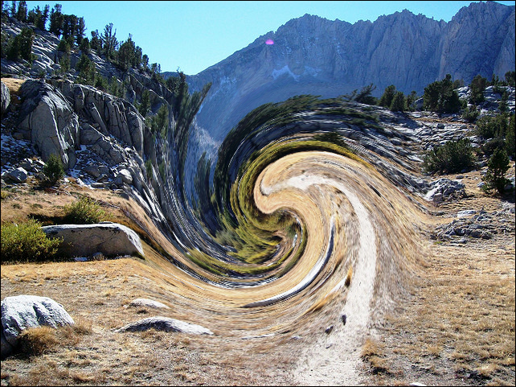

> 推荐阅读：
> [glfx.js - evanw](http://evanw.github.io/glfx.js/)
> [glfx.js Demo - evanw](http://evanw.github.io/glfx.js/demo/)

# 1. Overview
**glfx.js** 是一个基于 **WebGL** 的实时图像效果库，可以实时处理 Web 浏览器中的图像，实现如亮度、对比度、棕褐色效果、噪点、色调、模糊滤镜等效果。



**glfx.js** 包含三个部分：
+ **texture** - 原始图像数据（`` 标签）
+ **filter** - 图像效果（表示一个或多个 WebGL 着色器）
+ **canvas** - 存储并显示图像处理结果的图像缓冲区（`<canvas>` 标签）

需要注意的是：
+ 浏览器必须支持 WebGL 才能使用此库；
+ 由于图片存储在本地时，是默认没有域名的，用 `canvas.texture(image)` 或其他方法时 (如，`canvas.getImageData()` 等)，浏览器会判定其为跨域而报错。所以需要一个本地 Server 来托管该应用。或者直接将图片转为 `base64` 编码的字符串，并赋值给 `image.src`。


---
# 2. Quick Start
下面这个例子展示了 **glfx.js** 最基本的使用方法：创建一个包含 `glfx.js` 和 名为 `image.jpg` 图像的目录，在该目录下创建包含以下代码的 `index.html`。之后打开 `index.html`，就可以看到被处理成水墨画风格的图像了。
```html


<script src="glfx.js"></script>

<script>
window.onload = function() {
    // try to create a WebGL canvas (will fail if WebGL isn't supported)
    try {
        var canvas = fx.canvas();
    } catch (e) {
        alert(e);
        return;
    }

    // convert the image to a texture
    var image = document.getElementById('image');
    var texture = canvas.texture(image);

    // apply the ink filter
    canvas.draw(texture).ink(0.25).update();

    // replace the image with the canvas
    image.parentNode.insertBefore(canvas, image);
    image.parentNode.removeChild(image);
};
</script>
```

注意，除了将 `img` 元素替换为 `canvas` 元素的方法外，还可以直接将 `canvas` 的值转换为 URL 并赋值给`image.src`：
```javascript
image.src = canvas.toDataURL('image/png');
```
但是这样做要慢得多。


---
# 3. Core API
**Canvas Constructor**
```javascript
var canvas = fx.canvas();
```
在使用前必须创建一个 `canvas` 元素对象，该对象必须使用 **glfx.js** 提供的构造函数 `fx.canvas()` 来创建，并且创建之后包含了除 `canvas` 元素对象原生方法以外的由 **glfx.js** 提供的方法。

> 将其放入 `try ... catch ...` 中，如果浏览器不支持 WebGL，会捕获到错误信息。

**Texture Constructor**
```javascript
var texture = canvas.texture(element);
```
从 HTML 元素创建一个 `texture` 对象。参数：
+ `element` - `texture` 对象中要保存的 HTML 元素，可以为 ``，`<canvas>` 或者 `<video>`。

**Draw Image**
```javascript
canvas.draw(texture);
```
这将使用 `texture` 中存储的图像替换 `canvas` 的内容。所有 `filter` 操作都在以 `canvas.draw()` 开头，并以 `canvas.update()` 结尾的方法链中进行。参数：
+ `texture` - 保存了图像数据。

**Update Screen**
```javascript
canvas.update();
```
更新 `canvas`的渲染内容。出于效率原因，每次应用 `filter` 时都不会马上将图像缓冲区渲染到页面上，因此需要在设置好 `filter` 后调用 `update()`。所有 `filter` 操作都在以 `canvas.draw()` 开头，并以 `canvas.update()` 结尾的方法链中进行。

**Update Texture**
```javascript
texture.loadContentsOf(element);
```
将图像从 HTML 元素加载到 `texture` 中，用于更新 `texture`，这样做比先销毁再创建更有效率。参数：
+ `element` - `texture` 对象中要保存的 HTML 元素，可以为 ``，`<canvas>` 或者 `<video>`。

**Destroy Texture**
```javascript
texture.destroy();
```
`texture` 将在不再被引用时被垃圾收集器回收，但用此方法可以立即销毁 `texture` 并释放 GPU 资源。


---
# 4. Filter
所有 `filter` 都是 `canvas` 对象上的方法，可以修改画布上的图像。这意味着必须先在 `canvas` 上 `draw(texture)`，然后才能对其应用 `filter`。出于效率原因，每次应用 `filter` 时都不会马上将图像缓冲区渲染到页面上，因此需要在设置好 `filter` 后调用 `update()`。

## 4.1 Adjust
**Brightness / Contrast** - 亮度 / 对比度 [Demo](http://evanw.github.io/glfx.js/demo/#brightnessContrast)
```javascript
canvas.brightnessContrast(brightness, contrast);
```
修改亮度和对比度。参数：
+ `brightness` - 亮度，取值为 -1 到 1，其中 -1 为纯黑色，0 无变化，1 为纯白色；
+ `contrast` - 对比度，取值为 -1 到 1，其中 -1 为纯灰色，0 无变化，1 为最大对比度。


**Curves** - 曲线
```javascript
canvas.curves(red, green, blue);
```
功能强大的映射工具，借助样条曲线进行插值，可通过任意函数转换图像中的颜色。该 `filter` 可以采用一个或三个参数，这些参数将分别应用于亮度或 RGB 值：
+ `red` - 定义红色通道函数的点数组，每个点由包含两个值的数组构成：即映射前的值和映射后的值，均在 0 到 1 的范围内。例如，`[[0,1]，[1,0]]` 将反转红色通道，而 `[[0,0]，[1,1]]` 会使红色通道保持不变。如果省略 `green` 和 `blue`，则此参数也适用于绿色和蓝色通道。
+ `green` - （可选）定义绿色通道函数的点数组。
+ `blue` - （可选）定义蓝色通道函数的点数组。


**Denoise** - 降噪 [Demo](http://evanw.github.io/glfx.js/demo/#denoise)
```javascript
canvas.denoise(exponent);
```
使用由颜色强度加权的 9x9 盒式滤镜对暗图像中的颗粒噪声进行平滑处理，类似于双边滤镜。参数：
+ `exponent` - 颜色强度差的指数，应大于零。值为零会使图像全模糊，而高值会给出原始图像，但理想值通常在 10-20 左右。


**Hue / Saturation** - 色相 / 饱和度 [Demo](http://evanw.github.io/glfx.js/demo/#hueSaturation)
```javascript
canvas.hueSaturation(hue, saturation);
```
控制色相和饱和度。RGB 颜色空间可以想象为一个立方体，其中轴是红色，绿色和蓝色值。可以通过围绕灰度线旋转颜色矢量来进行色相变换，灰度线是从黑色（0,0,0）到白色（1,1,1）的直线。通过将所有颜色通道值朝向或远离平均颜色通道值进行缩放来实现饱和度。参数：
+ `hue` - 色相，取值为 -1 到 1，其中 -1 为向负方向旋转180度，0 无变化，1 为向正方向旋转180度；
+ `saturation` - 饱和度，取值为 -1 到 1，-1 为全灰色，0 无变化，1 为最大饱和度。


**Noise** - 噪声 [Demo](http://evanw.github.io/glfx.js/demo/#noise)
```javascript
canvas.noise(amount);
```
为图像添加黑白噪声。参数：
+ `amount` - 噪声，取值为 0 到 1，其中 0 无变化，1 为最大噪声。


**Sepia** - 深褐色 [Demo](http://evanw.github.io/glfx.js/demo/#sepia)
```javascript
canvas.sepia(amount);
```
使图像呈现深褐色，模仿旧照片。参数：
+ `amount` - 噪声，取值为 0 到 1，其中 0 无变化，1 为纯深褐色。


**Unsharp Mask** - 虚光蒙版 [Demo](http://evanw.github.io/glfx.js/demo/#unsharpMask)
```javascript
canvas.unsharpMask(radius, strength);
```
通过缩放像素远离其邻近点的平均值，可放大图像中的高频，对图像进行锐化。参数：
+ `radius` - 半径，用于计算相邻像素的平均值；
+ `strength` - 强度，其中 0 无变化，值越高表示效果越强。


**Vibrance** - 自然饱和度 [Demo](http://evanw.github.io/glfx.js/demo/#vibrance)
```javascript
canvas.vibrance(amount);
```
修改不饱和色（饱和度低）的饱和度，保持饱和色（饱和度高）不变。参数：
+ `amount` - 自然饱和度，取值为 -1 到 1，其中 -1 为最小自然饱和度，0 无变化，1 为最大自然饱和度。


**Vignette** - 晕影 [Demo](http://evanw.github.io/glfx.js/demo/#vignette)
```javascript
canvas.vignette(size, amount);
```
添加模拟镜头边缘变暗效果。参数：
+ `size` - 尺寸，取值为 0 到 1，其中 0 表示中心，1 表示边缘；
+ `amount` - 晕影强度，取值为 0 到 1，其中 0 无变化，1 为最大程度变暗。


---
## 4.2 Blur
**Lens Blur** - 镜头模糊 [Demo](http://evanw.github.io/glfx.js/demo/#lensBlur)
```javascript
canvas.lensBlur(radius, brightness, angle);
```
通过使用生成的模糊形状来模仿相机的失焦。参数：
+ `radius` - 模糊半径；
+ `brightness` - 散景的亮度，取值为 -1 到 1（负值会产生暗景）；
+ `angle` - 散景旋转角度（弧度）。


**Tilt Shift** - 移轴摄影 [Demo](http://evanw.github.io/glfx.js/demo/#tiltShift)
```javascript
canvas.tiltShift(startX, startY, endX, endY, blurRadius, gradientRadius);
```
模拟特写摄影中通常遇到的浅景深，这使得场景看起来比实际小得多。该滤镜假定场景是相对平面的，在这种情况下，完全聚焦的场景部分可以用线（焦平面和场景的交线）来描述。参数：
+ `startX` - 线段开始的 x 坐标；
+ `startY` - 线段开始的 y 坐标；
+ `endX` - 线段结束的 x 坐标；
+ `endY` - 线段结束的 y 坐标；
+ `blurRadius` - 模糊半径；
+ `gradientRadius` - 线段到最大模糊半径的距离。


**Triangle Blur** - 三角模糊 [Demo](http://evanw.github.io/glfx.js/demo/#triangleBlur)
```javascript
canvas.triangleBlur(radius);
```
这是最基本的模糊滤镜，可以使用金字塔滤镜对图像进行卷积。参数：
+ `radius` - 模糊半径。


**Zoom Blur** - 缩放模糊 [Demo](http://evanw.github.io/glfx.js/demo/#zoomBlur)
```javascript
canvas.zoomBlur(centerX, centerY, strength);
```
使图像远离某个点模糊，看起来像径向运动模糊。参数：
+ `centerX` - 模糊原点的 x 坐标；
+ `centerY` - 模糊原点的 y 坐标；
+ `strength` - 强度，取值为 0 到 1，其中 0 无变化，1 高度模糊。


---
## 4.3 Warp
**Bulge / Pinch** - 凸起 / 坍缩 [Demo](http://evanw.github.io/glfx.js/demo/#bulgePinch)
```javascript
canvas.bulgePinch(centerX, centerY, radius, strength);
```
使图像某一点上径向凸起或坍缩。参数：
+ `centerX` - 效果圆的圆心的 x 坐标；
+ `centerY` - 效果圆的圆心的 y 坐标；
+ `radius` - 效果圆的半径；
+ `strength` - 强度，取值为 -1 到 1，其中 -1 为强力坍缩，0 无变化，1 为强力凸起。


**Matrix Warp** - 矩阵变形
```javascript
canvas.matrixWarp(matrix, inverse, useTextureSpace);
```
通过 2x2 或 3x3 矩阵转换图像。变换中使用的坐标对于 2×2 矩阵是（x，y）或对于 3×3 矩阵是（x，y，1），其中 x 和 y 以像素为单位。参数：
+ `matrix` - 2x2 或 3x3 矩阵，可以为一维数组或二维数组。 例如，3x3 矩阵 `[[2,0,0]，[0,3,0]，[0,0,1]]` 也可以表示为 `[2,0,0,0,3,0,0,0,1]` 或 `[2,0,0,3]`；
+ `inverse` - 可选，布尔值，默认为false，当为 `true` 时，将应用逆转换；
+ `useTextureSpace` - 布尔值，当为 `true` 时，将使用 `texture` 空间坐标而不是屏幕空间坐标。`texture` 空间坐标范围从 -1 到 1，而不是 0 到宽度 -1 或高度 -1，并且更易于简单操作，如翻转和旋转。


**Perspective** - 透视 [Demo](http://evanw.github.io/glfx.js/demo/#perspective)
```javascript
canvas.perspective(before, after);
```
使用透视变换将一个四边形扭曲成另一个四边形。这可以用于使 2D 图像看起来像 3D 或恢复在 3D 环境中捕获的 2D 图像。参数：
+ `before` - 变换之前的四个点的 x 和 y 坐标组成的数组。对于四个点（ax，ay），（bx，by），（cx，cy）和（dx，dy），则为 `[ax, ay, bx, by, cx, cy, dx, dy]`。
+ `after` - 变换之后的四个点的 x 和 y 坐标组成的数组。

**Swirl** - 漩涡 [Demo](http://evanw.github.io/glfx.js/demo/#swirl)
```javascript
canvas.swirl(centerX, centerY, radius, angle);
```
将图像扭曲成原型漩涡。参数：
+ `centerX` - 圆形区域中心的 x 坐标；
+ `centerY` - 圆形区域中心的 y 坐标；
+ `radius` - 圆形区域的半径；
+ `angle` - 圆形区域中心的像素将旋转的角度（弧度）。


---
## 4.4 Fun
**Color Halftone** - 彩色半色调 [Demo](http://evanw.github.io/glfx.js/demo/#colorHalftone)
```javascript
canvas.colorHalftone(centerX, centerY, angle, size);
```
通过将像素值与四个旋转的 2D 正弦波模式相乘，模拟 CMYK 半色调渲染图像。参数：
+ `centerX` - 模式原点的 x 坐标；
+ `centerY` - 模式原点的 y 坐标；
+ `angle` - 模式旋转角度（弧度）；
+ `size` - 以像素为单位的点的直径。
           
**Dot Screen** - 点网 [Demo](http://evanw.github.io/glfx.js/demo/#dotScreen)
```javascript
canvas.dotScreen(centerX, centerY, angle, size);
```
通过将像素值与旋转的 2D 正弦波模式相乘，模拟图像的黑白半色调渲染图像。参数：
+ `centerX` - 模式原点的 x 坐标；
+ `centerY` - 模式原点的 y 坐标；
+ `angle` - 模式旋转角度（弧度）；
+ `size` - 以像素为单位的点的直径。


**Edge Work** - 边缘检测 [Demo](http://evanw.github.io/glfx.js/demo/#edgeWork)
```javascript
canvas.edgeWork(radius);
```
通过减去以不同半径模糊的图像的两个副本，在图像中挑选出不同的频率。参数：
+ `radius` - 效果的半径（以像素为单位）。


**Hexagonal Pixelate** - 六角形像素化 [Demo](http://evanw.github.io/glfx.js/demo/#hexagonalPixelate)
```javascript
canvas.hexagonalPixelate(centerX, centerY, scale);
```
使用六边形渲染图像，其颜色从中心最邻近点采样。参数：
+ `centerX` - 模式中心的 x 坐标；
+ `centerY` - 模式中心的 y 坐标；
+ `scale` - 单个图块的宽度（以像素为单位）。


**Ink** - 水墨画 [Demo](http://evanw.github.io/glfx.js/demo/#ink)
```javascript
canvas.ink(strength);
```
通过使边缘变暗超过某个阈值来模拟墨迹中的图像。边缘通过减去以不同半径模糊的图像的两个副本，在图像中挑选出不同的频率。参数：
+ `strength` - 墨水边缘的比例，取值为 0 到 1，其中 0 无变化，1 会增加大量黑边。负强度值将创建白色墨水边缘而不是黑色边缘。