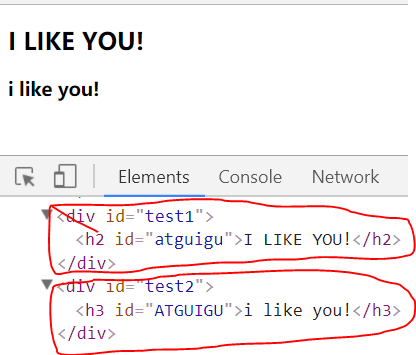
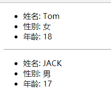
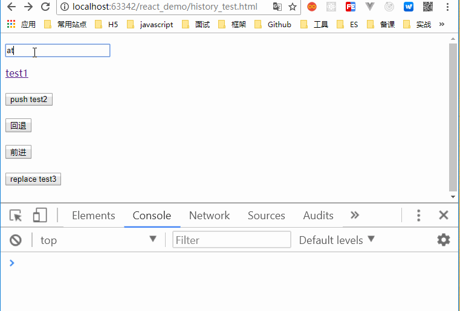

> 推荐阅读：
> [React - A JavaScript library for building user interfaces](https://reactjs.org/)
> [React 入门实例教程 - 阮一峰的网络日志](http://www.ruanyifeng.com/blog/2015/03/react.html)
> [前端框架 React 视频教程全集（45P） - 张晓飞 | 尚硅谷](https://www.bilibili.com/video/av59726903)

# 1. React 入门
## 1.1 React 的基本认识
> 英文官网 - [https://reactjs.org/](https://reactjs.org/)
> 中文官网 - [https://react.docschina.org/](https://react.docschina.org/)

+ 用于构建用户界面的 JS 库（只关注于 View），由 Facebook 开源；
+ React 的特点：
    + Declarative（声明式）
    + Component-Based（组件化）
    + Learn Once, Write Anywhere（一次学习，随处编写）
    + 支持客户端与服务器渲染
    + 高效
    + 单向数据流
+ React 高效的原因
    + 虚拟 (virtual) DOM, 不总是直接操作 DOM (批量更新, 减少更新的次数) 
    + 高效的 DOM Diff 算法, 最小化页面重绘(减小页面更新的区域)

---
## 1.2 React 的基本使用
> [Demo - react_test/01_HelloWorld/test.html](https://github.com/roarcurry/learn-react/blob/master/react_test/01_HelloWorld/test.html)

效果如下：

    
1. 导入 React 相关 JS 库：
    + `react.js` - React 的核心库
    + `react-dom.js` - 提供操作 DOM 的 React 扩展库
    + `babel.min.js` - 解析 JSX 语法代码转为纯 JS 语法代码的库
2. 编码：
    ```html
    <div id="test"></div>
    <script type="text/babel">/* 必须声明 babel，告诉 babel.js 解析里面的 jsx 的代码 */
        // 1. 创建虚拟 DOM 元素对象
        var vDom = <h1>Hello React!</h1>; // 不是字符串，不能加单引号或双引号
    
        // 2. 将虚拟 DOM 渲染到页面真实 DOM 容器中
        ReactDOM.render(vDom, document.getElementById('test'));
    </script>
    ```
3. 使用 React 开发者工具调试
Chrome 浏览器可以安装一个名为 `React Developer Tools` 的扩展程序，可以帮助开发者针对 React 进行调试。


---
## 1.3 React JSX
**虚拟 DOM**
> [Demo - react_test/02_JSX/test.html](https://github.com/roarcurry/learn-react/blob/master/react_test/02_JSX/test.html)

效果如下：


+ React 提供了一些 API 来创建一种 `特别` 的 JS 对象
    + `var element = React.createElement('h1', {id:'myTitle'}, 'hello');`
    + 上面这行代码就创建了一个简单的虚拟 DOM 对象
+ 虚拟 DOM 对象最终都会被 React 转换为真实的 DOM
+ 我们编码时基本只需要操作 React 的虚拟 DOM 相关数据, React 会转换为真实 DOM 变化而更新界面
```html
<script type="text/javascript"> /* 因为没有用到 JSX 语法，所以不用声明 babel */
   const msg = "I Like You";
   const myId = "root";
    
   // 1. 创建虚拟 DOM
   const vDom1 = React.createElement('h1', {id:myId.toLowerCase()}, msg.toUpperCase());
   // 2. 渲染虚拟 DOM
   ReactDOM.render(vDom1, document.getElementById('test1'));
</script>

<script type="text/babel"> /* 用了 JSX 语法，所以要声明 babel */
   // 1. 创建虚拟 DOM
   const vDom2 = <h3 od="{myId.toUpperCase()}">{msg.toLowerCase()}</h3>
   // 2. 渲染虚拟 DOM
   ReactDOM.render(vDom2, document.getElementById('test2'));
</script>
```


**JSX**
+ 全称：JavaScript XML
+ React 定义的一种类似于 XML 的 JS 扩展语法: XML + JS
+ 作用：用来创建 React 虚拟 DOM (元素)对象
    + `var vDom = <h1>Hello React!</h1>;`
    + 注意：它不是字符串，也不是 HTML/XML标签；它最终产生的就是一个 JS 对象
+ 标签名任意：HTML 标签或其它标签
+ 标签属性任意：HTML 标签属性或其它
+ 基本语法规则：
    + 遇到 `<` 开头的代码，以标签的语法解析：HTML 同名标签转换为 HTML 同名元素，其它标签需要特别解析
    + 遇到 `{` 开头的代码，以 JS 语法解析：标签中的 JS 代码必须用 `{ }` 包含
+ `babel.js` 的作用：
    + 浏览器不能直接解析 JSX 代码, 需要 babel 转译为纯 JS 的代码才能运行
    + 只要用了 JSX，都要在 `<script>` 标签加上 `type="text/babel"` 属性，声明需要 babel 来处理

**创建虚拟 DOM**
+ 纯 JS(一般不用)
`React.createElement('h1',  {id:'myTitle'},  title)`
+ JSX：
`<h1 id='myTitle'>{title}</h1>`

**渲染虚拟 DOM**
+ 语法：`ReactDOM.render(virtualDOM, containerDOM)`
+ 作用：将虚拟 DOM 元素渲染到页面中的真实容器 DOM 中显示
+ 参数：
    + `virtualDOM` - 纯 JS 或 JSX 创建的虚拟 DOM 对象
    + `containerDOM` - 用来包含虚拟 DOM 元素的真实 DOM 元素对象(一般是一个 `div`)

**JSX 练习**
> 动态展示列表数据 - [Demo - react_test/02_JSX/demo.html](https://github.com/roarcurry/learn-react/blob/master/react_test/02_JSX/demo.html)

效果如下：


+ 在解析显示 JS 数组时，React 会自动遍历显示
+ 把数据的数组转换为标签的数组，使用数组的 `map()` 方法：
    ```jsx
    const ul = (
      <ul>
        {
          names.map((name, index) => <li key={index}>{name}</li>)
        }
      </ul>
    );
    ```
    ES5 可以这样写
    ```jsx
    var ul = (
      <ul>
        {
          names.map(function(name, index){
            return <li key={index}>{name}</li>;
          })
        }
      </ul>
    );
    ```
    
    
---
## 1.4 模块与组件和模块化与组件化的理解
**模块**
+ 理解：向外提供特定功能的 JS 程序，一般就是一个 JS 文件
+ 为什么：JS 代码更多更复杂
+ 作用：复用 JS，简化 JS 的编写, 提高 JS 运行效率

**组件**
+ 理解：用来实现特定(局部)功能效果的代码集合 (html/css/js)
+ 为什么：一个界面的功能更复杂
+ 作用：复用编码，简化项目编码，提高运行效率

**模块化**
当应用的 JS 都以模块来编写的，这个应用就是一个模块化的应用

**组件化**
当应用是以多组件的方式实现，这个应用就是一个组件化的应用


---
# 2. React 面向组件编程
## 2.1 基本理解和使用
> [Demo - react_test/03_component_basic/test.html](https://github.com/roarcurry/learn-react/blob/master/react_test/03_component_basic/test.html)

效果如下：


步骤：
1. 定义组件
2. 渲染组件标签
    
**自定义组件**
+ 方式一：工厂函数组件(简单组件：没有状态的组件)
  ```jsx
  function MyComponent() {
    return <h2>工厂函数组件(简单组件)</h2>;
  }
  ```
+ 方式二：ES6 类组件(复杂组件)
  ```jsx
  class MyComponent2 extends React.Component {
    render() {
      return <h2>ES6 类组件(复杂组件)</h2>;
    }
  }
  ```

**渲染组件标签**
```javascript
ReactDOM.render(<MyComponent />, document.getElementById('example1'));
```

**注意**
+ 组件名必须首字母大写
+ 虚拟 DOM 元素只能有一个根元素
+ 虚拟 DOM 元素必须有结束标签

**`render()` 渲染组件标签的基本流程**
+ React 内部会创建组件实例对象
+ 得到包含的虚拟 DOM 并解析为真实 DOM
+ 插入到指定的页面元素内部


---
## 2.2 组件的 3 大属性 1: state
> [Demo - react_test/04_component_state/test.html](https://github.com/roarcurry/learn-react/blob/master/react_test/04_component_state/test.html)

效果如下：


**理解**
+ `state` 是组件对象最重要的属性, 值是对象(可以包含多个数据)
+ 组件被称为"状态机", 通过更新组件的 `state` 来更新对应的页面显示(重新渲染组件)

**编码操作**
1. 初始化状态
    ```jsx
    constructor(props) {
	    super(props);
        this.state = {
           stateProp1 : value1,
           stateProp2 : value2
        };
    }
    ```
2. 读取状态值
    ```jsx
    this.state.statePropertyName
    ```
3. 更新状态值
    ```jsx
    this.setState({
        stateProp1 : value1,
        stateProp2 : value2
    })
    ```


---
## 2.3 组件的 3 大属性 2: props
> [Demo - react_test/05_component_props/test.html](https://github.com/roarcurry/learn-react/blob/master/react_test/05_component_props/test.html)

需求: 自定义用来显示一个人员信息的组件
1. 姓名必须指定
2. 如果性别没有指定, 默认为男
3. 如果年龄没有指定, 默认为18
  
效果如下：


**理解**
+ 每个组件对象都会有 `props`(properties 的简写)属性
+ 组件标签的所有属性都保存在 `props` 中

**编码操作**
1. 内部读取某个属性值
    ```javascript
    this.props.propertyName
    ```
2. 对 `props` 中的属性值进行类型限制和必要性限制
    ```javascript
    // 自 React v15.5 起弃用
    Person.propTypes = {
        name: React.PropTypes.string.isRequired,
        age: React.PropTypes.number.isRequired
    };
    // React v15.5 以后
    Person.propTypes = {
        name: PropTypes.string.isRequired,
        age: PropTypes.number
    };
    ```
3. 扩展属性: 将对象的所有属性通过 `props` 传递
    ```jsx
    <Person {...person}/>
    ```
4. 默认属性值
    ```jsx
    Person.defaultProps = {
        age: 18,
        sex: '男'
    };
    ```
5. 组件类的构造函数
    ```jsx
    constructor (props) {
        super(props)
        console.log(props) // 查看所有属性
    }
    ```

**面试题**
问题: 请区别一下组件的 `props` 和 `state` 属性
1)	`state`: 组件自身内部可变化的数据
2)	`props`: 从组件外部向组件内部传递数据, 组件内部只读不修改

**`...` 的作用**
1. 打包
    ```javascript
    function fn(...arr){}
    fn(1, 2, 3);
    ```
2. 解包
    ```javascript
    const arr1 = [1, 2, 3];
    const arr2 = [6, ...arr1, 9];
    ```

---
## 2.4 组件的 3 大属性 3: refs 和事件处理
> [Demo - react_test/06_component_refs_event/test.html](https://github.com/roarcurry/learn-react/blob/master/react_test/06_component_refs_event/test.html)

需求: 自定义组件, 功能说明如下:
1. 点击按钮, 提示第一个输入框中的值
2. 当第 2 个输入框失去焦点时, 提示这个输入框中的值

效果如下：


**refs**
+ 组件内的标签都可以定义 `ref` 属性来标识自己
    1. `<input type="text" ref={input => this.msgInput = input}/>` 或者 `<input type="text" ref="refName"/>` (不建议)
    2. 回调函数在组件初始化渲染完或卸载时自动调用
+ 在组件中可以通过 `this.msgInput` 或者 `this.refs.refName` (不建议)来得到对应的真实 DOM 元素
+ 作用: 通过 `ref` 获取组件内容特定标签对象, 进行读取其相关数据

**event**
+ 通过 `onXxx` 属性指定组件的事件处理函数(注意大小写)
    1. React 使用的是自定义(合成)事件, 而不是使用的原生 DOM 事件, 如：`onClick` `onBlur`（原生 DOM 事件为 `onclick` `onblur`）
    2. React 中的事件是通过事件委托方式处理的(委托给组件最外层的元素)
+ 通过 `event.target` 得到发生事件的 DOM 元素对象
    ```jsx
    <input onFocus={this.handleFocus}/>
    handleFocus(event) {
        event.target  //返回 input 对象
    }
    ```

**注意**
+ 组件内置的方法中的 `this` 为组件对象
+ 在组件类中自定义的方法中 `this` 为 `undefined`
    1. 强制绑定 `this`: 通过函数对象的 `bind()`
    2. 箭头函数(ES6 模块化编码时才能使用)


---
## 2.5 组件的组合
> [Demo - react_test/07_components_composing/test.html](https://github.com/roarcurry/learn-react/blob/master/react_test/07_components_composing/test.html)

功能: 组件化实现此功能
1. 显示所有 `todo` 列表
2. 输入文本, 点击按钮显示到列表的首位, 并清除输入的文本

效果如下：


**功能界面的组件化编码流程(无比重要)**
+ 拆分组件: 拆分界面, 抽取组件
+ 实现静态组件: 使用组件实现静态页面效果
+ 实现动态组件
    1. 动态显示初始化数据
    2. 交互功能(从绑定事件监听开始)

**注意**
+ 问题1：数据保存在哪个组件内？
    + 看数据是某个组件需要（给它），还是某些组件需要（给共同的父组件）
+ 问题2：如何在子组件中改变父组件的状态？
    + 子组件中不能直接改变父组件的状态，状态在哪个组件，更新状态的行为就应该定义在哪个组件
    + 解决：父组件定义函数，传递给子组件，子组件调用


---
## 2.6 收集表单数据
> [Demo - react_test/08_component_form/test.html](https://github.com/roarcurry/learn-react/blob/master/react_test/08_component_form/test.html)

功能: 自定义包含表单的组件
1. 输入用户名密码后, 点击登陆提示输入信息
2. 不提交表单

效果如下：


**理解**
+ 问题: 在 react 应用中, 如何收集表单输入数据
+ 包含表单的组件分类：
    1. 受控组件: 表单项输入数据能自动收集成状态
        `<input type="password" value={this.state.pwd} onChange={this.handleChange}/>`
    2. 非受控组件: 需要时才手动读取表单输入框中的数据
        `<input type="text" ref={input => this.nameInput = input}/>`


---
## 2.7 组件生命周期
> [Demo - react_test/09_component_lifecycle/test.html](https://github.com/roarcurry/learn-react/blob/master/react_test/09_component_lifecycle/test.html)

功能: 自定义组件
1. 让指定的文本做显示/隐藏的渐变动画
2. 切换持续时间为 2S
3. 点击按钮从界面中移除组件界面

效果如下：


**理解**
+ 组件对象从创建到死亡它会经历特定的生命周期阶段
+ React 组件对象包含一系列的勾子函数(生命周期回调函数), 在生命周期特定时刻回调
+ 我们在定义组件时, 可以重写特定的生命周期回调函数, 做特定的工作


**生命周期详述**
+ 组件的三个生命周期状态：
    + `Mount`：插入真实 DOM
    + `Update`：被重新渲染
    + `Unmount`：被移出真实 DOM
+ React 为每个状态都提供了勾子 (hook) 函数：
    + `componentWillMount()`
    + `componentDidMount()`
    + `componentWillUpdate()`
    + `componentDidUpdate()`
    + `componentWillUnmount()`
+ 生命周期流程:
    + 第一次初始化显示: `ReactDOM.render(<Xxx/>, containDom)`
        1. `constructor()`
        2. `componentWillMount()` : 将要插入回调
        3. `render()` : 用于插入虚拟 DOM 回调
        4. `componentDidMount()` : 已经插入回调
    + 每次更新 `state`: `this.setState({})`
        1. `componentWillReceiveProps()`: 接收父组件新的属性
        2. `componentWillUpdate()` : 将要更新回调
        3. `render()` : 更新(重新渲染)
        4. `componentDidUpdate()` : 已经更新回调
    + 删除组件: `ReactDOM.unmountComponentAtNode(div)`: 移除组件
        `componentWillUnmount()` : 组件将要被移除回调
+ 常用的 hook 函数：
    + `render()` - 初始化渲染或更新渲染调用
    + `constructor()`: 初始化状态, 绑定 `this`(可以箭头函数代替)
    + `componentDidMount()` - 只执行一次, 已经在 DOM 树中, 适合启动/设置一些监听，如发送 `ajax` 请求
    + `componentWillUnmount()` - 只执行一次, 做一些收尾工作, 如: 清理定时器
    + `componentWillReceiveProps()` - 后面会介绍

**命令式编程与声明式编程**
+ 命令式编程：要关注做什么和怎么做(流程), 类似于问答题
+ 声明式编程：只关注做什么, 而不关注怎么做(流程), 类似于填空题
```javascript
var arr = [1, 3, 5, 7]
// 需求: 得到一个新的数组, 数组中每个元素都比 arr 中对应的元素大10: [11, 13, 15, 17]

// 命令式编程，关注流程
var arr2 = []
for(var i =0;i<arr.length;i++) {
    arr2.push(arr[i]+10)
}
console.log(arr2)

// 声明式编程，不关注流程
var arr3 = arr.map(function(item){
    return item +10
})
// 声明式编程是建立命令式编程的基础上

// 数组中常见声明式方法
map() / forEach() / find() / findIndex()
```

---
## 2.8 虚拟 DOM 与 DOM Diff 算法
> [Demo - react_test/10_vDOM-DOMDiff/test.html](https://github.com/roarcurry/learn-react/blob/master/react_test/10_vDOM-DOMDiff/test.html)

虚拟 DOM + DOM Diff 算法：最小化页面重绘。

效果如下：


**虚拟 DOM 是什么?**
+ 一个虚拟 DOM (元素)是一个一般的 JS 对象, 准确的说是一个对象树(倒立的)
+ 虚拟 DOM 保存了真实 DOM 的层次关系和一些基本属性，与真实 DOM 一一对应
+ 如果只是更新虚拟 DOM, 页面是不会重绘的

**Virtual DOM 算法的基本步骤**
+ 用 JS 对象树表示 DOM 树的结构；然后用这个树构建一个真正的 DOM 树插到文档当中
+ 当状态变更的时候，重新构造一棵新的对象树。然后用新的树和旧的树进行比较，记录两棵树差异
+ 把差异应用到真实 DOM 树上，视图就更新了

**进一步理解**
+ Virtual DOM 本质上就是在 JS 和 DOM 之间做了一个缓存
+ 可以类比 CPU 和硬盘，既然硬盘这么慢，我们就在它们之间加个缓存：既然 DOM 这么慢，我们就在它们 JS 和 DOM 之间加个缓存。CPU（JS）只操作内存（Virtual DOM），最后的时候再把变更写入硬盘（DOM）。

**基本原理图**


---
# 3. React 应用（基于 React 脚手架）
## 3.1 使用 `create-react-app` 创建 React 应用
> [Create React App - facebook | GitHub](https://github.com/facebook/create-react-app)
> [Demo - react_demo/src-base](https://github.com/roarcurry/learn-react/blob/master/react_demo/src-base)

**React 脚手架**
+ 脚手架：用来帮助程序员快速创建一个基于 xxx 库的模板项目：
    + 包含了所有需要的配置
    + 指定好了所有的依赖
    + 可以直接安装/编译/运行一个简单效果
+ React 提供了一个用于创建 React 项目的脚手架库: `create-react-app`
+ 项目的整体技术架构为:  react + webpack + es6 + eslint
+ 使用脚手架开发的项目的特点: 模块化, 组件化, 工程化

**创建项目并启动**
```
$ npm install -g create-react-app
$ create-react-app hello-react
$ cd hello-react
$ npm start
```

**React 脚手架项目结构**
```
react_app
    |--node_modules---第三方依赖模块文件夹
    |--public
        |-- index.html-----------------主页面
    |--scripts
        |-- build.js-------------------build打包引用配置
    |-- start.js-------------------start运行引用配置
    |--src------------源码文件夹
        |--components-----------------react组件
        |--index.js-------------------应用入口js
    |--.gitignore------git版本管制忽略的配置
    |--package.json----应用包配置文件 
    |--README.md-------应用描述说明的readme文件
```


---
## 3.2 评论管理 Demo
> [Demo - react_demo/src-comment](https://github.com/roarcurry/learn-react/blob/master/react_demo/src-comment)

效果如下：


**拆分组件**
+ 应用组件: App
    `state: comments/array`
+ 添加评论组件: CommentAdd
    `state: username/string, content/string`
   ` props: add/func`
+ 评论列表组件: CommentList
    `props: comments/array, delete/func`
+ 评论项组件: CommentItem
    `props: comment/object, delete/func, index/number`


**实现静态组件**
> [Demo - react_demo/public/comment_page](https://github.com/roarcurry/learn-react/blob/master/react_demo/public/comment_page)

上面这个目录包含了已经实现的静态页面，可以用作构建组件的参考。

**实现动态组件**
+ 动态展示初始化数据
    + 初始化状态数据
	+ 传递属性数据
+ 响应用户操作, 更新组件界面
	+ 绑定事件监听, 并处理
	+ 更新 state


---
# 4. React Ajax
## 4.1 简介
**前置说明**
+ React 本身只关注于界面, 并不包含发送 ajax 请求的代码
+ 前端应用需要通过 ajax 请求与后台进行交互(json 数据)
+ React 应用中需要集成第三方 ajax 库(或自己封装)

**常用的 ajax 请求库**
+ **jQuery**: 比较重, 如果需要另外引入不建议使用
+ **Axios**: 轻量级, 建议使用
    + 封装 XmlHttpRequest 对象的 ajax
    + promise 风格
    + 可以用在浏览器端和 node 服务器端
+ **Fetch**: 原生函数, 但老版本浏览器不支持
    + 不再使用 XmlHttpRequest 对象提交 ajax 请求
    + 为了兼容低版本的浏览器, 可以引入兼容库 fetch.js

> [Demo - react_test/11_ajax/test.html](https://github.com/roarcurry/learn-react/blob/master/react_test/11_ajax/test.html)

需求:
1. 界面效果如下
2. 根据指定的关键字在 github 上搜索匹配的最受关注的库 (most star repo) (`q=re&sort=stars`)
3. 显示库名, 点击链接查看库
4. 测试接口: `https://api.github.com/search/repositories?q=re&sort=stars`

效果如下：


---
## 4.2 Axios
> [Axios Documentation | GitHub](https://github.com/axios/axios)

**Get 请求**
```javascript
axios.get('/user?ID=12345')
  .then(function (response) {
    console.log(response);
  })
  .catch(function (error) {
    console.log(error);
  });

axios.get('/user', {
    params: {
      ID: 12345
    }
  })
  .then(function (response) {
    console.log(response);
  })
  .catch(function (error) {
    console.log(error);
  });
```
**Post 请求**
```javascript
axios.post('/user', {
    firstName: 'Fred',
    lastName: 'Flintstone'
})
.then(function (response) {
  console.log(response);
})
.catch(function (error) {
  console.log(error);
});
```


---
## 4.3 Fetch
> [Fetch Documentation | GitHub](https://github.github.io/fetch/)
> [传统 Ajax 已死，Fetch 永生 - Cam | segmentfault](https://segmentfault.com/a/1190000003810652)

**Get 请求**
```javascript
fetch(url).then(function(response) {
  return response.json()
}).then(function(data) {
  console.log(data)
}).catch(function(e) {
  console.log(e)
});
```
**Post 请求**
```javascript
fetch(url, {
  method: "POST",
  body: JSON.stringify(data),
}).then(function(data) {
  console.log(data)
}).catch(function(e) {
  console.log(e)
})
```


---
## 4.4 搜索 GitHub 用户 Demo
> [Demo - react_demo/src-users](https://github.com/roarcurry/learn-react/blob/master/react_demo/src-users)

效果如下：


**拆分组件**
+ 应用组件: App
    `state: searchName/string`
+ 搜索组件: Search
   ` props: setSearchName/func`
+ 用户组件: Main
    `state: initView/bool, loading/bool, users/array, errorMsg/string`
    `props: searchName/string`


**实现静态组件**
> [Demo - react_demo/public/users_page](https://github.com/roarcurry/learn-react/blob/master/react_demo/public/users_page)

上面这个目录包含了已经实现的静态页面，可以用作构建组件的参考。

**实现动态组件**
+ 组件生命周期中存在一个勾子函数 `componentWillReceiveProps(nextProps)`: 监视接收到新的 `props`, 可以在此函数中发送 `ajax`
+ 使用 Axios 库发送 ajax 请求


---
# 5. 几个重要技术总结
## 5.1 组件间通信
**方式一：通过 props 传递**
+ 共同的数据放在父组件上, 特有的数据放在自己组件内部(state)
+ 通过 props 可以传递一般数据和函数数据, 只能一层一层传递
+ 一般数据 --> 父组件传递数据给子组件 --> 子组件读取数据
+ 函数数据 --> 子组件传递数据给父组件 --> 子组件调用函数

**方式二：使用消息订阅(subscribe)-发布(publish)机制**
+ 工具库: [PubSubJS](https://github.com/mroderick/PubSubJS)
+ 下载: `npm install pubsub-js --save`
+ 使用: 
    ```javascript
    import PubSub from 'pubsub-js'; // 引入
    PubSub.subscribe('msgName', (msg, data) => {
        console.log(msg, data);
    }); // 订阅消息
    PubSub.publish('msgName', data); // 发布消息
    ```

**方式三：Redux**
详情请查看 [8. Redux](/#8-redux)


---
## 5.2 事件监听
**原生 DOM 事件**
1. 绑定事件监听
    + 事件名(类型): 只有有限的几个, 不能随便写
    + 回调函数
2. 触发事件
    + 用户操作界面
    + 事件名(类型)
    + 数据()

**自定义事件(消息机制)**
1. 绑定事件监听
    + 事件名(类型): 任意
    + 回调函数: 通过形参接收数据, 在函数体处理事件
2. 触发事件(编码)
    + 事件名(类型): 与绑定的事件监听的事件名一致
    + 数据: 会自动传递给回调函数


---
## 5.3 ES6 常用语法
+ 定义常量/变量: `const`/`let`
+ 解构赋值: `let {a, b} = this.props`, `import {aa} from 'xxx'`
+ 对象的简洁表达: `{a, b}`
+ 箭头函数: 
    + 常用场景:
        + 组件的自定义方法: `xxx = () => {}`
        + 参数匿名函数
    + 优点:
		+ 简洁
		+ 没有自己的 `this`,使用引用 `this` 查找的是外部 `this`
+ 扩展(三点)运算符: 拆解对象(`const MyProps = {}`, ` <Xxx {...MyProps}>`)
+ 类:  `class`/`extends`/`constructor`/`super`
+ ES6 模块化:  `export` `default` | `import`


---
# 6. React Router
## 6.1 简介
**react-router**
+ React 的一个插件库，[官网](https://reacttraining.com/react-router/)
+ 专门用来实现一个 SPA（单页）应用
+ 基于 React 的项目基本都会用到此库

**SPA**
+ 单页 Web 应用（single page web application，SPA）
+ 整个应用只有一个完整的页面
+ 点击页面中的链接不会刷新页面, 本身也不会向服务器发请求
+ 当点击**路由链接**时, 只会做页面的局部更新
+ 数据都需要通过 ajax 请求获取, 并在前端异步展现

**路由**
1. 什么是路由?
    + 一个路由就是一个映射关系(`key`: `value`)
    + `key` 为路由路径, `value` 可能是 `function`/`component`
2. 路由分类
    + 后台路由: node 服务器端路由, `value` 是 `function`, 用来处理客户端提交的请求并返回一个响应数据
    + 前台路由: 浏览器端路由, `value` 是 `component`, 当请求的是路由 `path` 时, 浏览器端前没有发送 http 请求, 但界面会更新显示对应的组件 
3. 后台路由
    + 注册路由: `router.get(path, function(req, res))`
    + 当 node 接收到一个请求时, 根据请求路径找到匹配的路由, 调用路由中的函数来处理请求, 返回响应数据
4. 前端路由
    + 注册路由: `<Route path="/about" component={About}>`
    + 当浏览器的 `hash` 变为 `#about` 时, 当前路由组件就会变为 `About` 组件

**前端路由的实现**
1. history 库
    + 网址: [https://github.com/ReactTraining/history](https://github.com/ReactTraining/history)
    + 管理浏览器会话历史 (history) 的工具库
    + 包装的是原生 BOM 中 `window.history` 和 `window.location.hash`
2. history API
    + `History.createBrowserHistory():` - 得到封装 `window.history` 的管理对象
    + `History.createHashHistory():` - 得到封装 `window.location.hash` 的管理对象
    + `history.push():` - 添加一个新的历史记录
    + `history.replace():` - 用一个新的历史记录替换当前的记录
    + `history.goBack():` - 回退到上一个历史记录
    + `history.goForword():` - 前进到下一个历史记录
    + `history.listen(function(location){}):` - 监视历史记录的变化

**关于 url 中的 #**
1. 理解 `#`
    `#` 代表网页中的一个位置。其右面的字符，就是该位置的标识符
    改变 `#` 不触发网页重载
    改变 `#` 会改变浏览器的访问历史
2. 操作 `#`
    `window.location.hash` 读取 `#` 值
    `window.onhashchange = func` 监听 `hash` 改变
3. 学习资源: 
    阮一峰教程: [http://www.ruanyifeng.com/blog/2011/03/url_hash.html](http://www.ruanyifeng.com/blog/2011/03/url_hash.html)


> [Demo - react_router/history_test.html](https://github.com/roarcurry/learn-react/blob/master/react_router/history_test.html)

效果如下：



---
## 6.2 react-router 相关 API
**组件**
1. `<BrowserRouter>` - 路由器组件, 用来包含各个路由组件
2. `<HashRouter>` - 路由器组件, 用来包含各个路由组件（路由链接多个 `#`）
3. `<Route>` - 路由组件, 注册路由
4. `<Redirect>` - 重定向
5. `<Link>` - 路由链接
6. `<NavLink>` - 路由链接（提供 `activeClassName` 属性，点击之后可以添加 Class）
7. `<Switch>` - 可切换的路由组件（用来包含 `<Route/>`）

**对象**
1. `this.props.history` 对象
    + `push()` - 跳转
    + `replace()` - 替换
    + `goBack()` - 返回
    + `goForward()` - 前进
2. `this.props.match` 对象
    + `params` - 参数
3. `withRouter` 函数


---
## 6.3 react-router 基本使用
> [Demo - react_router](https://github.com/roarcurry/learn-react/blob/master/react_router)

效果如下：


**准备**
1. 下载 `react-router`: `$ npm install --save react-router-dom`
2. 引入 `bootstrap.css`: `<link rel="stylesheet" href="/css/bootstrap.css">`

**如何编写路由效果**
1. 编写路由组件
2. 在父路由组件中指定两个标签
    1. 路由链接：`<NavLink />`
    2. 路由：`<Route />`


---
## 6.4 嵌套路由使用
> [Demo - react_router](https://github.com/roarcurry/learn-react/blob/master/react_router)

效果如下：


---
## 6.5 向路由组件传递数据
> [Demo - react_router](https://github.com/roarcurry/learn-react/blob/master/react_router)

效果如下：


---
## 6.6 多种路由跳转方式
> [Demo - react_router](https://github.com/roarcurry/learn-react/blob/master/react_router)

效果如下：


---
# 7. React UI
## 7.1 流行的开源组件库
**material-ui**
> [material-ui | Official](https://material-ui.com/)
> [material-ui | GitHub](https://github.com/mui-org/material-ui)

**ant-design**
> [ant-design | Official](https://ant.design/index-cn)
> [ant-design | GitHub](https://github.com/ant-design/ant-design)
> [ant-design-mobile | Official](https://mobile.ant.design/index-cn)
> [ant-design-mobile | GitHub](https://github.com/ant-design/ant-design-mobile)


---
## 7.2 ant-design-mobile 使用入门
> [Demo - react_ui](https://github.com/roarcurry/learn-react/blob/master/react_ui)

效果如下：


1. 先使用 `create-react-app` 创建 react 应用
    ```
    npm install create-react-app -g
    create-react-app react_ui
    cd react_ui
    npm start
    ```
2. 搭建 `antd-mobile` 的基本开发环境
    ```
    npm install antd-mobile --save
    ```
3. html 模板
    ```html
    <meta name="viewport" content="width=device-width, initial-scale=1, maximum-scale=1, minimum-scale=1, user-scalable=no" />
    
    <script src="https://as.alipayobjects.com/g/component/fastclick/1.0.6/fastclick.js"></script>
    <script>
      if ('addEventListener' in document) {
        document.addEventListener('DOMContentLoaded', function() {
          FastClick.attach(document.body);
        }, false);
      }
      if(!window.Promise) {
        document.writeln('<script src="https://as.alipayobjects.com/g/component/es6-promise/3.2.2/es6-promise.min.js"'+'>'+'<'+'/'+'script>');
      }
    </script>
    ```
4. 引入样式
```jsx
import 'antd-mobile/dist/antd-mobile.css';  // or 'antd-mobile/dist/antd-mobile.less'
```
5. 引入需要使用的组件
```jsx
import Button from 'antd-mobile/lib/button'
import Toast from 'antd-mobile/lib/toast'

export default class App extends Component {
  handleClick = () => {
    Toast.info('提交成功', 2);
  };

  render() {
    return (
      <div>
        <Button type="primary" onClick={this.handleClick}>提交</Button>
      </div>
    )
  }
}
```

---
## 7.3 实现按需打包（组件 js/css）
1. 下载依赖包
    ```
    npm install react-app-rewired --save-dev
    npm install babel-plugin-import --save-dev
    ```
2. 修改默认配置 `package.json`
    ```
    "scripts": {
      "start": "react-app-rewired start",
      "build": "react-app-rewired build",
      "test": "react-app-rewired test --env=jsdom"
    }
    ```
3. 创建 `config-overrides.js`
    ```
    const {injectBabelPlugin} = require('react-app-rewired');
    module.exports = function override(config, env) {
      config = injectBabelPlugin(['import', {libraryName: 'antd-mobile', style: 'css'}], config);
      return config;
    };
    ```
4. 编码
```jsx
// import 'antd-mobile/dist/antd-mobile.css'

// import Button from 'antd-mobile/lib/button'
// import Toast from 'antd-mobile/lib/toast'
import {Button, Toast} from 'antd-mobile'
```


---
# 8. Redux
## 8.1 简介
> 英文文档: [https://redux.js.org/](https://redux.js.org/)
> 中文文档: [http://www.redux.org.cn/](http://www.redux.org.cn/)
> Github: [https://github.com/reactjs/redux](https://github.com/reactjs/redux)

+ Redux 是一个独立专门用于做状态管理的 JS 库(不是 React 插件库)
+ 它可以用在 Redux, Redux, Redux 等项目中, 但更多与 React 配合使用
+ 作用: 集中式管理 React 应用中多个组件共享的状态

Redux 工作流程：


Redux 使用场景：
+ 总体原则: 能不用就不用, 如果不用比较吃力才考虑使用
+ 某个组件的状态，需要共享
+ 某个状态需要在任何地方都可以拿到
+ 一个组件需要改变全局状态
+ 一个组件需要改变另一个组件的状态

> 但目前基本上都会使用 Redux


---
## 8.2 Redux 核心 API
**`store` 对象**
+ 作用: Redux 库最核心的管理对象
+ 它内部维护着:
    + `state`
    + `reducer`
+ 核心方法:
    + `getState()`
    + `dispatch(action)`
    + `subscribe(listener)`
+ 编码:
    ```jsx
    store.getState()
    store.dispatch({type:'INCREMENT', number})
    store.subscribe(render)
    ```

**`createStore()`**
+ 作用: 创建包含指定 `reducer` 的 `store` 对象
+ 编码:
    ```jsx
    import {createStore} from 'redux'
    import counter from './reducers/counter'
    const store = createStore(counter)
    ```

**`applyMiddleware()`**
+ 作用: 应用上基于 Redux 的中间件(插件库)
+ 编码:
    ```jsx
    import {createStore, applyMiddleware} from 'redux'
    import thunk from 'redux-thunk'  // redux异步中间件
    const store = createStore(
      counter,
      applyMiddleware(thunk) // 应用上异步中间件
    )
    ```

**`combineReducers()`**
+ 作用: 合并多个 `reducer` 函数
+ 编码:
    ```jsx
    export default combineReducers({
      user,
      chatUser,
      chat
    })
    ```

---
## 8.3 Redux 三个核心概念
**action**
+ 标识要执行行为的对象
+ 包含 2 个方面的属性
    + `type`: 标识属性, 值为字符串, 唯一, 必要属性
    + `xxx`: 数据属性, 值类型任意, 可选属性
+ 例子:
    ```jsx
    const action = {
        type: 'INCREMENT',
        data: 2
    }
    ```		
+ Action Creator(创建 Action 的工厂函数)
    ```jsx
    const increment = (number) => ({type: 'INCREMENT', data: number});
    ```
    
**reducer**
+ 根据老的 `state` 和 `action`, 产生新的 `state` 的纯函数
+ 样例:
    ```jsx
    export default function counter(state = 0, action) {
      switch (action.type) {
        case 'INCREMENT':
          return state + action.data
        case 'DECREMENT':
          return state - action.data
        default:
          return state
      }
    }
    ```
+ 注意
    + 返回一个新的状态
    + 不要修改原来的状态

**store**
+ 将 `state`, `action` 与 `reducer` 联系在一起的对象
+ 如何得到此对象?
    ```jsx
    import {createStore} from 'redux'
    import reducer from './reducers'
    const store = createStore(reducer)
    ```
+ 此对象的功能?
    + `getState()`: 得到 `state`
    + `dispatch(action)`: 分发 `action`, 触发 `reducer` 调用, 产生新的 `state`
    + `subscribe(listener)`: 注册监听, 当产生了新的 `state` 时, 自动调用


---
## 8.4 使用 Redux 编写应用
> [Demo - react_redux](https://github.com/roarcurry/learn-react/blob/master/react_redux)

效果如下：


**不使用 Redux**
> [Demo - react_redux/src-counter1_react](https://github.com/roarcurry/learn-react/blob/master/react_redux/src-counter1_react)

**使用 Redux**
> [Demo - react_redux/src-counter2_redux](https://github.com/roarcurry/learn-react/blob/master/react_redux/src-counter2_redux)

**下载依赖包**
```
npm install --save redux
```

**问题**
+ Redux 与 React 组件的代码耦合度太高
+ 编码不够简洁


---
## 8.5 使用 react-redux
**简介**
+ 一个 React 插件库
+ 专门用来简化 React 应用中使用 Redux

**React-Redux 将所有组件分成两大类**
1. UI 组件
    + 只负责 UI 的呈现，不带有任何业务逻辑
    + 通过 `props` 接收数据(一般数据和函数)
    + 不使用任何 Redux 的 API
    + 一般保存在 `/components` 文件夹下
2. 容器组件
    + 负责管理数据和业务逻辑，不负责 UI 的呈现
    + 使用 Redux 的 API
    + 一般保存在 `/containers` 文件夹下

**相关 API**
+ `<Provider>`
    让所有组件都可以得到 `state` 数据
    ```jsx
    <Provider store={store}>
      <App />
    </Provider>
    ```
+ `connect()`
    用于包装 UI 组件生成容器组件(关联 React 组件与 Redux 关联起来)
    ```jsx
    import { connect } from 'react-redux'
    connect(
      mapStateToprops,
      mapDispatchToProps
    )(Counter)
    ```
+ `mapStateToprops()`
    将外部的数据（即 `state` 对象）转换为 UI 组件的标签属性
    ```jsx
    const mapStateToprops = function (state) {
     return {
       value: state
     }
    }
    ```
+ `mapDispatchToProps()`
将分发 `action` 的函数转换为 UI 组件的标签属性，简洁语法可以直接指定为 `actions` 对象或包含多个 `action` 方法的对象

**使用 react-redux**
> [Demo - react_redux/src-counter3_react-redux](https://github.com/roarcurry/learn-react/blob/master/react_redux/src-counter3_react-redux)

**下载依赖包**
```
npm install --save react-redux
```

**问题**
+ Redux 默认是不能进行异步处理的, 
+ 应用中又需要在 Redux 中执行异步任务(ajax, 定时器)


---
## 8.6 Redux 异步编程
> [Demo - react_redux/src-counter4_redux-async](https://github.com/roarcurry/learn-react/blob/master/react_redux/src-counter4_redux-async)

**下载 redux-thunk 插件（异步中间件, middleware）**
```
npm install --save redux-thunk
```

**应用异步中间件**
```jsx
import {createStore, applyMiddleware} from "redux";
import {counter} from './reducers';
import thunk from 'redux-thunk';

const store = createStore(
    counter,
    applyMiddleware(thunk)
);
```

**在 action 中编写异步代码**
```jsx
export const incrementAsync = (number) => {
    return (dispatch) => {
        // 异步的代码
        setTimeout(() => {
            // 1s 之后才去分发一个增加的 action
            dispatch(increment(number))
        }, 1000);
    }
};
```


---
## 8.7 使用 Redux 调试工具
**安装 Chrome 插件**
Chrome 浏览器可以安装一个名为 `Redux DevTools` 的扩展程序，可以帮助开发者针对 Redux 进行调试。

**下载工具依赖包**
```
npm install --save-dev redux-devtools-extension
```

**引入工具**
```jsx
import { composeWithDevTools } from 'redux-devtools-extension'

const store = createStore(
  counter,
  composeWithDevTools(applyMiddleware(thunk)) 
)
```


---
## 8.8 将评论管理 Demo 改造成 Redux
> [Demo - react_redux/src-comment1_react](https://github.com/roarcurry/learn-react/blob/master/react_redux/src-comment1_react)
> [Demo - react_redux/src-comment2_redux](https://github.com/roarcurry/learn-react/blob/master/react_redux/src-comment2_redux)


---
## 8.9 相关重要知识: 纯函数和高阶函数
**纯函数**
+ 一类特别的函数: 只要是同样的输入，必定得到同样的输出
+ 必须遵守以下一些约束  
    + 不得改写参数
    + 不能调用系统 I/O 的 API
    + 能调用 `Date.now()` 或者 `Math.random()` 等不纯的方法  
+ `reducer` 函数必须是一个纯函数

**高阶函数**
+ 理解: 一类特别的函数
    + 情况1: 参数是函数
    + 情况2: 返回是函数
+ 常见的高阶函数: 
    + 定时器设置函数
    + 数组的 `map()`/`filter()`/`reduce()`/`find()`/`bind()`
    + react-redux 中的 `connect` 函数
+ 作用: 能实现更加动态, 更加可扩展的功能
