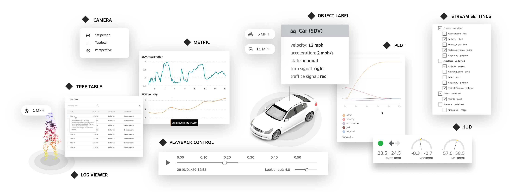

# 1. Overview
StreetscapeGL 是一个可视化工具包，用于以 [XVIZ 协议](https://avs.auto/#/xviz/overview/introduction) 编码的自治和机器人数据。它提供了一组模块化的 React 组件，使用户可以可视化 XVIZ 数据并与之交互。



**Features**
+ 从静态文件或流服务器加载 XVIZ 数据。
+ 在完全交互式的 3D 环境中可视化动态 XVIZ 数据：
    + 覆盖基本地图 - 将数据放在真实环境中
    + 平移、旋转、缩放
    + 选择对象以显示信息
    + 打开/关闭原始流
    + 自定义相机模式：俯视、透视、司机视角等。
+ 播放日志，及时向前或向后搜索。
+ 渲染 XVIZ [声明性 UI](https://avs.auto/#/xviz/protocol/declarative-ui/overview)，允许后端或机器人系统定义用于调试的 UI 组件，例如交互式表格、图表和视频。
+ 优先考虑性能和内存效率。
+ 所有组件都可以实现高度风格化。


---
# 2. Getting Started
## 2.1 Starter Kit
Starter Kit 是一个最小化的示例，它使用 StreetscapeGL 的组件来显示 XVIZ 日志。该应用程序演示了如何连接到 XVIZ 源并将数据传输到 StreetscapeGL 组件。

### 2.1.1 运行示例
```
# clone the repo
git clone https://github.com/uber/streetscape.gl.git

cd streetscape.gl/examples/get-started

# install dependencies
yarn

# start the app
yarn start
```

**显示地图**
需要 Mapbox access token 才能显示地图，查看有关 Mapbox access token 的[选项](https://avs.auto/#/streetscape.gl/getting-started/about-mapbox-tokens)。

**从不同的源加载数据**
此示例加载从 [KITTI](http://www.cvlibs.net/datasets/kitti/) 数据集中提取的 XVIZ 日志。默认情况下，使用 [XVIZFileLoader](https://avs.auto/#/streetscape.gl/api-reference/loaders/xviz-file-loader) 从远程 URL 加载数据。可以通过修改 [log-from-file.js](https://github.com/uber/streetscape.gl/tree/master/examples/get-started/src/log-from-file.js) (`/examples/get-started/src/log-from-file.js`) 中的 URL 以指向您自己的文件。

您还可以使用此示例从服务器获取 XVIZ 流数据：
+ 按照 [说明](https://avs.auto/#/xviz/getting-started/converting-to-xviz/viewing-the-generated-xviz) 启动 XVIZ Server；
+ 在 Starter Kit 目录下通过 `yarn start-stream` 启动。

同样可以通过修改 [log-from-stream.js](https://github.com/uber/streetscape.gl/tree/master/examples/get-started/src/log-from-stream.js) (`/examples/get-started/src/log-from-stream.js`) 中的参数来设置流选项。

### 2.1.2 应用控制
+ 鼠标控制
    + `shift + drag / right drag` => 旋转
    + `drag` => 平移
    + `wheel / pinch` => 缩放
+ 对象交互
    + 单击图表跳转到时间
    + 单击 3D 视图中的对象以选择并显示上下文信息

### 2.1.3 应用演练
本节将介绍应用主程序源代码 [app.js](https://github.com/uber/streetscape.gl/tree/master/examples/get-started/src/app.js) (`/examples/get-started/src/app.js`) 中的一些关键部分。

**XVIZ Configuration**
```javascript
setXVIZConfig(XVIZ_CONFIG);
setXVIZSettings(XVIZ_SETTINGS);
```
调用 [setXVIZConfig and setXVIZSettings](https://avs.auto/#/xviz/api-reference/xviz-parser/set-xviz-config) 设置 XVIZ 日志解析和同步的配置。XVIZ 库使用该配置来跨流收集和关联信息，以及为播放生成适当的帧。

**Connecting to XVIZ Server**
```javascript
componentDidMount() {
  this.state.log.connect();
}
```
该应用程序使用 [XVIZFileLoader](https://avs.auto/#/streetscape.gl/api-reference/loaders/xviz-file-loader) 或 [XVIZStreamLoader](https://avs.auto/#/streetscape.gl/api-reference/loaders/xviz-stream-loader) 来获取 XVIZ 数据，默认连接参数在 [constants.js](https://github.com/uber/streetscape.gl/tree/master/examples/get-started/src/constants.js) (`/examples/get-started/src/constants.js`) 中定义。

**Log Playback Components**
```html
<div id="map-view">
    <LogViewer
        log={log}
        mapboxApiAccessToken={MAPBOX_TOKEN}
        mapStyle={MAP_STYLE}
        car={CAR}
        xvizStyles={XVIZ_STYLE}
        viewMode={VIEW_MODE[settings.viewMode]}
    />
</div>

<div id="timeline">
    <PlaybackControl
        width="100%"
        log={log}
        formatTimestamp={x => new Date(x).toUTCString()}
    />
</div>
```
从代码中可以看到如何将 **XVIZStreamLoader** 的日志传递给 [LogViewer](https://avs.auto/#/streetscape.gl/api-reference/react-components/log-viewer) 和 [PlaybackControl](https://avs.auto/#/streetscape.gl/api-reference/react-components/playback-control)。

每个组件都将使用 [XVIZLoaderInterface](https://avs.auto/#/streetscape.gl/api-reference/loaders/xviz-loader-interface) 从日志中访问必要的数据。

**Declarative UI Components**
```html
<div id="control-panel">
    <XVIZPanel log={log} name="Camera" />
    <hr />
    <XVIZPanel log={log} name="Metrics" />
</div>
```
XVIZ 的一个重要部分是 [Declarative UI](https://avs.auto/#/xviz/protocol/declarative-ui/overview)，它允许 UI 元素通过绑定到 XVIZ 流实现数据驱动。这使开发者能够创建在生成数据的源中定义的控件，而无需了解客户端实现的细节。
StreetscapeGL 中的 [XVIZPanel](https://avs.auto/#/streetscape.gl/api-reference/react-components/xviz-panel) 组件可以渲染所有符合 XVIZ Declarative UI 规范的 panel。

## 2.2 Mapbox Tokens
StreetscapeGL 使用 [react-map-gl](https://uber.github.io/react-map-gl/) 渲染地图。要显示 Mapbox 地图，需要在 [Mapbox 网站](https://www.mapbox.com/) 上注册以获取访问令牌 Access Token。

有几种设置 Token 的方式：
+ 插入 LogViewer 实例 - `<LogViewer mapboxApiAccessToken={TOKEN} />`
+ 设置 `MapboxAccessToken` 环境变量
+ 在 URL 中提供 `?access_token=TOKEN`

建议使用像 `dotenv` 这样的工具将密钥保存在一个 `.env` 文件中，然后将其作为 `process.env` 变量公开，这样泄露的风险要小得多。


## 2.3 Styling Guide
**Style Overrides**
StreetscapeGL 将 [emotion](https://emotion.sh/docs/introduction) 用于基于 JavaScript 的样式。每个组件都提供了一个接受自定义 CSS 覆盖的 `style` 属性。请参阅每个组件的文档以了解可设置的样式。

**Themes**
可以通过在应用的根目录下渲染 `ThemeProvider` 来覆盖默认主题：
```javascript
import {ThemeProvider} from '@streetscape.gl/monochrome';

const MY_THEME = {
  base: 'dark',
  background: '#F0E807',
  textColorPrimary: '#F0E8E7'
};

<ThemeProvider theme={MY_THEME}>
  <MyApp />
</ThemeProvider>;
```

可以设置的主题请查看[文档](https://avs.auto/#/streetscape.gl/getting-started/styling-guide)。


---
返回 [AVS 专题](/2019/07/05/avs)