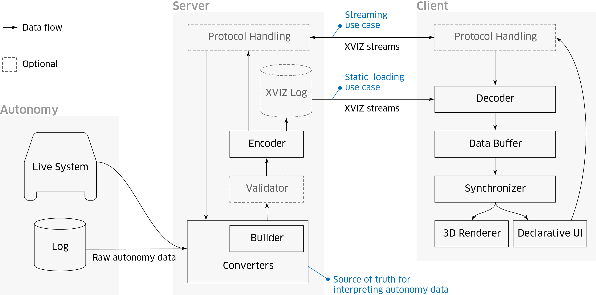

> 推荐阅读：
> [XVIZ - Overview | AVS](https://avs.auto/#/xviz/overview/introduction)
> [XVIZ - Github | Uber](https://github.com/uber/xviz)

# 1. 简介
[XVIZ](https://avs.auto/#/xviz/overview/introduction) 是自治数据 (Autonomy Data) 的实时传输和可视化协议，是 AVS 的数据层。

## 1.1 主要特点
XVIZ 可以用来描述以下内容：
+ 视觉元素
    + 几何
    + 点云
    + 图像
    + 文本
    + 向量
+ 样式表
+ 可声明的绑定数据的 UI
+ 机器可读的 [JSON Schema](http://json-schema.org/) (位于 `@xviz/schema` 包中)

## 1.2 XVIZ Protocol 协议规范
[XVIZ Protocal](https://avs.auto/#/xviz/protocol/schema/introduction) 涵盖了所有重要的概念和数据类型。

## 1.3 XVIZ JS 库
[XVIZ JS 库](https://avs.auto/#/xviz/api-reference/xviz-builder/xviz-builder) 是一组用于验证，构建和解析 XVIZ 数据的模块，同时提供其他语言实现验证的支持。

## 1.4 XVIZ Server 服务
XVIZ 的设计重点在于分布式系统和团队，这意味着不仅需要考虑数据大小和处理效率，还要考虑优化网络基础设施上的数据传输。
XVIZ Server 简单演示了如何将 XVIZ 数据传送到应用程序，详细请参考 [Quick Start](https://avs.auto/#/xviz/getting-started/example-xviz-server)。

---
# 2. 基本概念
XVIZ 协议涵盖了许多重要的概念 ([Concept](https://avs.auto/#/xviz/overview/concepts))。

## 2.1 Datum 数据对象
我们希望可视化的数据对象（通常来自机器人系统），是 XVIZ 协议的基本单元。

## 2.2 Stream 数据流
一条数据流是带有时间戳的同类型数据对象的一个序列，不同类型的数据对象被归为不同的数据流。
+ **Stream Name** - 每条数据流必须被指定唯一的名字，可以根据具体应用来指定这些名字，不过 XVIZ 规定其为类路径结构，使用 `/` 作为分隔符，比如 `/vehicle/velocity`。
+ **Stream Type** - 一条数据流的类型由其包含的数据对象的类型来定义。

协议预定义了以下流类型，XVIZ 客户端库提供了将其解析并显示的支持：
+ **Pose Stream** - 一组位置数据，描述一个目标的位置和朝向，及其定义的任何相对坐标系。
+ **Geometry Types** - 原始几何数据。
+ **Variables** - 数据数组。
+ **Time series** - 一个较大序列的独立样本。
+ **Tree Table** - 分级数据结构，用于表达密集记录类型的数据。
+ **Image Stream** - 二进制格式图像数据。

## 2.3 Source 源
一个 XVIZ 数据流的源，可以是加载自 URL 或一个文件的一个预生成日志，也可以是源自一个服务端的实时数据（比如 socket）。
每一个源包含一个或多个数据流，同时还有一个描述该数据流的元数据。

## 2.4 Metadata 元数据
一条特殊的 XVIZ 消息，其中包含有关数据源及其流的描述性信息。

## 2.5 Primitive 原始数据
XVIZ 原始数据是一类几何对象，比如一个点、一条线、一个多边形等可以被可视化的对象，它可以被标记并赋予特殊样式（比如颜色等）。

## 2.6 Style 样式
XVIZ 支持一种样式表，允许基于流和类指定对象属性。

## 2.7 Object 对象
可以通过将标识符附加到原始数据、变量和时间序列来定义对象。标识符允许跨越流和时间链接信息。

## 2.8 Variable 变量
存在于同一时间的值的序列，比如车辆在计划路径上驶过的速度。每次获取变量数据流的更新，所有的值列表随之改变。

## 2.9 Time Series 时间序列
带时间戳的值可以包含在流中。每次流更新时，都会获得一个新的时间戳和键值对。

## 2.10 Declarative UI 声明性UI
一种用于映射UI元素的结构化数据模式，例如 plots，controls，tables，和 video panels，连同数据流名和数据绑定。此数据与元数据一起被发送，以保持与数据源的密切关联。

## 2.11 Video 视频
XVIZ 可以与提供了合适编码的外部视频源同步。

## 2.12 Encoding 编码
XVIZ 协议规范没有规定编码方式，但是 XVIZ 库支持在 JSON 下的编码和解析。

---
返回 [AVS 专题](/2019/07/05/avs)