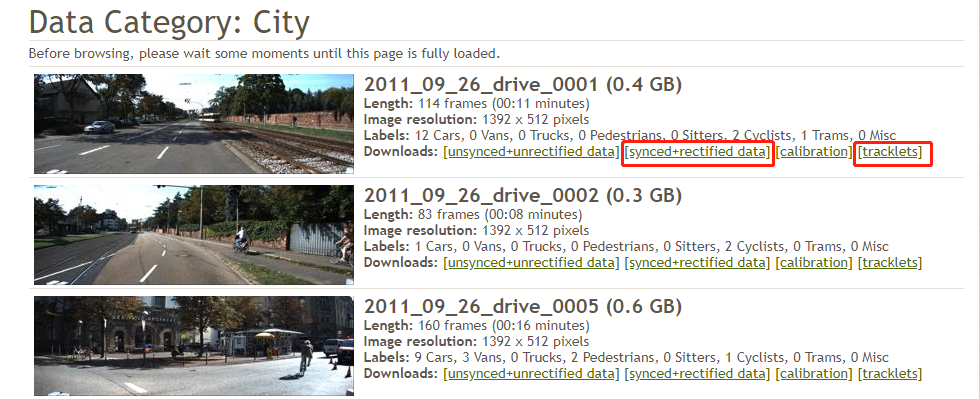

> 推荐阅读：
> [XVIZ - Getting Started | AVS](https://avs.auto/#/xviz/getting-started/converting-to-xviz/overview)
> [XVIZ - Github | Uber](https://github.com/uber/xviz)
> [KITTI | Vision Benchmark Suite](http://www.cvlibs.net/datasets/kitti)


# 1. 将 KITTI 数据集转换为 XVIZ
## 1.1 概述
该部分介绍如何将 [KITTI](http://www.cvlibs.net/datasets/kitti) 数据集转换为 XVIZ。这有助于我们了解如何将数据转换为 XVIZ，并在浏览器中对数据进行可视化和探索。

**What XVIZ enables**
+ 将数据转换为 XVIZ 可以进入一个与特定平台分离的崭新的生态系统，并且可以针对 Web 应用的目标用例进行优化；
+ 该生态系统为用户提供了许多关键的功能，包括：**3D 场景、播放控件、图表、图片、基本地图**，用户只需一个 Web 浏览器即可快速高效地访问数据。

**Guide Overview**
+ 接下来将以介绍 KITTI 数据切入点，进而理解数据如何映射到 XVIZ 元素。并且还会轮流介绍每个 XVIZ 概念，了解如何映射数据和管理数据依赖关系；
+ 另外还将介绍一些可选的数据生成，以展示一些目前 KITTI 中不存在但 XVIZ 和 streetscape.gl 都支持的特性；
+ 生成 XVIZ 数据后，将会介绍如何使用 [XVIZ Server](https://avs.auto/#/xviz/getting-started/example-xviz-server) 为 XVIZ 数据提供服务，并使用 [streetscape.gl starter kit](https://avs.auto/#/streetscape.gl/getting-started/starter-kit) 进行查看。


## 1.2 下载 KITTI 数据集
+ 从 [KITTI 官网](http://www.cvlibs.net/datasets/kitti/raw_data.php) 下载原始数据；
+ 对于每个数据集，都需要下载 **synced+rectified** 和 **tracklets** 文件：
+ 将下载后的数据集解压到项目中的 `data/kitti` 目录，数据集被分为不同数据类型的目录，每种类型中，每一帧都对应一个文件，如下所示：
    ```
    /data/kitti
        |- 2011_09_26
            |- 2011_09_26_drive_0005_sync
                |- tracklet_labels.xml
                |- image_00
                |- image_01
                |- image_02
                |- image_03
                |- oxts
                |- velodyne_points
    ```

也可以使用脚本来更方便地下载 KITTI 数据集：
```
$ ./scripts/download-kitti-data <dataset name>
$ ./scripts/download-kitti-data 2011_09_26_drive_0005
```

**What data is available**
+ 我们可以在 [KITTI 官网](http://www.cvlibs.net/datasets/kitti/raw_data.php) 上查看每个数据集的详细信息；
+ 从数据集中我们可以获取到以下信息：
    + 车辆位置、方向和指标
    + 以边界分类的对象 (tracklets)
    + 相机图像
    + 激光雷达扫描

**Data synchronization**
+ XVIZ 将准确地同步多个带时间戳的 XVIZ 流，但数据处理系统必须能够同步数据并为数据加上时间戳；
+ 如果是下载的 KITTI 数据集，则需要下载 **synced+rectified** 数据，因为它通过时间戳对齐了所有数据。


## 1.3 将 KITTI 数据映射到 XVIZ
### 1.3.1 概述
本节介绍如何将 KITTI 数据集转换为 XVIZ，旨在增加对 XVIZ 概念的理解。在这之前必须阅读 XVIZ 的[基本概念](http://localhost:4000/2019/07/05/avs-xviz-0/#2-%E5%9F%BA%E6%9C%AC%E6%A6%82%E5%BF%B5)。

**KITTI 数据格式**
+ 数据集被分为不同数据类型的目录，每种类型中，每一帧都对应一个文件，因此我们需要处理每一帧的数据并将其转换为 XVIZ 消息。
+ KITTI 数据为我们提供了丰富的源材料，包括：
    + 车辆位置、方向和指标
    + 以边界分类的对象 (tracklets)
    + 相机图像
    + 激光雷达扫描
+ 接下来将轮流介绍每一种数据类型，包括它们与 XVIZ 中的概念的关系，以及如何使用 XVIZ Javascript 库进行数据转换。

**XVIZ 概念简述**
+ XVIZ 将数据组织成流 ([streams](https://avs.auto/#/xviz/protocol/schema/introduction))，采用类似路径语法的标识符，例如 `/object/bounds`，用于存储同类数据；
  XVIZ 提供了一个 Javascript 类 [XVIZBuilder](https://avs.auto/#/xviz/api-reference/xviz-builder/xviz-builder) 来帮助构建数据流；
+ 每个数据流都有元数据 ([metadata](https://avs.auto/#/xviz/protocol/schema/session-protocol?section=stream_metadata))，必须设置这些元数据来解释和验证数据流
  XVIZ 提供了一个 Javascript 类 [XVIZMetadataBuilder](https://avs.auto/#/xviz/api-reference/xviz-builder/xviz-metadata-builder) 来帮助定义流的元数据。

### 1.3.2 Vehicle Data 车辆
+ KITTI 数据集提供了我们需要的关键字段，我们将使用车辆信息来获取 `timestamp`, `location`, `orientation`；
+ 由于 KITTI 数据通过 `timestamp` 同步，因此 `timestamp` 可以出现在任何地方，但是 XVIZ 将车辆信息的 `timestamp` 视为主要驱动，因为车辆信息通常是其他信息的参考点。
+ 我们还将使用 `velocity` 和 `acceleration`，以用于图表显示。

> 以下代码出自 KITTI converter file - [gps-converter.js](https://github.com/uber/xviz/tree/master/examples/converters/kitti/src/converters/gps-converter.js)，位于 `/examples/converters/kitti/src/converters/gps-converter.js`

**Location**
我们要为 XVIZ 定义的第一个数据是 [Pose](https://avs.auto/#/xviz/protocol/schema/core-types?section=pose)，它是表明车辆位置的核心数据，也是其他数据的一个参考点。

首先需要使用 [XVIZMetadataBuilder](https://avs.auto/#/xviz/api-reference/xviz-builder/xviz-metadata-builder) 定义数据流的元数据：
```javascript
const xb = xvizMetaBuilder;
xb.stream('/vehicle_pose').category('pose');
```
> 这里定义了 **stream name** 和 **category**；
> 由于 [Pose](https://avs.auto/#/xviz/protocol/schema/core-types?section=pose) 非常重要，所以 `/vehicle_pose` 是必须的；
> **category** 的取值可以在 [category list](https://avs.auto/#/xviz/protocol/schema/session-protocol?section=stream_metadata) 中查看。

目前，每条消息都需要一个 [Pose](https://avs.auto/#/xviz/protocol/schema/core-types?section=pose)，可以使用 [XVIZBuilder](https://avs.auto/#/xviz/api-reference/xviz-builder/xviz-builder) 为每条消息创建：
```javascript
xvizBuilder
  .pose('/vehicle_pose')
  .timestamp(pose.timestamp)
  .mapOrigin(pose.longitude, pose.latitude, pose.altitude)
  .orientation(pose.roll, pose.pitch, pose.yaw)
  .position(0, 0, 0);
```

**Acceleration and Velocity**
KITTI 还为车辆定义了许多字段，比如 `velocity` 和 `acceleration` 可以用来演示 XVIZ 的绘图UI组件。

可以为这些流定义元数据：
```javascript
const xb = xvizMetaBuilder;
  // ...
  .stream(this.VEHICLE_ACCELERATION)
  .category('time_series')
  .type('float')
  .unit('m/s^2')

  .stream(this.VEHICLE_VELOCITY)
  .category('time_series')
  .type('float')
  .unit('m/s')
```
> 这里使用的常量分别代表字符串 `/vehicle/acceleration` 和 `/vehicle/velocity`；
> `type()` 定义流的值的类型，取值可以在 [type values](https://avs.auto/#/xviz/protocol/schema/session-protocol?section=stream_metadata) 中查看；
> `unit()` 是一个自由格式字符串，用于定义将在 UI 中显示的单位。

为每条消息添加这些数据：
```javascript
xvizBuilder
  .timeSeries(this.VEHICLE_VELOCITY)
  .timestamp(velocity.timestamp)
  .value(velocity['velocity-forward']);

xvizBuilder
  .timeSeries(this.VEHICLE_ACCELERATION)
  .timestamp(acceleration.timestamp)
  .value(acceleration['acceleration-forward']);
```
> 使用 `builder` 设置流名称，并且将数据类型定义为 [time_series](https://avs.auto/#/xviz/protocol/schema/core-types?section=time-series-state-)，这是随时间变化而变化的单个值，正是我们想要的瞬时值。

### 1.3.3 Objects 对象
KITTI 为一些（不是全部）数据集提供了标记的对象数据，这使我们能够了解如何使用 XVIZ 的几何图元，以及如何在 XVIZ 中处理视觉元素的样式。

> 以下代码出自 KITTI converter file - [tracklets-converter.js](https://github.com/uber/xviz/blob/master/examples/converters/kitti/src/converters/tracklets-converter.js)，位于 `/examples/converters/kitti/src/converters/tracklets-converter.js`

**Object Tracking point**
+ KITTI Tracklet 数据定义在特定时间戳处相对于车辆位置的对象；
+ 数据包括对象的中心位置、边界和分类；
+ 对象的数据来自于车辆上的激光雷达扫描仪，其相对于 GPS 的位置可以在 KITTI [Sensor Setup](http://www.cvlibs.net/datasets/kitti/setup.php) 中看到。

首先，为正在创建的流定义元数据，并且需要考虑到与车辆原点 (GPS) 的偏移量。作为参考，代码将该值定义为 `FIXTURE_TRANSFORM_POSE`，它是从 GPU 传感器到激光雷达传感器的仪表偏移值。
```javascript
this.FIXTURE_TRANSFORM_POSE = {
  x: 0.81,
  y: -0.32,
  z: 1.73
};
```
然后将该值用于在流元数据中定义 `pose()` 变换，以此来确保数据相对于车辆位置以及与车辆位置原点的偏移进行了适当变换。
```javascript
.stream(this.TRACKLETS_TRACKING_POINT)
  .category('primitive')
  .type('circle')
  .streamStyle({
    radius: 0.2,
    fill_color: '#FFFF00'
  })
  .pose(this.FIXTURE_TRANSFORM_POSE)
```
在上述元数据的定义中还可以看到第一次使用了 `streamStyle()` 方法。此方法为所有流数据定义默认样式，详情请参考 [Style reference](https://avs.auto/#/xviz/protocol/schema/styling-specification)。

样式可以用3种方式定义，它们按优先顺序依次为：
1. 内联对象样式
2. 流元数据样式类 `styleClass`
3. 流元数据流样式 `streamStyle`

采用简单的 [circle()](https://avs.auto/#/xviz/api-reference/xviz-builder/xviz-builder?section=circle) 方法将 Tracking point 定义为圆。
```javascript
xvizBuilder
  // ...
  .stream(this.TRACKLETS_TRACKING_POINT)
  .circle([tracklet.x, tracklet.y, tracklet.z])
  .id(tracklet.id);
```
这里使用了 [id()](https://avs.auto/#/xviz/api-reference/xviz-builder/xviz-builder?section=id) 方法，使用该方法可以用 `id` 标记元素，详情请参考 [XVIZ Object Identity](https://avs.auto/#/xviz/protocol/schema/core-types)。

**Object bounds**
KITTI 数据提供对象边界和类别标签，可以使用此信息以适当的样式可视化场景中的对象，以便区分。

流元数据定义如下：
```javascript
const xb = xvizMetaBuilder;
xb.stream(this.TRACKLETS)
  .category('primitive')
  .type('polygon')
  .streamStyle({
    extruded: true,
    wireframe: true,
    fill_color: '#00000080'
  })
  .styleClass('Car', {
    fill_color: '#7DDDD760',
    stroke_color: '#7DDDD7'
  })
  .styleClass('Cyclist', {
    fill_color: '#DA70BF60',
    stroke_color: '#DA70BF'
  })
  .styleClass('Pedestrian', {
    fill_color: '#FEC56460',
    stroke_color: '#FEC564'
  })
  .styleClass('Van', {
    fill_color: '#267E6360',
    stroke_color: '#267E63'
  })
  .styleClass('Unknown', {
    fill_color: '#D6A00060',
    stroke_color: '#D6A000'
  })
  .pose(this.FIXTURE_TRANSFORM_POSE);
```
这里使用了 [styleClass()](https://avs.auto/#/xviz/api-reference/xviz-builder/xviz-metadata-builder?section=styleClass) 方法，该方法可以通过类名引用样式，从而避免重复使用内联样式。

以下是将单个多边形和标签转换为 XVIZ 的方式。
```javascript
xvizBuilder
  .primitive(this.TRACKLETS)
  .polygon(tracklet.vertices)
  .classes([tracklet.objectType])
  .style({
    height: tracklet.height
  })
  .id(tracklet.id);
```
+ [polygon()](https://avs.auto/#/xviz/api-reference/xviz-builder/xviz-builder?section=polygon) 方法的参数是一个顶点列表。
+ [classes()](https://avs.auto/#/xviz/api-reference/xviz-builder/xviz-builder?section=classes) 方法可以同时为每个对象设置不同的类，参数为 KITTI 数据中所有类名对应的字符串组成的数组。
+ [style()](https://avs.auto/#/xviz/api-reference/xviz-builder/xviz-builder?section=style) 方法为对象添加内联样式，其优先级高于其他内容。
在此例中，KITTI 为每个对象设置了高度属性，利用该属性可以为场景中每个对象设置高度。 
详情请参考 [style guide](https://avs.auto/#/xviz/protocol/schema/styling-specification)。

### 1.3.4 Camera 相机
KITTI 有4个相机图像源，转换代码将每个图像源转换为单独的流。通常来说应尽可能地缩小图像尺寸，以减轻数据传输负担，如 720x480 等。

> 以下代码出自 KITTI converter file - [image-converter.js](https://github.com/uber/xviz/blob/master/examples/converters/kitti/src/converters/image-converter.js)，位于 `/examples/converters/kitti/src/converters/image-converter.js`

**Camera data**
对于图像数据，我们可以简单地将原始图像数据添加到 XVIZ。

首先定义元数据。
```javascript
const xb = xvizMetaBuilder;
xb.stream(this.streamName)
  .category('primitive')
  .type('image');
```

接下来，我们添加图像数据。
```javascript
xvizBuilder
  .primitive(this.streamName)
  .image(nodeBufferToTypedArray(data), 'png')
  .dimensions(width, height);
```
这是将二进制图像数据嵌入到 XVIZ 数据中以进行传递，同时提供了图像类型和尺寸。

### 1.3.5 Lidar 雷达
激光雷达数据非常丰富且有用，但可能数据量很大。XVIZ 支持点和其颜色的二进制编码。

> 以下代码出自 KITTI converter file:
> [lidar-converter.js](https://github.com/uber/xviz/blob/master/examples/converters/kitti/src/converters/lidar-converter.js)，位于 `/examples/converters/kitti/src/converters/lidar-converter.js`
> [parse-lidar-points.js](https://github.com/uber/xviz/blob/master/examples/converters/kitti/src/parsers/parse-lidar-points.js)，位于 `/examples/converters/kitti/src/parsers/parse-lidar-points.js`

**Lidar scans**
首先定义元数据。
```javascript
const xb = xvizMetaBuilder;
xb.stream(this.LIDAR_POINTS)
  .category('primitive')
  .type('point')
  .streamStyle({
    fill_color: '#00a',
    radius: 2
  })
  // laser scanner relative to GPS position
  // http://www.cvlibs.net/datasets/kitti/setup.php
  .pose({
    x: 0.81,
    y: -0.32,
    z: 1.73
  });
```

关于雷达数据的解析如下所示。
```javascript
export function loadLidarData(data) {
  const binary = readBinaryData(data);
  const float = new Float32Array(binary);
  const size = Math.round(binary.length / 4);

  const positions = new Float32Array(3 * size);
  const colors = new Uint8Array(4 * size).fill(255);

  for (let i = 0; i < size; i++) {
    positions[i * 3 + 0] = float[i * 4 + 0];
    positions[i * 3 + 1] = float[i * 4 + 1];
    positions[i * 3 + 2] = float[i * 4 + 2];

    const reflectance = Math.min(float[i * 4 + 3], 3);
    colors[i * 4 + 0] = 80 + reflectance * 80;
    colors[i * 4 + 1] = 80 + reflectance * 80;
    colors[i * 4 + 2] = 80 + reflectance * 60;
  }
  return {positions, colors};
}
```
> `positions` 平面阵列，每个点取 `x`，`y` 和 `z` 3个值。
> `colors` 平面阵列，每个点需要4个值，即红色，蓝色，绿色和alpha。

由上可知，激光雷达数据只是一组平面阵列，XVIZ 代码实现如下。
```javascript
xvizBuilder
  .primitive(this.LIDAR_POINTS)
  .points(lidarData.positions)
  .colors(lidarData.colors);
```

### 1.3.6 Extra Generated Data 其他数据
+ KITTI 数据不会提供我们想要演示的所有数据类型，尤其是关于对象预测和决策的数据。
+ 为此，我们从基础 KITTI 数据集中生成了额外的数据，以展示 XVIZ 更为完整的功能。
+ KITTI converter 有一个选项 `--fake-streams`，可用于输出下面描述的 XVIZ 流。

**Vehicle trajectory path**
+ KITTI 数据不提供车辆的决策信息，不过我们可以使用存储的位置信息来生成轨迹预览，并假设其为车辆的计划路径。
+ 通过将已知的未来时间段的车辆位置生成折线，以显示车辆的计划路径，来创建 XVIZ 流 `/vehicle/trajector`。

**Variables**
+ 与 XVIZ 中的 **time_series** 数据不同，**variable** 提供了捕获给定时间戳的未来时间段的度量信息的机制。
+ 将创建具有 `/motion_planning` 前缀的多个流以绘出相应的图表。

**Objects future_instances**
+ 与 `variables` 具有捕获未来时间段信息的能力类似，`future_instances` 也为 `primitive` 对象提供相同的能力。
+ 此数据始终在 KITTI 流 `/tracklets/objects/futures` 中创建，可以在 streetscape.gl 的 [live demo](https://avs.auto/demo/index.html) 中使用右下方播放控件的滑块查看。

## 1.4 查看生成的 XVIZ
该部分介绍了可视化 KITTI 数据集的详细步骤：
1. 下载 KITTI 数据
2. 将其转换为 XVIZ 格式
3. 启动流服务器
4. 构建并启动 streetscape.gl UI 应用程序

如果已经执行了 [Quick Start](https://avs.auto/#/xviz/getting-started/example-xviz-server) 步骤，则以上大部分的步骤已经完成了，接下来介绍更多的一些细节。

### 1.4.1 Convert KITTI to XVIZ Format
```
$ cd examples/converters/kitti
$ yarn  # install dependencies
$ yarn add @xviz/builder
$ yarn start -d <xviz path>/data/kitti/2011_09_26/2011_09_26_drive_0005_sync -o <xviz path>/data/generated/kitti/2011_09_26/2011_09_26_drive_0005_sync --disable-streams=image_00,image_01,image_02,image_03
```
运行 `yarn start --help` 查看 **converter** 的所有参数：
+ `-d, --data-directory` - ~~原始 KITTI 数据相对于 `/data/kitti/` 的路径~~ 此时相对路径为 `<xviz path>/examples/converters/kitti/`，所以此处建议使用绝对路径；
+ `-o, --output` - ~~生成数据相对于 `/data/generated/kitti/` 的路径~~ 同上；
+ `--disable-streams` - 要禁用的 stream name，采用逗号分隔；
+ `--message-limit` - 限制 XVIZ 生成消息的数量，用于测试时快速转换数据；
+ `--image-max-width` - 图像保持纵横比时允许的最大宽度，默认 400；
+ `--image-max-height` - 图像保持纵横比时允许的最大高度，默认 300。

**Image resizing**
**converter** 脚本提供图像大小调整选项 `--image-max-width` 和 `--image-max-height`，如果这两个参数同时提供，那么图像将保持纵横比并尽可能大地调整大小。

**Disable cameras**
**converter** 脚本选项 `disable-streams` 允许用户选择要显示的某些摄像机。默认情况下，所有四个摄像机 `image_00`，`image_01`，`image_02`，`image_03` 都将转换为 xviz 格式。
```
$ yarn start -d 2011_09_26/2011_09_26_drive_0005_sync --image-max-width=300 --disable-streams=image_01,image_02
```

### 1.4.2 Start Stream Server
按照 [Quick Start](https://avs.auto/#/xviz/getting-started/example-xviz-server) 步骤启动 XIVZ Server，并开始传输转换后的数据。
```
$ yarn bootstrap # Install deps and build modules
$ ./modules/server/bin/babel-xvizserver -d <XVIZ path>/data/generated/kitti/2011_09_26/2011_09_26_drive_0005_sync --port 8081
```
运行 `./modules/server/bin/babel-xvizserver --help` 查看参数说明。

### 1.4.3 Start Client Application
参考 [streetscape.gl starter kit](https://avs.auto/#/streetscape.gl/getting-started/starter-kit) 安装 WEB 应用，并在启动 Server 作出如下更改：
```
$ cd streetscape.gl/examples/get-started
$ yarn start-streaming-local # 无效
$ yarn start-streaming
```


---
# 2. Quick Start
这个 XVIZ Server 示例将读取 [XVIZBuilder](https://avs.auto/#/xviz/api-reference/xviz-builder/xviz-builder) 生成的 XVIZ 索引和数据文件，并通过 Websocket 进行传输。XVIZ Server 支持基本的 [XVIZ Session](https://avs.auto/#/xviz/protocol/schema/session-protocol)。

在开始之前，需要安装 [Node.js](http://nodejs.cn/) 和 [yarn](https://yarn.bootcss.com/)。

运行 `bootstrap` 来安装依赖并构建模块。
```
$ yarn bootstrap
```

进入 `@xviz/server` 模块目录。
```
$ cd ./modules/server
```

启动服务器将其指定 XVIZ 数据文件夹 (转换的 KITTI 数据，或者从 [xviz-data](https://github.com/uber/xviz-data) 直接下载数据)。
```
$ ./bin/xvizserver -d <XVIZ data folder> --port 8081
$ ./bin/xvizserver -d <XVIZ path>/data/generated/kitti/2011_09_26/2011_09_26_drive_0005_sync --port 8081
```


---
# 3. Issues
## 3.1 Win 平台问题
脚本中的许多命令都需要在 Linux 运行环境下运行。
> Unfortunately, **Windows** build support is not a priority for us. That said, we know that people have been able to build our frameworks on Windows - but not under the Windows command prompt, you will most likely need a **Linux command line environment**.
> -- ibgreen, [uber/xviz/issues/449#](https://github.com/uber/xviz/issues/449#issuecomment-491877233)

## 3.2 NodeJs 版本问题
看到有人提出将 Node 升级后出现 `gyp build error` 的问题，保守起见用 nvm 将 Node 版本退回至 v8.11.3。
> [如何解决node升级v10.5.0后 gyp ERR! build error问题 - youthcity](https://www.jianshu.com/p/16c9150f1649)

## 3.3 puppeteer 安装失败
安装 puppeteer 时需要下载 Chromium，但下载过程中提示下载失败：
`Failed to download Chromium r549031! Set "PUPPETEER_SKIP_CHROMIUM_DOWNLOAD" env variable to skip download.`
该问题可以通过更换 npm 源来解决。
> [ERROR: Failed to download Chromium r609904! - 睡眠不足的瞌睡虫](https://www.jianshu.com/p/d69b1d8bc2a6)

## 3.4 libvips 不存在
原因是没有安装 libvips，可以前往 [官网](https://github.com/jcupitt/libvips/releases) 下载源码，如 `vips-8.7.0.tar.gz`。
```
$ tar xf vips-8.7.0.tar.gz
$ cd vips-x.y.z
$ ./configure
```
编译 libvips 之前，环境中必须要有 build-essential，pkg-config，glib2.0-dev，libexpat1-dev，其他可选的依赖可以查看下方链接中的说明。
> [Building libvips from a source tarball - jcupitt](https://jcupitt.github.io/libvips/install.html)

必须的依赖都装好之后就可以编译了。
```
$ make
$ sudo make install
$ sudo ldconfig
```

---
返回 [AVS 专题](/2019/07/05/avs)