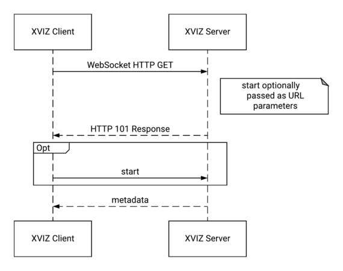
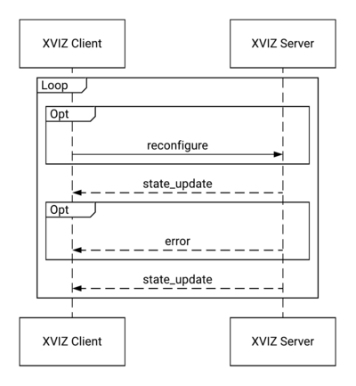
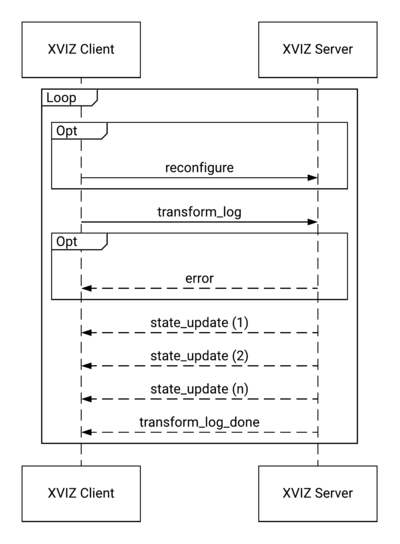

> 推荐阅读：
> [XVIZ - Protocal | AVS](https://avs.auto/#/xviz/protocol)
> [XVIZ - Github | Uber ](https://github.com/uber/xviz)


# 1. Introduction
## 1.1 Overview
XVIZ 是一种抽象的视觉世界状态描述格式，可以使用完整快照逐步进行数据更新。它旨在将大型复杂数据流分解为逻辑视觉层次结构，以便构建丰富的应用程序和查看数据。

## 1.2 Data Model
这是典型的 XVIZ 世界状态中所有的数据对象：

**Streams and World State**
XVIZ 将世界状态划分为一组流。这允许用户快速浏览和筛选适合特定用例的视觉世界。每个流以原子方式随时间变化。世界状态代表特定时间内所有最新流状态的完整集合。

**Primitives and Objects**
XVIZ 的基本类型是单独的数据元素：基元 (primitives)、变量 (variables) 和时间序列 (time series)
+ **Primitives** 是抽象的几何形状；
+ **Variables** 是数据数组（通常随着时间而更新）；
+ **Time series** 是一个较大系列的独立样本。

这些单独的元素具有共同的语义含义，它们被包含在流中的集合捕获。

例如，流 `/object/shape` 将包含所有几何形状，而 `/vehicle/velocity` 将包含对象的速度。

由于对象的表示是跨流分割的，因此 XVIZ 基本类型可以具有用于维护数据关系的 ID。在上面的示例中，`/shape` 流将传输对象的形状信息，而 `/velocity` 流将传输对象的速度信息。
这些流是分开的，以便于解析和改进数据压缩 - 例如，对象形状可能只需要每秒更新一次，而速度可能更有用，每秒更新 10 次。

**Poses**
XVIZ 的核心部分是了解车辆的位置，以便相对于其他数据显示它们。这定义了车辆自身任意帧的位置，以及它在纬度、经度、形态上的位置。

**Styles**
与 CSS 类似，每个基元可以具有一个或多个类，每个类可以具有关联的样式信息。这允许样式信息与主数据流一起一次性发送。此外，就像在 HTM L和 CSS 中一样，可以为每个对象内联样式信息。可以在 [style specification](https://avs.auto/#/xviz/protocol/schema/styling-specification) 中了解更多信息。

**Annotations**
注释本身作为 XVIZ 流发送，但可以为另一个流提供详细的补充信息。当一个团队需要将附加的可视信息附加到除他们自己之外的对象时，将使用注释。

## 1.3 Implementations
与服务器通信或读取导出和存储在磁盘上的数据时使用 XVIZ，需要了解更多信息，可以查看：
+ [Session Protocol](https://avs.auto/#/xviz/protocol/schema/session-protocol)；
+ ETL (暂未实现)；

这两个方法都可以使用两个公共 XVIZ 协议实现中的任何一个，来对下面所描述的类型进行编码：
+ [JSON protocol](https://avs.auto/#/xviz/protocol/protocol-implementations/json-protocol) - JSON 格式的 XVIZ 数据；
+ [Binary protocol](https://avs.auto/#/xviz/protocol/protocol-implementations/binary-protocol) - 混合 JSON 二进制协议，专为更大的数据集和更快的性能而设计；
+ [Protobuf protocol]() - 一个与 JSON 协议兼容的正在开发的 Protobuf 协议。


---
# 2. Core Types
## 2.1 Basic Types
**ID Types**
这些是在协议的多个不同部分中使用的 XVIZ 特定的 ID 类型。它们只能定义一次：
**ID Type** | **Type** | **Description**
:- | :- | :-
`stream_id` | `string` | 描述 XVIZ 数据流，例如 `'/object/polygon'`
`object_id` | `guid` | 任何时间一个对象的唯一标识
`class_id` | `string` | 对象样式
`widget_id` | `guid` | UI 元素的唯一标识
`treetable_column_id` | `uint32` | 用于将 treetable 节点值与其所在列相关联
`treetable_node_id` | `uint32` | 树表中节点的唯一标识，并充当指向节点的指针
`type_id` | `variable_type` | 枚举值：`'bool'`，`'integer'`，`'double'` 和 `'string'`

**Point3D**
Point3D 类型用于表示坐标。请注意，它不使用字段 x，y 和 z，而是具有三个浮点值的数组，索引 0，1 和 2 分别对应于 x，y 和 z。
**Name** | **Type** | **Description**
:- | :- | :-
`coordinates` | `array<float>(3)` | 坐标

**Flat Arrays**
为了更快地在内存缓冲区中加载 `list<Point3d>`，可以提供一个只包含值的单根数组，并且其长度必须是 3 的倍数，其中每 3 个元素是构成 3D 点的 (x, y, z) 元组。
`list<color>` 也是如此，其长度必须是 4 的倍数，其中每个元素是 (r, g, b, a) 颜色元组。


---
## 2.2 Stream Set
这是一组有凝聚力的流，它们全部同时发生并与单个系统帧相关联。这是 XVIZ 提取器产生的。
**Name** | **Type** | **Description**
:- | :- | :-
`timestamp` | `timestamp` | 与此数据相关联的车辆/日志传输时间
`poses` | `map<stream_id, pose>` | 相关联的车辆位置
`primitives` | `map<stream_id, primitive_state>` | 包含 `primitives` 的流
`future_states` | `map<stream_id, future_instances>` | 包含此项的流表示了不同于当前时间戳的基元集合
`ui_primitives` | `map<stream_id, ui_primitive_state>` | 包含特定 UI 基元列表的流
`time_series` | `list<time_series_state>` | 
`variables` | `map<stream_id, variable_state>` | 数值流
`annotations` | `map<stream_id, annotation_state>` | 注释流

以下是一个流数据的示例：
```
{
    "timestamp": 1001.3,
    "primitives": {
        "/object/polygon": {
            "polygons": [
                {
                  "vertices": [[9, 15, 3], [20, 13, 3], [20, 5, 3]]
                }
            ]
        }
    },
    "variables": [
        "/plan/time": {
            "values": {
              "doubles": [1001.3, 1002.3, 1003.3]
            }
        }
    }
}
```


---
## 2.3 Pose
XVIZ 的核心部分是了解车辆的位置，以便相对于其他数据显示它们。这定义了车辆自身任意帧的位置，以及它在纬度、经度、形态上的位置。
**Name** | **Type** | **Description**
:- | :- | :-
`timestamp` | `float` | 与此数据相关联的车辆/日志传输时间
`map_origin` | `map_origin` | 车辆的位置
`position` | `array<float>(3)` | 车辆本身相对于 GPS 的偏移，单位：米
`orientation` | `array<float>(3)` | roll 翻滚角，pitch 俯仰角，yaw 偏航角，单位：弧度

`map_origin` 对象描述地理坐标和海拔高度的位置：
**Name** | **Type** | **Description**
:- | :- | :-
`longitude` | `float` | 经度
`latitude` | `float` | 纬度
`altitude` | `float` | 海拔，单位：米


---
## 2.4 Primitive State
这包含 XVIZ 支持的每种类型的基元列表。它将流，`stream_set` 或表示未来时间点的 `future_instances`， 映射到合适的基元。

**Name** | **Type** | **Description**
:- | :- | :-
`polygons` | `list<polygons>` | 多边形
`polylines` | `list<polylines>` | 折线
`texts` | `list<texts>` | 文字
`circles` | `list<circles>` | 圆
`points` | `list<points>` | 点
`stadiums` | `list<stadiums>` | stadiums to draw
`images` | `list<images>` | 图像

示例：
```
{
    "points": [
        {
            "points": [[1, 2, 3]]
        }
    ]
}
```

可以在 [geometry primitives](https://avs.auto/#/xviz/protocol/schema/geometry-primitives) 查看详情。


---
## 2.5 UI Primitive State
这包含 XVIZ 支持的 UI 基元列表。它被用于映射流和`stream_set`。
**Name** | **Type** | **Description**
:- | :- | :-
`treetable` | `treetable` | UI 中要展示的 tree 或 table

示例：
```
{
    "treetable": {
        "columns": [
            {
                "display_text": "Age",
                "type": "int32"
            }
        ],
        "nodes": [
            {
                "id": 0
            },
            {
                "id": 1,
                "parent": 0,
                "column_values": [10]
            }
        ]
    }
}
```


---
## 2.6 Future Instances
Future instances 用于为给定时刻提供先行世界状态。这些未来实例可用于跟踪在给定时刻之后的数秒内预测发生的情况，不适用于正常时间顺序的基元。
**Name** | **Type** | **Description**
:- | :- | :-
`timestamps` | `list<timestamp>` | 未来的时间戳列表
`primitives` | `list<primitive_state>` | 每个时间戳对应的基元列表

示例：
```
{
  "timestamps": [1.0, 1.1, 1.2],
  "primitives": [
    {
      "points": {
        "points": [[1, 2, 3]]
      }
    },
    {
      "points": {
        "points": [[1.5, 2, 3]]
      }
    },
    {
      "points": {
        "points": [[2, 2, 3]]
      }
    }
  ]
} 
```

---
## 2.7 Time Series State
这表示了一组每次转换数据时都会更改的值，用于提供瞬间的瞬时数据，但不用于表示将来的数据。
**Name** | **Type** | **Description**
:- | :- | :-
`timestamp` | `timestamp` | 与此数据相关联的车辆/日志传输时间
`object_id` | `optional<object_id>` | 关联的对象，可选
`streams` | `list<stream_id>` | `values` 列表中每个元素对应的流
`values` | `values` | 保存 number，string 或 其他类型值的列表，长度与 `streams` 相同

示例：
```
{
    "timestamp": 12345.5,
    "streams": [
        "/vehicle/torque/commanded",
        "/vehicle/torque/actual"
    ],
    "values": {
        "doubles": [
            5,
            4.8
        ]
    }
}
```


---
## 2.8 Variable State
将像 `/constraints` 这样的流映射到单个或多个变量列表。
**Name** | **Type** | **Description**
:- | :- | :-
`variables` | `list<variable>` | 要展示的变量
示例：
```
{
    "variables": [
        {
            "values":
            {
                "doubles": [1001.3, 1002.3, 1003.3]
            }
        }
    ]
}
```


---
## 2.9 Variables
变量用于表示作为时间，距离或任何其他因素的函数的度量数据。Variable State 可用于在给定时刻提供先行值，类似于 Future Instances。

这方面的一个例子是在接下来的10秒内将数据规划为时间的函数。例如，以下三个流将表示三个 variable states
```
/plan/time
/plan/velocity
/plan/jerk
```
每个流将包含相同数量的值，然后可以将速度和加速度流绘制为时间的函数。有关如何绘制的详细信息，请参阅 [Declarative UI docs](https://avs.auto/#/xviz/protocol/declarative-ui/overview) 文档。
**Name** | **Type** | **Description**
:- | :- | :-
`values` | `values` | 值
`base` | `optional<variable_base>` | 关联的对象，可选

其中 `base` 为：
**Name** | **Type** | **Description**
:- | :- | :-
`object_id` | `optional<object_id>` | 关联的对象，可选

---
## 2.10 Annotation State
将像 `/annotations` 这样的流映射到单个或多个变量列表。
**Name** | **Type** | **Description**
:- | :- | :-
`annotations` | `list<annotations>` | 要展示的注释

---
## 2.11 Annotation
注释是附加到现有基元类型的附加数据。 注释当前涵盖现有对象的显示中的视觉变化。
只要该注释处于活动状态，就必须在流集中生成注释。
**Name** | **Type** | **Description**
:- | :- | :-
`base` | `optional<base>` | 常用的注释字段，可选
`style_classes` | `optional<list<string>>` | 样式类
`style_info` | `optional<style>` | 样式信息

其中 `base` 为：
**Name** | **Type** | **Description**
:- | :- | :-
`object_id` | `optional<object_id>` | 注释关联的对象，可选


---
# 3. Session Protocol
XVIZ 可用于显示正在运行的系统或记录中的数据。客户端连接到服务器并建立会话，在会话开始时设置可用的流和参数。

## 3.1 Server Types
XVIZ Server 有多种类型，不同类型决定了如何对数据进行转换以及是否进行重新配置。典型的类型是：
+ **dynamic-log** - 根据需要将原始底层数据转换为 XVIZ，可以响应所有命令类型
+ **static-log** - 从存储位置提供静态 XVIZ 数据，无法响应任何重新配置命令
+ **live** - 嵌入在运行的系统中，不能响应任何转换命令，但可以重新配置

---
## 3.2 Session Message Flow
XVIZ 客户端和服务器建立一个会话，该会话专注于来自单个日志或实时场景的数据。会话首先由具有某些参数的客户端启动，服务器使用元数据对其进行响应，然后开始传输数据。客户端可以选择发送重新配置的消息来更改服务器为客户端传输数据的方式。

会话协议当前被定义并设计为通过 WebSocket 或类似的通信方式。

**Initialization**
每个会话由连接到服务器的客户端启动，通过发送 WebSocket 连接的HTTP GET请求，与服务器建立长连接。终止连接会终止会话。

建立连接后，客户端发送 [**start**](https://avs.auto/#/xviz/protocol/schema/session-protocol?section=start) 消息，该消息设置会话类型和各种其他参数。在 WebSocket 中，也可以将 start 属性作为 URL 参数发送，从而无需发送 start 消息。
服务器使用元数据 [**metadata**](https://avs.auto/#/xviz/protocol/schema/session-protocol?section=metadata) 消息进行响应，该消息包含有关服务器可以提供的 XVIZ 数据的各种信息。


**Data Transfer - Live**
在开始实时会话时，服务器将立即以不确定的频率连续向客户端发送 [**state_update**](https://avs.auto/#/xviz/protocol/schema/session-protocol?section=state_update) 消息。



**Data Transfer - Logs**
要请求日志数据，客户端以 [**transform_log**](https://avs.auto/#/xviz/protocol/schema/session-protocol?section=transform_log) 请求开始，该请求指定要发送回的日志的时间范围以及请求 ID。
然后，服务器以不确定数量的 [**state_update**](https://avs.auto/#/xviz/protocol/schema/session-protocol?section=state_update) 消息进行响应。完成后，它会发送标记为给定请求ID的完成消息 [**transform_log_done**](https://avs.auto/#/xviz/protocol/schema/session-protocol?section=transform_log_done)。



**Data Transfer - Point In Time**
为了在特定时间获得世界状态的单帧图片，客户端发送 [**transform_point_in_time**](https://avs.auto/#/xviz/protocol/schema/session-protocol?section=transform_point_in_time-warning-unstable-feature-) 消息，并且服务器使用包含完整世界快照的单个 state_update 消息进行响应。

**Reconfiguration**
可选的，可以将 [**reconfigure**](https://avs.auto/#/xviz/protocol/schema/session-protocol?section=reconfigure-warning-unstable-feature-) 消息发送到服务器以改变将来发送到客户端的数据。


---
## 3.3 Session Message Types
此部分描述启动并管理客户端与服务端通信的 Sessiong Message 类型。

---
**start**

由客户端发送到服务端。当服务端收到此消息后，开始将数据流传输到客户端。常用参数：
**Name** | **Type** | **Description**
:- | :- | :-
`version` | `string` | Protocol 版本，例如 `2.0.0`
`profile` | `optional<string>` | 后端配置，可以定义想要获取的流的内容、类型、选择器
`session_type` | `optional<string>` | 打开的 Session 类型，默认为 `LOG`
`message_format` | `optional<string>` | 数据格式，默认为 `JSON`
`log` | `optional<string>` | 当 `session_type` = `LOG`，此参数为要打开的 log 标识符
errors - 以下字段不接受所有参数：
+ `profile` - 如果其值不受支持，服务器会返回一个 [**error message**](https://avs.auto/#/xviz/protocol/schema/session-protocol?section=error)。如果服务器类型为 [**static-log**](https://avs.auto/#/xviz/protocol/schema/session-protocol?section=server-types)，会继续发送数据，而其他的服务器类型则会关闭连接。
+ `session_type` - 如果其类型不受支持，服务器会返回一个 **error message**，并关闭连接。允许的值为：1. `LIVE` 发送实时数据；2. `LOG` 从日志中加载数据（默认）。
+ `message_format` - 如果其类型不受支持，服务器会返回一个 **error message**，并关闭连接。允许的值为：1. `JSON` 采用 UTF8 编码的 JSON 字符串（默认）；2. `BINARY` GLB 格式的二进制文件。

---
**metadata**
连接时由服务器发送至客户端，包含有关 XVIZ 流的信息。
**Name** | **Type** | **Description**
:- | :- | :-
`version` | `string` | Protocol 版本，例如 `2.0.0`
`profile` | `optional<string>` | 配置，用来生成数据
`streams` | `map<stream_id, stream_metadata>` | Stream 信息
`cameras` | `map<string, camera_info>` | Camera 信息， `string` 为 camera name
`stream_aliases` | `map<stream_id, stream_id>` | 将旧的流名称进行映射，这样即使服务端修改了流名称，客户端也不用做出相应的更改
`ui_config` | `map<string, ui_panel_info>` | Declarative UI panel configuration

Log Specific Metadata fields
创建日志会话时，以下参数特定于日志会话和元数据消息。
**Name** | **Type** | **Description**
:- | :- | :-
`map_info` | `map_metadata` | 地图信息
`log_info` | `log_metadata` | 日志信息
`vehicle_info` | `vehicle_metadata` | 车辆类型/平台信息
+ `map_info` - 目前尚未说明
+ `vehicle_info` - 目前尚未说明
+ `log_info` - 时间信息
    + `start_time` (optional<timestamp>) - 日志开始时间戳
    + `end_time` (optional<timestamp>) - 日志结束时间戳


---
**error**
如果服务器系统出现任何问题，则发送此消息至客户端。
**Name** | **Type** | **Description**
:- | :- | :-
`message` | `string` | 描述错误的文字


---
## 3.4 Data Messages
**state_update**
这是所有提取器输出的流的集合。
**Name** | **Type** | **Description**
:- | :- | :-
`update_type` | `string` | 表示更新是完整的还是一个增量
`updates` | `list<stream_set>` | 
`update_type` 取值：
+ `COMPLETE_STATE` - 提供的流包含完整的视图，任何未包含的流都被视为空
+ `INCREMENTAL` - 提供的流替换现有流的内容

下表阐明了这两种类型的区别，根据是否已在缓冲区中存在该流的现有数据，显示了在接收和更新时在 `complete_state` 或 `incremental` 状态中执行的操作：
+ *create* - 将新流和数据添加到缓冲区
+ *update* - 流已经存在，因此在新的时间添加数据  
+ *replace* - 在此特定时间删除数据并替换新数据
+ *delete* - 在提供的时间戳处将流设置为空

**Stream In Message** | **Stream in Buffer** | `complete_state` | `incremental`
:- | :- | :- | :-
Yes | No | *create* | *create*
Yes | Yes, but **not** at this timestamp | *update* | *update*
Yes | Yes, at this timestamp | *replace* | *replace*
No | Yes | *delete* | *do nothing*
Yes (as an empty marker) | Yes | *delete* | *delete*

这是一个 JSON 示例，显示了包含单个 Stream Set 的增量更新，该 Stream Set 本身只包含一个  `/object/polygon`：
```
{
    "update_type": "INCREMENTAL",
    "updates": [
        {
            "timestamp": 1001.3,
            "primitives": {
                "/object/polygon": {
                    "polygons": [
                        {
                            "vertices": [[9, 15, 3], [20, 13, 3], [20, 5, 3]]
                        }
                    ]
                }
            }
        }
    ]
}
```


---
## 3.5 Request Messages
**transform_log**
从客户端发送到服务器以请求部分给定日志。时间范围是可选的，如果不指定，则发送整个日志。使用 `requested_streams` 可以让服务器仅发送需要的流，限制数据使用并尽可能加快后端处理速度。
**Name** | **Type** | **Description**
:- | :- | :-
`id` | `string` | 用于跟踪请求的标识符
`start_timestamp` | `optional<timestamp>` | 开始时间戳
`end_timestamp` | `optional<timestamp>` | 结束时间戳
`requested_streams` | `list<string>` | 如果非空，则只发送这些流

**transform_log_done**
从服务器发送到客户端表示 transform_log 请求已完成。
**Name** | **Type** | **Description**
:- | :- | :-
`id` | `string` | 与原始 transform_log 请求一起传递的标识符

**transform_point_in_time (WARNING: unstable feature)**
从客户端发送到服务器以从日志请求单个时间点的快照。这将包含所有流的最新版本，或者包含 `query_timestamp` 之前所请求的子集。使用 `requested_streams` 可以让服务器只发送您需要的流，限制数据使用并尽可能加快后端处理速度。
**Name** | **Type** | **Description**
:- | :- | :-
`id` | `string` | 用于跟踪请求的标识符
`query_timestamp` | `timestamp` | 获得所需流的时间点
`requested_streams` | `list<string>` | 如果非空，则只发送这些流

**reconfigure (WARNING: unstable feature)**
reconfigure 消息允许客户端更改 XVIZ 服务器的配置，从而影响将来对服务器数据的所有请求。这反过来使客户端能够启用或禁用昂贵的计算或传输功能。

reconfigure 消息的典型用途是用户在 [declarative ui select component](https://avs.auto/#/xviz/protocol/declarative-ui/components?section=select-warning-unstable-feature-) 中选择新值，这会向服务器发送 `delta` reconfigure 消息。
**Name** | **Type** | **Description**
:- | :- | :-
`update_type` | `enum { FULL, DELTA }` | 表示更新是完整还是一个增量
`config_update` | `object` | JSON patch 或完整配置更新。

---
## 3.6 Core Types
**stream_metadata**
元数据提供有关流结构的信息，流中的冗余信息将被删除，并放入在传输开始时或重新配置时发送的元数据包中。
**Name** | **Type** | **Description**
:- | :- | :-
`source` | `string` | 此流的来源 URL。空字符串表示它来自标准的 XVIZ 流
`coordinate` | `optional<enum{ frames }>` | 默认为 `IDENTITY`，定义流中数据的坐标系
`transform` | `4x4` | `VEHICLE_RELATIVE` 的 4x4 矩阵
`transform_callback` | `string` | `DYNAMIC` 的回调函数名
`units` | `string` | 对于 variables 和 time_series 数据，可以设置数据显示单位
`value_map` | `optional<enum{ stream values }>` | 将在流上发送的所有值的列表，可用于绘图
`style_info` | `map<class_id, style>` | 样式描述
`category` | `enum{ category }` | 流数据的分类
`scalar_type` | `enum{ scalar-types }` | time_series 或 variables 的值
`primitive_type` | `enum{ primitive_types }` | primitive 的类型
`ui_primitive_type` | `enum{ ui_primitive_types }` | 目前只支持 `'treetable'` 一种类型
`annotation_type` | `enum{ annotation_types }` | 目前只支持 `'visual'` 一种类型

Frames:
+ `IDENTITY` - 以米为单位的数据，在显示之前不对数据作任何转换
+ `GEOGRAPHIC` - 经度、纬度、海拔数据
+ `VEHICLE_RELATIVE` - 数据相对于主要车辆进行转换
+ `DYNAMIC` - 在运行时动态返回所需转换的函数的名称

Category:
+ `PRIMITIVE`
+ `TIME_SERIES`
+ `VARIABLE`
+ `ANNOTATION`
+ `FUTURE_INSTANCE`
+ `POSE`
+ `UI_PRIMITIVE`

Scalar types:
+ `FLOAT`
+ `INT32`
+ `STRING`
+ `BOOL`

Primitive types:
+ `CIRCLE`
+ `IMAGE`
+ `POINT`
+ `POLYGON`
+ `POLYLINE`
+ `STADIUM`
+ `TEXT`


**camera_info**
将视频显示并深度集成到 3D 应用程序中。
**Name** | **Type** | **Description**
:- | :- | :-
`human_name` | `string` | 相机名称
`source` | `string` | XVIZ 流的 URL 或为空
`vehicle_position` | `3x1 float vector` | 从车辆位置到摄像机位置的平移偏移量
`vehicle_orientation` | `3x3 float matrix` | 从车辆位置到摄像机位置的旋转偏移量
`pixel_width` | `int` | 原始相机图像的宽度
`pixel_height` | `int` | 原始相机图像的高度
`rectification_projection` | `3x3 float matrix` | 将原始像素坐标转换为校正坐标（在着色器中使用），也称为单映射变换 (homography)
`gl_projection` | `4x4 float matrix` | 从 3D 世界坐标到经过校正的图像坐标，与 OpenG L一起使用可在图像上绘制 3D 数据


**ui_panel_info**
UI 配置可以让数据更加灵活地显示。
**Name** | **Type** | **Description**
:- | :- | :-
`name` | `string` | 面板的唯一名称
`needed_streams` | `list<stream_id>` | 填充此面板需要哪些流
`config` | `object, declarative ui` | 声明性 UI 面板配置
详情请参考 [declarative ui specification](https://avs.auto/#/xviz/protocol/declarative-ui/overview)。


---
# 4. Geometry Primitives
Geometry Primitives 是渲染数据的最基本单位，XVIZ 当前支持的几何图元是：
+ `point`
+ `polygon`
+ `polyline`
+ `circle`
+ `stadium`
+ `text`
+ `image`

## 4.1 Base Field
XVIZ 中的每个几何图元都有一个可选的基础对象，其中包含所有对象共有的字段，这些字段允许将数据与对象关联或将样式应用于对象。

基础对象的字段：
**Name** | **Type** | **Description**
:- | :- | :-
`object_id` | `optional<object_id>` | 这个几何图元与哪个对象相关联
`inline_style` | `optional<style>` | 可选内联样式
`style_classes` | `list<class_id>` | 样式类

---
## 4.2 Styling
基础对象的主要用途是设置几何图元的样式，下面为为使用样式类的 `point` 基元的 JSON 示例：
```
{
    "base": {
      "object_id": "178beda89169420cbb876c14acdba7f8",
      "classes": ["car", "important"]
    },
    "vertices": [[9, 15, 3], [20, 13, 3], [20, 5, 3]]
}
```

对内联样式也可以执行相同的操作，但为每个对象反复发送相同的样式信息效率较低，以下是使用内联样式的例子：
```
{
    "base": {
      "object_id": "178beda89169420cbb876c14acdba7f8",
      "style": {
          "fill_color": "#FF0000",
          "stroke_color": "#000080"
      }
    },
    "vertices": [[9, 15, 3], [20, 13, 3], [20, 5, 3]]
}
```


---
## 4.3 Point Primitive
`point` 基元是最基本的 XVIZ 几何图元，它可以表示单点或点云，如果顶点字段中有多个顶点，那么它就是一个点云。
**Name** | **Type** | **Description**
:- | :- | :-
`points` | `list` | 如果列表中有多个点，那么这是一个点云，否则它只是一个点（可选择展平）
`colors` | `optional<list>` | 如果存在，则为点列表中的每个点提供颜色，并覆盖任何内联颜色样式或样式类
Example:
```
{
    "points": [[9, 15, 3], [20, 13, 3], [20, 5, 3]]
}
```

---
## 4.4 Polygon Primitive
`Polygon` 基元用于绘制任何多边形闭合形状。
**Name** | **Type** | **Description**
:- | :- | :-
`vertices` | `list` | 多边形的顶点，至少需要3个顶点（可选择展平）
Example:
```
{
    "vertices": [[9, 15, 3], [20, 13, 3], [20, 5, 3]]
}
```

---
## 4.5 PolyLine Primitive
`PolyLine` 基元用于绘制任何多边形链（折线）。
**Name** | **Type** | **Description**
:- | :- | :-
`vertices` | `list` | 折线的顶点，至少需要2个顶点（可选择展平）
Example:
```
{
    "vertices": [[9, 15, 3], [20, 13, 3], [20, 5, 3]]
}
```

---
## 4.6 Circle Primitive
`Circle` 基元用于绘制圆和环，它的中心与对象中心对齐。
**Name** | **Type** | **Description**
:- | :- | :-
`center` | `point3d` | 圆心位置
`radius` | `float32` | 半径（单位：米）
Example:
```
{
    "center": [9, 15, 3],
    "radius": 2.5
}
```

---
## 4.7 Stadium Primitive
`Stadium` 基元用于绘制 2D 几何体育场。从 XVIZ v2.0.0 开始，体育馆是 XVIZ 最接近 3D 胶囊形状的场所。
**Name** | **Type** | **Description**
:- | :- | :-
`start` | `point3d` | 体育场的矩形部分与半圆相邻的一端的中点
`end` | `point3d` | 体育场的矩形部分与半圆相邻的另一端的中点
`radius` | `float32` | 半圆的半径（单位：米）
Example:
```
{
    "start": [9, 15, 3],
    "end": [20, 13, 3],
    "radius": 2.5
}
```

---
## 4.8 Text Primitive
`Text` 基元用于呈现任何类型的纯文本信息，它的位置是指文本的左上角。
**Name** | **Type** | **Description**
:- | :- | :-
`position` | `point3d` | 位置
`text` | `string` | 要显示的文本
Example:
```
{
    "position": [9, 15, 3],
    "text": "Location of interest"
}
```

---
## 4.9 Image Primitive
`Image` 基元用于渲染现有图像。
**Name** | **Type** | **Description**
:- | :- | :-
`position` | `point3d` | 图像左上角的位置
`data` | `byte_buffer` | 打包的 RGB 相机图像数据
`width_px` | `float32` | 源图像的宽度（以像素为单位）
`height_px` | `float32` | 源图像的高度（以像素为单位）
以下是一个 JSON 示例，出于效率原因，通常使用二进制存储原始映像，而不需要对其进行 base64 编码：
```
{
    "position": [9, 15, 3],
    "data": "/9j/2wBDAAMCAgICAgMCAgIDAwMDBAYEBAQEBAgGBgUGCQgKCgkICQkKDA8MCgsOCwkJDRENDg8QEBEQCgwSExIQEw8QEBD/yQALCAABAAEBAREA/8wABgAQEAX/2gAIAQEAAD8A0s8g/9k=",
    "width_px": 1280,
    "height_px": 720
}
```


---
# 5. Styling Specification
可以使用 JSON 定义 XVIZ 对象的样式。每种基本类型都允许使用自己的一组样式选项，例如笔触宽度，填充颜色等。

## 5.1 Styling Levels
XVIZ 中的样式存在多个级别。这允许定义共享默认值以及微观控制，以避免过多的样式冗余，同时不影响表达性。

对象的样式按以下优先级解析：
1. Object styles
2. Class styles
3. Stream styles

**Stream Styles**
流样式被定义为流的元数据的一部分。
```
// metadata
{
  'version': '2.0.0',
  'streams': {
    '/object/shape': {
      "category": "PRIMITIVE",
      "primitive_type": "POLYGON",
      "stream_style": {
        "stroked": false,
        "fill_color": "#9D9DA3"
      }
    }
  }
}
```
在流级别定义的任何样式都将是该流中任何对象的默认样式。
某些样式属性只能在流级别定义，这些属性可以给渲染过程带来某些性能优势，详细信息请参阅每种基元类型的属性表。

**Class Styles**
类样式也被定义为流的元数据的一部分，但是基于它们的类有选择地应用于该流中的对象。
```
// metadata
{
  "version": "2.0.0",
  "streams": {
    '/object/shape': {
      "category": "PRIMITIVE",
      "primitive_type": "POLYGON",
      "stream_style": {
        "stroked": false,
        "fill_color": "#9D9DA3"
      },
      "style_classes": [
        {
          "name": "Pedestrian",            // class selector
          "style": {
            "fill_color": "#00C8EF"
          }
        },
        {
          "name": "Pedestrian selected",   // class selector
          "style": {
            "fill_color": "#FFDC00"
          }
        }
      ]
    }
  }
}
```
假设数据帧中有以下对象：
```
// snapshot
"primitives": {
  "/object/shape": {
    "polygons": [
      {
        "vertices": [[-6, -6, 0], [-6, -4, 0], [-4, -4, 0], [-4, -6, 0]],
        "base": {
          "classes": ["Car"]         // fill color resolves to #9D9DA3
        }
      },
      {
        "vertices": [[-3, 3, 0], [-3, 5, 0], [-1, 5, 0], [-1, 3, 0]],
        "base": {
          "classes": ["Pedestrian"]  // fill color resolves to #00C8EF
        }
      }
    ]
  }
}
```
样式类与 HTML 和 CSS类似，每个流都有多个使用选择器定义的样式规则，每个规则都包含以下字段：
+ `name` - 此规则的选择器，以空格分隔的类名称
+ `styles` - 样式属性的键值对

该流中的每个对象都可以包含一个 `class` 字段。如果出现以下情况，则样式规则适用于对象：
+ 该对象包含选择器中的所有类
+ 如果对象与多个规则匹配，则以最后定义的规则为主

规则和类的作用域是 `streamId`，可以通过 `XVIZMetaBuilder` 生成类样式。特别是 `styleClass()` 和 `classes()` 函数。

**Object Styles**
对象可以定义自己的内联样式，内联样式会覆盖任何其他样式。
```
// snapshot
"primitives": {
  "/object/shape": {
    "polygons": [
      {
        "vertices": [[-6, -6, 0], [-6, -4, 0], [-4, -4, 0], [-4, -6, 0]],
        "base": {
          "style": {
            "fill_color": "#FF0000"
          }
        }
      }
    ]
  }
}
```
请注意，无法为每个对象定义某些样式属性。详细信息，请参阅每种基元类型的属性表。


---
## 5.2 Style Properties
`primitive` 支持的样式属性：

**circle**
**Property** | **Description** | **Type** | **Default** | **Per-stream** | **Per-object**
:- | :- | :- | :- | :- | :-
`radius` | 圆半径，单位：米 | Number | `1` | X | X
`radius_min_pixels` | 绘制半径的最小像素，防止在较大的缩放级别上圆圈太小而无法被看到 | Number | (none) | X | 
`radius_max_pixels` | 绘制半径的最大像素，防止在较小的缩放级别上圆圈太大 | Number | (none) | X | 
`filled` | 是否填充圆 | Boolean | `true` | X | 
`stroked` | 是否围绕圆绘制轮廓 | Bool | `true` | X | 
`fill_color` | 填充颜色 | [Color](#53-property-types) | `'#fff'` | X | X
`stroke_color` | 轮廓颜色 | [Color](#53-property-types) | `'#000'` | X | X
`stroke_width` | 轮廓宽度，单位：米 | Number | `1` | X | X
`stroke_width_min_pixels` | 轮廓宽度的最小像素 | Number | (none) | X | 
`stroke_width_max_pixels` | 轮廓宽度的最大像素 | Number | (none) | X | 
`opacity` | 对象的透明度 | Number | `1` | X | 

**point**
**Property** | **Description** | **Type** | **Default** | **Per-stream** | **Per-object**
:- | :- | :- | :- | :- | :-
`radius_pixels` | 点半径，单位：像素 | Number | `1` | X | 
`fill_color` | 填充颜色 | [Color](#53-property-types) | `'#fff'` | X | 
`point_color_mode` | 点颜色模式 | [PointColorMode](#53-property-types) | `'default'` | X | 
`point_color_domain` | 点的下限和上限分别映射到蓝色和红色。仅在定义了 `point_color_mode` 时使用 | Array | `elevation` 模式下为 `[0, 3]`, `distance_to_vehicle` 模式下为 `[0, 60]` | X | 
`opacity` | 对象的透明度 | Number | `1` | X | 

**polygon**
**Property** | **Description** | **Type** | **Default** | **Per-stream** | **Per-object**
:- | :- | :- | :- | :- | :-
`extruded` | 是否挤出多边形 | Bool | `false` | X | 
`height` | 如果 `extruded = true`，则该参数可以设置挤出高度 | Number | `0` | X | X
`filled` | 是否填充 | Bool | `true` | X | 
`stroked` | 是否绘制轮廓 | Bool | `true` | X | 
`fill_color` | 填充颜色 | [Color](#53-property-types) | `'#fff'` | X | X
`stroke_color` | 轮廓颜色 | [Color](#53-property-types) | `'#000'` | X | X
`stroke_width` | 轮廓宽度，单位：米，必须设置 `extruded = false` | Number | `1` | X | X
`stroke_width_min_pixels` | 轮廓宽度的最小像素 | Number | (none) | X | 
`stroke_width_max_pixels` | 轮廓宽度的最大像素 | Number | (none) | X | 
`opacity` | 对象的透明度 | Number | `1` | X | 

**polyline**
**Property** | **Description** | **Type** | **Default** | **Per-stream** | **Per-object**
:- | :- | :- | :- | :- | :-
`stroke_color` | 轮廓颜色 | [Color](#53-property-types) | `'#000'` | X | X
`stroke_width` | 轮廓宽度，单位：米 | Number | `1` | X | X
`stroke_width_min_pixels` | 轮廓宽度的最小像素 | Number | (none) | X | 
`stroke_width_max_pixels` | 轮廓宽度的最大像素 | Number | (none) | X | 
`opacity` | 对象的透明度 | Number | `1` | X | 

**stadium**
**Property** | **Description** | **Type** | **Default** | **Per-stream** | **Per-object**
:- | :- | :- | :- | :- | :-
`fill_color` | 填充颜色 | [Color](#53-property-types) | `'#fff'` | X | X
`radius` | 体育场半圆部分的半径，单位：米 | Number | `1` | X | X
`radius_min_pixels` | 绘制半径的最小像素，防止在较大的缩放级别上圆圈太小而无法被看到 | Number | (none) | X | 
`radius_max_pixels` | 绘制半径的最大像素，防止在较小的缩放级别上圆圈太大 | Number | (none) | X | 
`opacity` | 对象的透明度 | Number | `1` | X | 

**text**
**Property** | **Description** | **Type** | **Default** | **Per-stream** | **Per-object**
:- | :- | :- | :- | :- | :-
`font_family` | 文本字体 | String | `'Arial'` | X | 
`font_weight` | 文本字体粗细 | Number | `400` | X | 
`fill_color` | 填充颜色 | [Color](#53-property-types) | `'#fff'` | X | X
`text_size` | 文本字号 | Number | `400` | X | X
`text_rotation` | 以度为单位逆时针旋转文本 | Number | `0` | X | X
`text_anchor` | 文本水平对齐方式，可以为 `'START'`，`'MIDDLE'`，`'END'` | String | `'MIDDLE'` | X | X
`text_baseline` | 文本垂直对齐方式，可以为 `'TOP'`，`'CENTER'`，`'BOTTOM'` | String | `CENTER` | X | X
`opacity` | 对象的透明度 | Number | `1` | X | 


---
## 5.3 Property Types
**Color**
颜色值可以采用以下格式之一：
+ 十六进制 RGB 或者 RGBA 字符串，比如：`'#F00'`, `'#F00A'`, `'#FF0000'`, `'#FF000080'`
+ 有效的 CSS 颜色字符串，比如：`'red'`, `'rgba(255, 0, 0, 0.5)'`
+ RGB 或者 RGBA 数组，每个元素的值在 0-255 的范围内，比如：`[255, 0, 0]`, `[255, 0, 0, 128]`

**Point Color Mode**
Point 对象的着色方式，可以是以下几种：
+ `default` - 如果提供则使用内联颜色，否则使用 `fill_colors` 样式
+ `elevation` - 从地面垂直向上的渐变颜色
+ `distance_to_vehicle` - 从车辆本身到远离车辆的渐变颜色


---
# 6. UI Primitives
UI Primitives 属于 XVIZ Primitives，旨在用于 2D UI，如 XVIZ 声明性 UI 框架。

## 6.1 TreeTable Type
TreeTable Primitives 以类似于文件系统资源管理器窗口的方式表示数据：
+ 数据是分层的，每个节点都有公共字段
+ 根据节点在树中的位置，公共字段也可能为空
+ 每个节点通常在 TreeTable 中呈现为一行，其中更高级别的节点是可折叠的

**Property** | **Type** | **Description**
:- | :- | :- 
`columns` | `list<treetable_column>` | 指定 TreeTable 表部分的列数据
`nodes` | `list<treetable_node>` | 指定节点内容的数据，可以将其视为表中行的数据

**TreeTable Columns**
TreeTable Columns 对应于 TreeTable 中每个节点的可用字段。此外，它们还包含有关列中表示的数据类型和所表示数据单位的信息。
**Property** | **Type** | **Description**
:- | :- | :- 
`display_text` | `string` | 要在 TreeTable 的标题中显示的文本
`type` | `type_id` | XVIZ 变量的可接受类型之一
`unit` | `optional<string>` | 此列中数据的单位，如“米”或“米/秒”或“英里”

**TreeTable Nodes (Rows)**
TreeTable Nodes 的作用类似于树中的节点或表中的行。请注意，不保证列在每个节点都有值。
:- | :- | :- 
`id` | `treetable_node_id` | TreeTable 中此节点的 ID
`parent` | `optional<treetable_node_id>` | 父节点的 ID
`column_values` | `list<string>` | 数组，根据索引对应了列的值

**Example**
```json
{
  "columns": [
    {
      "display_text": "Age",
      "type": "int32",
      "unit": "Years"
    },
    {
      "display_text": "Name",
      "type": "string"
    }
  ],
  "nodes": [
    {
      "id": 0
    },
    {
      "id": 1,
      "parent": 0,
      "column_values": ["10", "Jim"]
    },
    {
      "id": 2,
      "parent": 0,
      "column_values": ["22", "Bob"]
    }
  ]
}
```


---
返回 [AVS 专题](/2019/07/05/avs)


