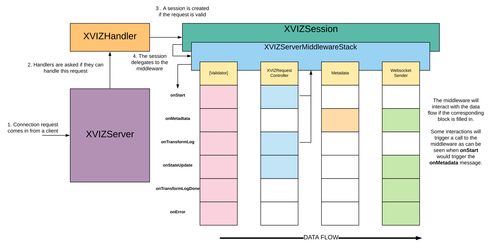
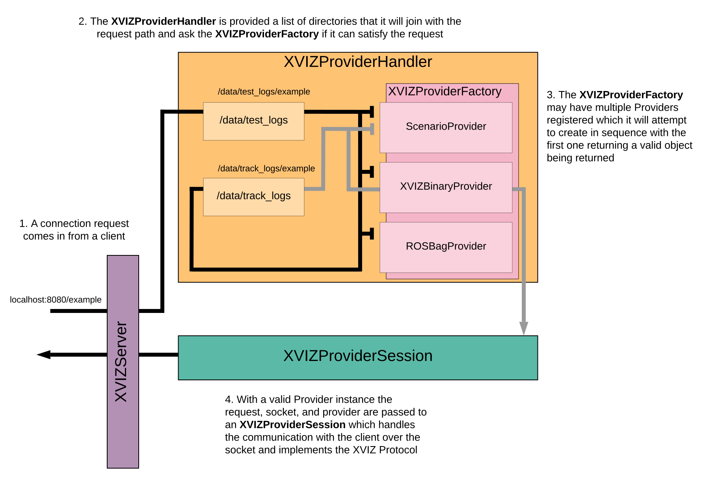

> 推荐阅读：
> [XVIZ - API | AVS](https://avs.auto/#/xviz/api-reference/xviz-builder/xviz-builder)
> [XVIZ - Github | Uber ](https://github.com/uber/xviz)


# 1. Overview
**@xviz/server** 模块提供了一个将 XVIZ Data 通过 WebSocket 进行传输的框架。

[XVIZServer](#41-xvizserver) 将请求委托给构造 Server 时传入的 [XVIZHandler](#42-xvizhandler-interface) 数组。XVIZHandlers 将尝试处理请求，如果可以，它会返回 [XVIZSession](#43-xvizsession-interface) 的实例。客户端接下来的通信都交由 XVIZSession 处理，特别是有关 [XVIZ Protocol](/2019/07/09/avs-xviz-4/#13-session-protocol) 部分。



---
# 2. Usage
XVIZ 提供了一个命令行工具 [xvizserver-tool]() 来使用 XVIZServer，此工具可以同时托管来自多个目录的 XVIZ 数据。

---
# 3 Extending the XVIZServer
XVIZServer 和 XVIZHandler 允许任何人以现有的实现为基础，根据自己的用例进行继承，以扩展其功能。

---
# 4. Module Classes
## 4.1 XVIZServer
XVIZServer 是主类，可以监听一个端口以与客户端进行连接。连接后，XVIZServer 将寻找可以处理请求的 XVIZHandler。如果找到合适的 XVIZHandler，将调用它来管理请求，否则 socket 将被关闭。

**Example**
```javascript
import {XVIZServer} from '@xviz/server';

// Construction of 'handler'

const ws = new XVIZServer([handler], options, () => {
  console.log(`Listening on port ${ws.server.address().port}`);
});
```

**Constructor**
`XVIZServer(handlers, options, cb)`，参数：
+ `handlers` (Array) - 一组用来处理请求的 XVIZHandler 数组。
+ `options` (Object) - 将传递给底层 WebSocket 服务器，用于服务器选项：
    + `port` (Number) - 端口
    + `maxPayload` (Number) - 允许的最大消息（字节）(bytes)
    + `perMessageDeflate` (Boolean) - 设置 WebSocket 是否启用消息压缩
    + `logger` (Object) - 通过系统传递的记录器对象：
        + `log` (Function)
        + `error` (Function)
        + `warn` (Function)
        + `info` (Function)
        + `verbose` (Function)
+ `cb` (Function) - 服务器监听成功时的回调函数

**Properties**
`server` - 访问底层服务器对象。
Returns: (Object) - 底层服务器对象。

**Methods**
`close()` - 关闭服务器。

---
## 4.2 XVIZHandler Interface
调用 XVIZHandler 并返回一个 XVIZSession 用来来处理 XVIZServer 收到的请求。

**Interface**
`async newSession(socket, request)`，参数：
- `socket` (Object) - The socket from the server
- `request` (Object) - The request object from the server

Returns: XVIZSession 或 `null` - 如果可以处理请求，则发挥一个 XVIZSession，否则返回 `null`。

要使用`socket` 和 `request`，Handler 必须确定是否可以处理此连接。

**Example**
[xvizserver tool]() 使用 [xviz-provider-handler.js](https://github.com/uber/xviz/blob/master/modules/server/src/server/xviz-provider-handler.js) (位于 `/modules/server/src/server//xviz-provider-handler.js`) 模块的接口来处理 XVIZ Data。

下图为 XVIZProviderHandler 使用目录数组的流程，然后调用 [XVIZProviderFactory]() 来尝试满足请求并在查找成功时返回 [XVIZProviderSession]()。



---
## 4.3 XVIZSession Interface
XVIZSession 的作用是响应 WebSocket 事件并通过 [XVIZServerMiddlewareStack](#44-xvizservermiddlewarestack) 路由消息。

**Methods**
`onConnect()` - 这标志着请求将被 session 处理的开始，实现此函数的具体类应该在构造函数中传递所有必需的参数。

---
## 4.4 XVIZServerMiddlewareStack
XVIZServerMiddlewareStack 定义并整合 [Middleware components](#45-middleware-components) 的接口，通过已注册的中间件管理消息，是它整个中间件数据流的入口。

**Constructor**
`XVIZServerMiddlewareStack(middlewares)`，参数：
+ `middlewares` (Array) - middleware components 数组

**Methods**
`set(middlewares)` - 设置中间件堆栈，可以在构造 XVIZServerMiddlewareStack 实例之后设置中间件。参数：
+ `middlewares` (Array) - middleware components 数组

---
## 4.5 Middleware components
+ Middleware components 是定义处理 XVIZ 消息的方法的对象。这些方法的接口派生自 XVIZServerMiddlewareStack。
+ 这些组件可以对消息和响应进行操作，在共享的上下文环境中存储 session 状态，并响应事件时调用 XVIZServerMiddlewareStack。
+ 中间件提供了一个结构化管道，用于控制和自定义消息数据流。
+ 中间件由 XVIZServerMiddlewareStack 管理并按顺序调用，除非处理程序选择停止进一步的后续流程。

**Example**
XVIZServerMiddlewareStack 由 XVIZSession 实例化。XVIZSession 将创建中间件，然后将这些中间件设置到 XVIZServerMiddlewareStack 中。
```javascript
import {
  XVIZProviderRequestHandler,
  XVIZMessageToMiddleware,
  XVIZServerMiddlewareStack,
  XVIZSessionContext,
  XVIZWebsocketSender} from '@xviz/server';

export class ExampleSession {
  constructor(socket, request, provider, options) {
    this.socket = socket;
    this.provider = provider;
    this.request = request;
    this.options = options;

    // Session shared storage for the middlewares
    this.context = new XVIZSessionContext();

    // The middleware will manage calling the components in the stack
    this.middleware = new XVIZServerMiddlewareStack();

    // Setup a pipeline to respond to request and send back messages
    const stack = [
      new XVIZProviderRequestHandler(this.context, this.provider, this.middleware, this.options),
      new XVIZWebsocketSender(this.context, this.socket, this.options)
    ];
    this.middleware.set(stack);

    // The XVIZMessageToMiddleware object is a convenience class to
    // simply inspect a message and if it is an XVIZ message call the middleware
    this.handler = new XVIZMessageToMiddleware(this.middleware);

    this.socket.onmessage = message => {
      if (!this.handler.onMessage(message)) {
        // Handle non-XVIZ message here
      }
    };
  }
}
```

**Common Method Parameters**
中间件以 XVIZ 消息为基础运行，参数：
+ `message` ([XVIZData]()) - 中间件要处理的消息。

Returns: (Boolean) - 如果为 `false`，则此消息会被中止。当一种消息类型触发另一种消息类型，或发生错误时，才会返回 `ture`。

**Middleware Interface**
+ `onConnect()` - 连接被接受时调用。
+ `onClose()` - 连接被关闭时调用。

**XVIZ Message Events** 
+ `onStart(message)` - 启动 `xviz/start` 消息时调用。
+ `onTransformLog` - 启动 `xviz/tranform_log` 消息时调用。
+ `onError` - 启动 `xviz/error` 消息时调用。
+ `onMetadata` - 启动 `xviz/metadata` 消息时调用。
+ `onStateUpdate` - 启动 `xviz/state_update` 消息时调用。
+ `onTransformLogDone` - 启动 `xviz/transform_log_done` 消息时调用。
+ `onReconfigure` - 启动 `xviz/transform_log_done` 消息时调用。

---
## 4.6 XVIZMessageToMiddleware
XVIZMessageToMiddleware 将检查并确定一条消息是否是 XVIZ 消息。如果是，它会将该消息转发到 XVIZServerMiddlewareStack。

**Example**
```javascript
class ExampleSession {
  constructor(socket) {
    this.socket = socket;

    // Create the middleware instance
    this.middleware = new XVIZServerMiddlewareStack();

    // Create XVIZMessageToMiddleware to inspect and route XVIZ messages
    this.handler = new XVIZMessageToMiddleware(this.middleware);

    // Example calling XVIZMessageToMiddleware.onMessage()
    // to handle a raw socket message
    this.socket.onmessage = message => {
      if (!this.handler.onMessage(message)) {
        // Handle non-XVIZ message here
      }
    };

    // Example calling XVIZMessageToMiddleware.callMiddleware()
    // to handle an explicit XVIZ message
    this.socket.onopen = () => {
      this.handler.callMiddleware('start', params);
    };
  }
}
```

**Constructor**
`XVIZMessageToMiddleware(middleware, options)`，参数：
+ `middleware` (XVIZServerMiddlewareStack) - XVIZServerMiddlewareStack 实例。
+ `options` (Object) - 选项：
    + `logger` (Object) - Logger 接口。

**Methods**
+ `onMessage(message)` - 处理 websocket 消息，参数：
    + `message` (Object) - XVIZ 消息。

+ `callMiddleware(xvizType, message)` - 直接调用处理 XVIZ 消息的方法：
    + `xvizType` (Object) - XVIZ 消息类型。
    + `message` (Object) - XVIZ 消息。

---
## 4.7 XVIZProviderRequestHandler
XVIZProviderRequestHandler 是 [XVIZProvider]() 的中间件，它将响应 XVIZ 消息，根据特定的 XVIZ 请求，根据特定的XVIZ请求事件转换处理状态管理和事件转换。

**Example**
```javascript
this.middleware = new XVIZServerMiddlewareStack();

const stack = [
  new XVIZProviderRequestHandler(this.context, this.provider, this.middleware, this.options),
  new XVIZWebsocketSender(this.context, this.socket, this.options)
];
this.middleware.set(stack);
```

**Constructor**
`XVIZProviderRequestHandler(context, provider, middleware, options)`，参数：
+ `context` ([XVIZSessionContext](#49-xvizsessioncontext)) - 用来保存公共数据的共享 session 上下文环境。
+ `provider` (XVIZProvider) - XVIZProvider 实例。
+ `middleware` (XVIZServerMiddlewareStack) - 中间件堆栈。
+ `options` (Object) - Server 选项：
    + `delay` (Number) - 发送响应消息之间的毫秒延迟。
    + `logger` (Object) - 通过系统传递的记录器对象。
        + `log` (Function)
        + `error` (Function)
        + `warn` (Function)
        + `info` (Function)
        + `verbose` (Function)

---
## 4.8 XVIZWebSocketSender
XVIZWebSocketSender 是一个中间件组件，它可以通过 WebSocket 发送 XVIZ 消息。必须确保数据格式正确，以便通过 WebSocket 发送数据并在必要时转换数据。

**Example**
```javascript
this.middleware = new XVIZServerMiddlewareStack();

const stack = [
  new XVIZProviderRequestHandler(this.context, this.provider, this.middleware, this.options),
  new XVIZWebsocketSender(this.context, this.socket, this.options)
];
this.middleware.set(stack);
```

**Constructor**
`XVIZWebSocketSender(context, socket, options)`，参数：
+ `context` ([XVIZSessionContext](#49-xvizsessioncontext)) - 用来保存公共数据的共享 session 上下文环境。
+ `socket` (XVIZProvider) - Websocket 实例。
+ `options` (Object) - Server 选项：
    + `compress` (Boolean)
    + `format` ([(XVIZ_FORMAT]()) - XVIZ 数据格式。
    + `logger` (Object) - 通过系统传递的记录器对象。
        + `log` (Function)
        + `error` (Function)
        + `warn` (Function)
        + `info` (Function)
        + `verbose` (Function)

---
## 4.9 XVIZSessionContext
此对象提供共享 XVIZSession 中间件的状态，还可以作为任何组件的存储器来保存状态。
XVIZProvider 封装了读取特定 XVIZ 源的详细信息，并返回一个对象，允许您访问元数据并迭代 XVIZ 消息。

**Constructor**
`XVIZSessionContext(state)`，参数：
+ `state` (Object) - 初始化状态。

**Methods**
+ `set(name, val)` - 保存状态，参数：
    + `name` (String) - key；
    + `val` (Any) - value。
+ `get(name)` - 获取状态，参数：
    + `name` (String) - key；
    + Returns: (Any) - 保存的状态。
+ `startTransform(id, state)` - 为 transform 初始化一个状态，参数：
    + `id` (String) - transform 的标识符；
    + `state` (Object) - 与 transform 关联的状态。
+ `transform(id)` - 获取保存的 transform state，参数：
    + `id` (String) - transform 的标识符；
    + Returns: (Object) - 保存的状态。
+ `endTransform(id)` - 移除 transform state，参数：
    + `id` (String) - transform 的标识符。

---
# 5. Tools
## 5.1 xvizserver Tool
xvizserver Tool 通过 WebSocket 提供 XVIZ 数据，支持包含 XVIZ 数据的多个目录和各种源，并完整地支持 XVIZ 协议。

**Running the tool**
```
# have build modules
./modules/ros/bin/xvizserver -d xvizFolder
# or run directly
./modules/ros/bin/babel-xvizserver -d xvizFolder
# check for help
./modules/ros/bin/babel-xvizserver -h
```

**Viewing applications**
+ [Getting Started App](https://github.com/uber/streetscape.gl/tree/master/examples/get-started)
+ [Test Viewer](https://github.com/uber/streetscape.gl/tree/master/test/apps/viewer).

**Host Options**
+ `--directory, -d <path>` - 数据源或文件夹路径（必须）
+ `--port #` - 端口（默认：3000）

**General Options**
+ `--verbose, -v` - 显示附加信息
+ `--format <format>` - 格式，可以为 `'JSON_STRING'`, `'JSON_BUFFER'`, `'BINARY_GLB'` (默认: `'BINARY_GLB'`)
+ `--live` - 支持在连接时立即发送数据的实时会话
+ `--delay #` - 发送消息之间延迟的毫秒数 (默认: 50ms)

**Scenarios**
服务器支持内置的 XVIZ 脚本，主要用于测试。路径为：
+ `/scenario-circle`
+ `/scenario-straight`
```
http://localhost:8080/scenario-circle
```

**Options**
+ `--scenarios <true/false>` - 启用或禁用脚本支持（默认：`true`）
+ `--duration #` - XVIZ 脚本生成的数据的总时长 (默认：30 秒)
+ `--hz #` - 更新速率 (默认：10)


---
## 5.2 CLI Command
该工具能够构建自定义命令行工具以配置数据。在执行命令之前，使用 **XVIZProviderFactory** 注册自定义 **Provider** 以设置任何自定义参数所对应的功能。

`serverArgs(inArgs, options)` - 注册`server`命令和支持的选项
+ `inArgs` (yargs) - 用于注册选项和命令的 yargs 实例
+ `options.defaultCommand` (Boolean) - 使此命令成为默认命令的选项 (默认：`false`)
  
`serverCmd(args)` - 根据提供的参数执行服务器
+ `args` (Object) - 包含已解析参数的对象

---
返回 [AVS 专题](/2019/07/05/avs)


